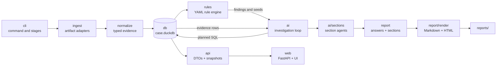
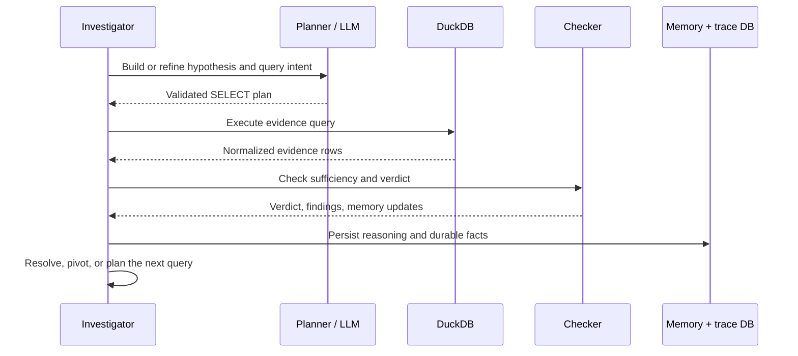
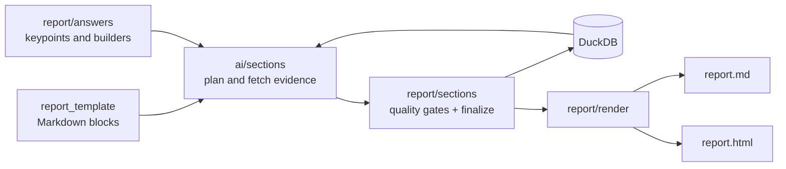

# Contributing to forensia

Thank you for your interest in contributing to forensia.
This document is a short guide on "what, where, and how to write." For implementation details, see [docs/](docs/); for development environment setup, test commands, and CLI flags, see [docs/development.md](docs/development.md). For concrete extension recipes, start with [docs/extending.md](docs/extending.md).

## Setup

```bash
git clone https://github.com/sumeshi/forensia
cd forensia
uv sync
```

For LLM connectivity, copy `.env.example` to `.env` and edit it with your local values. Do not commit `.env` or case artifacts.
For Web UI setup, see [docs/development.md](docs/development.md).

## Package map

The following is the package-level map contributors usually need. See
[docs/code-map.md](docs/code-map.md) only when you need file-level detail.

| Package / directory | What belongs there |
|---|---|
| `src/forensia/cli/` | Typer commands, pipeline stage runners, CLI-only validation and diagnostics |
| `src/forensia/web/` | FastAPI routes and packaged static assets |
| `src/forensia/core/` | Case, session, memory, verdict, time, and progress primitives without workflow policy |
| `src/forensia/db/` | DuckDB schema, migrations, connections, and generic query/evidence access |
| `src/forensia/api/` | UI-facing DTOs, DB projections, progress records, and API snapshot cache |
| `src/forensia/ingest/` | Artifact discovery, parser adapters, and raw JSONL production |
| `src/forensia/normalize/` | Raw parser output to normalized DuckDB tables |
| `src/forensia/rules/` | Rule models, YAML loading, rule execution, and finding generation |
| `src/forensia/knowledge/` | Readers for shared declarative catalogs and structured questions |
| `src/forensia/rulepacks/` | Detection rules and shared DFIR/schema knowledge in YAML/Markdown |
| `src/forensia/profiles/` | YAML policies selecting rulepacks and investigation behavior |
| `src/forensia/ai/` | Investigation orchestration, LLM access, prompts, checking, hypotheses, and section agents |
| `src/forensia/report/answers/` | Deterministic structured answers, keypoints, and table builders |
| `src/forensia/report/sections/` | Report-template parsing, section assembly, quality gates, and persistence |
| `src/forensia/report/render/` | Final Markdown/HTML rendering, formats, evidence maps, and Jinja templates |
| `src/forensia/report/` | Cross-cutting report projections, ranking, validation, and template export |
| `src/forensia/report_template/` | Packaged default report-section templates and format policy |
| `web_ui/` | Svelte frontend source |
| `tests/` | Deterministic unit, integration, regression, and extension-point tests |
| `scripts/` | Repository audits and maintenance commands used by `forensia doctor` |
| `docs/` | Architecture, development, extension, and operation documentation |

The allowed dependency direction is broadly `interface → workflow → reporting
→ knowledge → evidence → platform`. `scripts/check_imports.py` enforces it. If a
new import points in the opposite direction, move the behavior to its owning
layer instead of adding a convenience re-export.

## Main call flows

The full pipeline entered through `forensia run` / `forensia investigate` is:



Within one hypothesis, control moves through a small PDCA loop:



Report generation then follows this path:



For a new feature, start in the package that owns the data or policy. In
particular, prefer `rulepacks/` declarations and the public registries described
in [docs/extending.md](docs/extending.md) over adding branches to orchestration
code.

## Design principles to know before making changes

See [docs/design-principles.md](docs/design-principles.md) for details. The following are the points most scrutinized during review.

### 1. Declarative layer first

DFIR knowledge such as Event ID descriptions, detection rules, fallback procedures, QuestionSpec, structured answer interpretation text (`interpretation_template`), and verdict vocabulary **belongs in YAML under `src/forensia/rulepacks/`**. PRs that add hardcoded branches for rule_id / event_id / host names on the Python side are generally not accepted.

- New detection perspective → `rulepacks/<pack>/*.yaml`([docs/rules-and-profiles.md](docs/rules-and-profiles.md))
- New canned question → `rulepacks/_schema/question_routing.yaml`
- New table → schema card in `rulepacks/_schema/<table>.yaml`

### 2. Do not pass deterministic processing to the LLM

Routing, retries, SQL validation, duplicate detection, aggregation, formatting, and value validation are handled in code. When adding an LLM role, verify that its `<TASK>` can be stated in one sentence.

The reverse direction is equally important: **never persist LLM output without validation**. Verdicts must pass code-side consistency gates (matching claimed Event IDs and required entities against result rows, prohibiting confirmed from fallback rows), and only observed evidence_ids and entity names are accepted into memory. Changes that weaken these gates require proportionate justification and tests.

### 3. verdict / status are enums, not free strings

Allowed values and cross-layer mappings are authoritative in `rulepacks/_schema/verdict_taxonomy.yaml`. When adding a new value (e.g. `untestable`), edit the taxonomy and follow up with the Python-side Literal / validator. Bypassing the validator is treated as a bug.

Note that `refuted` (contradicted by evidence) and `untestable` (cannot be verified because the required telemetry is not present in the case) have different meanings. Do not record "no evidence" as a refutation.

### 4. Schema changes require migrations

Editing `CREATE TABLE IF NOT EXISTS` in `db/schema.py` does **not** apply to existing case databases. When adding columns to an existing table, always add a migration in `_apply_migration_once("<key>", ...)` in `db/database.py` (using the `ALTER TABLE ... ADD COLUMN IF NOT EXISTS` pattern). When adding a mutable table, also update `_reset_case_tables()` and the corresponding tests.

### 5. Maintain evidence traceability

Durable conclusions (findings / claims / memory facts) must always be traceable back to an evidence_id. Even when adding abstractions that summarize or rank evidence, do not sever the reference path back to the source evidence.

### 6. Do not optimize for the benchmark

The CFReDS benchmark in BENCHMARK.md is **a measurement instrument, not an optimization target**. Adding code paths or prompts tied to specific questions, host names, file names, or timestamps is prohibited. When you find a gap in the benchmark, translate it into "which generic DFIR capability is missing" before implementing.

## Tests

```bash
# All tests (should complete in seconds)
UV_CACHE_DIR=/tmp/uv-cache PYTHONPATH=src uv run python -m pytest tests/ -q

# Declarative layer / documentation consistency audit
forensia doctor
```

- **Do not write tests that make real LLM calls or hit a real LLM server** (see the "Test policy" section in [docs/development.md](docs/development.md) for the rationale).
- When you change a determinism gate, update the corresponding regression tests:
  `tests/test_checker_gates.py` (verdict consistency gates, fallback downgrade, memory filter, finding verification),
  `tests/test_untestable_resolution.py` (early untestable resolution).
- When you change rule YAML or `question_routing.yaml`, confirm that `scripts/audit_schema_coverage.py --strict` (included in `forensia doctor`) passes.
- The directional import layer contract is checked by `scripts/check_imports.py` (included in `forensia doctor`). When you add a new module, confirm it passes without adding an exception.

## Templates

The package-bundled default templates have `src/forensia/report_template/` as the source of truth. When changing the standard report structure, update this directory and, if necessary, update the README / docs in the same PR.

To derive templates for local evaluation, create a working copy with `uv run forensia templates-export ./my-templates` and specify it explicitly with `--template-dir ./my-templates`. Only commit evaluation templates or case-specific templates whose content is suitable for publication as generic templates.

## Documentation

When you change code, update the relevant page in [docs/](docs/) **in the same PR**, and update README.md if user-facing behavior changes (see the convention at the top of docs/architecture.md).

## Submitting PRs

1. Cut a branch and keep changes small and focused (do not mix in unrelated refactors).
2. Make `pytest` and `forensia doctor` pass in full. Do not mark something "done" while skips or failures remain.
3. Write code, comments, and commit messages in English.
4. In the PR description, state "what, why, and how you verified it." For LLM prompt changes, attaching the before/after behavior diff speeds up review.

## Bug reports and suggestions

Include reproduction steps (entries from `ai_logs/` or excerpts of `hypothesis_reasoning` where possible) along with expected and actual behavior in issues. Do not paste sensitive investigation data as-is; sanitize it first.

For security issues and handling of sensitive data, also see [SECURITY.md](SECURITY.md).
