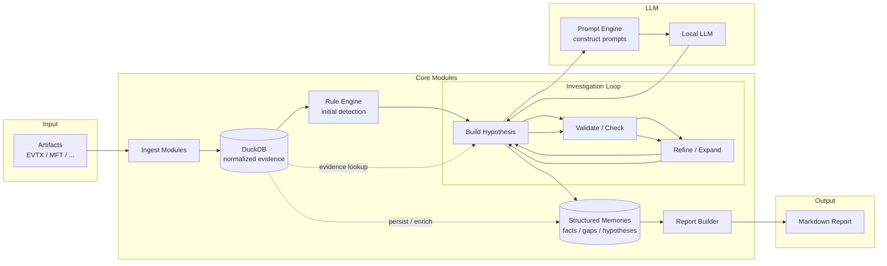
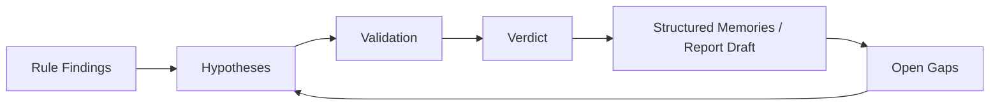
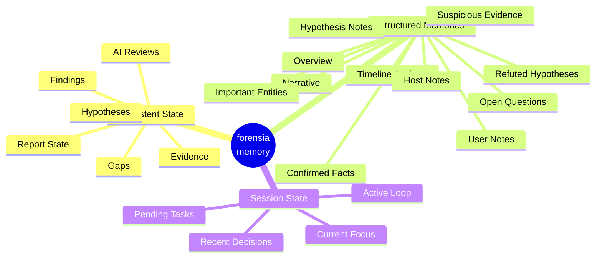

# forensia


あなたの代わりに週末作業してくれるAIフォレンジック調査員。

## 概要

`forensia` (= forensic-ai) は、一般的な個人所有のデスクトップPCで、
ローカルLLMで調査できることを目的したミニマルなフォレンジック調査支援ツールです。

`qwen3.5-9b` や `gemma4-e2b` といった小規模モデルでも精度の高い調査ができるように、
ルールベース検知やハードコードされたプロンプトを利用して、細かい単位の推論ループを行うアーキテクチャで設計しています。


## なぜ作ったか

Claude のモデル性能が上がった？素晴らしい！ GPT も追従？未来はきっと明るいですね。
でもフォレンジックのような機微な情報を扱う技術者にはあまり関係のないことです。

インシデントに関する情報は、当然外部に出せません。クラウドにも。
疑心暗鬼に陥っている人たちならば、自分たちが新たなインシデントを産まないようにオフラインで作業するでしょう。私もそうです。

かといってオフラインで動く LLM に仕事を任せられるでしょうか。
試してみました。**とても無理です。**

なぜなら、彼らは厳格なプロンプトを与えなければ指示を誤解するし、あまり長い文章は読めないし、健忘症です。
なので、私はこれを **アーキテクチャで解決** できないかと考えました。

それから、インシデントの相談というのはたいてい金曜日に来ます。あるいは長期休みの前に。
このロジックは以下のとおりです。

まず、攻撃者は土日の人がいない時間を狙い、システムを侵害します。  
月曜に担当者が異変に気づきます。でも家に帰ることのほうが重要なので報告はしません。  
火曜の朝、ミーティングで「もしかするとインシデントかもしれない」と共有され、社内調査が開始します。  
水曜の終わり頃になって、ようやくインシデントらしいと諦めがつきます。  
木曜にベンダへ相談しようという話になり、当社の営業に連絡が来ますが、残念ながらレイテンシがあります。  
金曜の朝あなたのところにリクエストが届き、月曜に報告をくださいという話になっています。データはまだ届いていません。  

もううんざりです。あなたの代わりに週末作業してくれる人はいないでしょうか。
いません。AIの友人以外は。

## forensia が解決すること

forensia がやろうとしているのは、要するに次の 4 つです。

- **大量ログを、調査可能な形に落とすこと**  
  EVTX や MFT はそのままだと重いし読みにくい。まず正規化して DuckDB に置き、Evidence として扱える形にする。

- **弱いローカル LLM を、弱いまま使わないこと**  
  調査全体を丸投げせず、仮説生成、検証方針、結果確認、説明文生成といった小さな仕事に分解する。

- **調査の途中経過を失わないこと**  
  仮説、gap、確認済み事項、レポート下書きを残し、同じケースを何度でも続きから回せるようにする。

- **報告書作成を最後の苦行にしないこと**  
  レポートを最後に一気に書かず、調査ループの中で少しずつ育てる。


## システム概念図

forensia は、EVTX や MFT などのアーティファクトを正規化して DuckDB に格納し、Rule Engine による初期検出を行います。

その結果を起点に仮説を組み立て、ローカル LLM には Prompt Engine 経由で小さく構造化されたタスクだけを渡します。LLM は調査全体を一度に判断するのではなく、仮説の検証、再解釈、次に確認すべきポイントの提案を反復的に行います。

各ループの結果は Structured Memories として蓄積されます。これは単なる会話履歴ではなく、確認済みの事実、未解決の gap、重要なエンティティ、仮説の状態を圧縮・再構成した、LLM の健忘症を補うための中間記憶です。

最終的に Report Builder が Structured Memories を再解釈し、Markdown レポートを生成します。




## 設計原則

### 1. **孤独に戦う**

インシデントに関する生ログや調査結果を外部サービスに送らない。  
取り込み、検出、仮説検証、記憶、レポート生成までを、一般的な個人所有のデスクトップ PC 上で完結できることを重視する。

巨大な解析基盤やクラウドサービス、インターネットに依存せず、PC一台あれば解析ができることを前提とする。


### 2. **弱さは構造で補う**

LLM を「賢い調査官」として扱うのではなく、  
構造化された調査ループの中で使うための道具として扱うこと。

LLM に調査全体を丸投げしない。仮説を作る、検証方針を出す、結果を確認する、レポートの一部を書く、といった小さな仕事だけを渡す。

モデルの賢さではなく、タスク分解、ルールベース検知、構造化プロンプト、検証可能な出力によって調査を進める。


### 3. **AIの出力を信じない**

AI の出力を真実として扱わない。  
正規化されたアーティファクト、ルール検出結果、仮説、検証結果、レポートの中間状態は DuckDB に保存し、あとから辿れるようにする。

Rule Engine による初期検出を起点に仮説を作り、その仮説を検証し、何が確認され、何が否定され、何がまだ分かっていないのかを継続的に更新する。


### 4. **時間は湯水のごとく使う**

一度の実行で完璧な結論を出すことを目指さない。  
各ループの結果を Structured Memories として蓄積し、確認済みの事実、未解決の gap、重要なエンティティ、仮説の状態を次の調査ループに再利用する。

レポートも最後にまとめて書くのではなく、調査中に少しずつ育てる。  
不足している情報は次の調査対象に戻し、同じケースに対して何度でも再実行できるようにする。


## 調査ループの仕組み

forensia は、ログを一度スキャンして終わるツールではありません。  
Rule Engine による初期検出を起点に仮説を作り、その仮説を証拠で検証し、結果を記憶とレポートへ反映します。

不足している情報は gap として残り、次の調査ループで再び仮説の材料になります。  
これにより、実行を重ねるほど「何が分かったか」「何が否定されたか」「まだ何が足りないか」が整理されていきます。



### 4 つの verdict

各検証結果に対して、LLM は次の 4 値のいずれかを返します。

| Verdict | 意味 |
|---|---|
| `confirmed` | 仮説を支持する証拠がある |
| `refuted` | 仮説を否定する証拠がある |
| `inconclusive` | 判断材料が不足している |
| `newlead` | 元の仮説とは別に追うべき不審点が見つかった |


## 長期記憶 / Structured Memories

forensia の記憶は会話履歴ではありません。  
DuckDB を source of truth とし、その内容を LLM が読める形に射影・圧縮・再構成したものが Structured Memories です。



### 3 層の記憶

| 層 | 場所 | 役割 | 正本か |
|---|---|---|---|
| Persistent State | `db/case.duckdb` + `db/trace.duckdb` | 証拠、Finding、仮説、レポート状態、進捗ログ、LLM 実行履歴 | はい |
| Structured Memories | `memory/*.md` | LLM に渡すための圧縮済みコンテキスト | いいえ |
| Session State | プロセスメモリ | 今回の実行中だけ使う作業記憶 | いいえ |

### ここでのポイント

- 正本は DuckDB です
- `memory/*.md` は LLM 向けに圧縮した作業メモで、コピーではありません
- `memory/` は消しても DB から再生成できます
- Session State は今走っている 1 回の調査だけの一時メモリです

AI 調査員は証拠を全部抱え込むわけではありません。  
見るのは、確認済み事実、重要エンティティ、時系列アンカー、open gaps、仮説状態です。人間がノートを整理してから渡すのに近い。生ログ全件を読ませて覚えておけ、と言うのは、さすがに酷です。

- `overview.md`: 調査全体の索引
- `confirmed_facts.md`: 確定した事実
- `timeline_anchors.md`: 主要な時刻アンカー
- `open_questions.md`: 未解決の問い
- `narrative.md`: 次サイクルでも保持したい短い説明筋
- `refuted_hypotheses.md`: 否定済み仮説の控え
- `important_entities.md`: 追跡対象の IP / user / host / process / service
- `hosts/*.md`: ホスト単位のメモ
- `users/*.md`: ユーザー単位のメモ
- `hypotheses/*.md`: 仮説ごとの状態と reasoning trail
- `evidence/suspicious.md`: 注意すべき evidence の断片

これらは人間が直接読めるように Markdown で置きつつ、LLM が次のループで再利用しやすい形にもしています。  
Markdown なのは見た目の趣味ではなく、ローカル実行・可搬性・差分確認のしやすさを優先した結果です。

### LLM へのコンテキスト渡し方

各 LLM 呼び出しでは次の順に context を組み立てます。

1. `overview.md` を常時ロードする
2. 主要メモファイルの末尾を `LLM_MEMORY_MAX_BYTES` 内に収まるよう切り出したコンパクトスナップショットを渡す
3. LLM が特定ファイルを読みたいときは `read_more` フィールドにファイル名を返す。プランナーはそのファイルを読み込み、同じプロンプトに追記して再度 LLM を呼ぶ

`read_more` で要求できるファイルは `confirmed_facts.md`、`timeline_anchors.md`、`open_questions.md`、`narrative.md`、`hosts/*.md`、`users/*.md`、`hypotheses/*.md` など。一度のサイクルで必要なファイルだけを on-demand でロードするため、常に全ファイルを詰め込まずに済む。

### 圧縮の挙動

`LLM_MEMORY_MAX_BYTES` は `overview.md`、`open_questions.md`、個別メモファイルの圧縮閾値として使います。  
`confirmed_facts.md`、`timeline_anchors.md`、`refuted_hypotheses.md`、`important_entities.md` は保持優先で圧縮対象外です。これらは調査を通じて増え続けますが、削って調査結果を失うよりマシと判断しています。


## 信頼性の担保

forensia は「AI を賢く使う」より先に、「AI が雑でも壊れにくい」ことを優先しています。

### AI の自由度を制限する

- `SELECT` / `WITH` のみ許可。複数文・破壊的 SQL は拒否する
- 参照できるテーブルを 13 テーブルに固定する（`sql_schema.py` が SSOT）
- SQL 修正リトライにも上限を設ける
- LLM が返す verdict は `confirmed` / `refuted` / `inconclusive` / `newlead` の 4 値に限定し、それ以外は再試行する
- LLM に渡す Finding 一覧は最大 10 件・6 フィールド（finding_id / title / severity / confidence / status / summary）に絞る
- レポート書き込み時にコンテキストセクションを 1 セクション 600 文字で切り捨て、プロンプトを小さく保つ
- チェックフェーズのプロンプトには偽陽性低減ガイダンスを固定で埋め込む（ログオンタイプ・業務時間内・既知サービスアカウントの除外基準）

### 証拠に戻れるようにする

- Finding から Evidence に戻れる
- Hypothesis から検証結果に戻れる
- レポート断片から Evidence / gap に戻れる
- `suppressed` は削除ではなく状態変更として扱う

forensia は、もっともらしい文章を増やすためのツールではなく、あとから「それ、どの証拠？」と聞かれたときに戻れる状態を保つツールです。

### LLM の入出力を記録する

- investigate ループの LLM リクエスト / レスポンスを `ai_logs/<session_id>/` に残す
- 調査ステップごとの `input_json` / `output_json` を `investigation_steps` に残す
- Finding / 仮説に対するレビュー結果を保存する

つまり「AI がそう言った」ではなく、「AI に何を渡し、何が返り、何を採用したか」を辿れます。

### 分からないことを分からないまま扱う

`confirmed / refuted / inconclusive / newlead`（元の仮説とは別に追うべき不審点）の 4 値を持たせるのは、そのためです。  
分からないのに断定するより、`inconclusive` のまま止まってくれた方がはるかにマシです。

### レポートも検証対象にする

- 根拠不足は gap にする
- gap は次の調査対象へ戻す
- レポートを雰囲気で埋めない

レポートは最終成果物であると同時に、調査ループの一部です。  
「文章になったから終わり」ではなく、「文章にしたら根拠不足が見えたので、もう一度掘る」が発生します。


## インストール

### 要件

- Python 3.14+
- [uv](https://github.com/astral-sh/uv)
- LM Studio
- Node.js 20+（UI を開発・再ビルドする場合）

### セットアップ

```bash
git clone https://github.com/sumeshi/forensia
cd forensia
uv sync
```

`.env` を作成して LLM 接続先を設定します。

```dotenv
LLM_BASE_URL="http://127.0.0.1:1234"
LLM_MODEL="qwen/qwen3-8b"
```

詳細な設定値は [CONTRIBUTING.md](CONTRIBUTING.md) を参照してください。

CLI では `--llm-base-url` を使います。`--lmstudio` は互換のため残している旧名です。

## 使い方

### 一括実行

```bash
# 初回 20 サイクルで実行する
forensia run ./input --out ./case001 --profile windows-basic

# より長く回したいときだけ明示する
forensia run ./input --out ./case001 --profile windows-basic --max-iter 50
```

`forensia run` はデフォルトで ingest → normalize → analyze → investigate まで走ります。  
LLM を設定せずに実行すると、Stage 3（ルール検知）まで走って止まります。

再実行時によく使うのは次の 2 つです。

- `--reinvestigate`: 既存セッションがあっても Stage 4 をもう 1 回回す
- `--init`: テーブルデータと raw/findings/reports を消して同じ出力先を作り直す（memory/ と ai_logs/ は保持）

### ステップ実行

#### 調査を続ける

同じケースに対して investigate を再実行すると、前回までの仮説、Finding、gap、レポート状態を引き継いで続きから調査できます。
investigate は、現在の調査状態を読み込み、仮説の検証、Structured Memories の更新、レポート下書きの更新、gap の再投入を繰り返します。

```
forensia investigate case001 --max-iter 50
```

`investigate` の主な調整項目は `--max-queries-per-hypothesis`、`--no-progress-limit`、`--report-every-n-cycles`、`--report-parallelism`、`--report-only` です。  
何を触るべきかは [CONTRIBUTING.md](CONTRIBUTING.md) に寄せています。

`investigate` は 1 サイクルごとに次のフェーズを回します。

1. **Broad plan**: LLM が overview.md・直近 Finding（最大 10 件・6 フィールドに絞り込み）・仮説一覧を読み、新規仮説を提案する
2. **Hypothesis plan**: 各仮説に対して LLM が検証用クエリを 1 本提案する（クエリテンプレートライブラリから選ぶか、フォールバックで raw SQL を返す）
3. **SQL 実行**: クエリをバリデーション後に DuckDB に対して実行し、結果を要約する
4. **Check**: LLM が結果サマリーと memory context を受け取り、verdict（`confirmed` / `refuted` / `inconclusive` / `newlead`）と memory_updates・report_text を返す
5. **Memory 更新**: LLM の memory_updates を受けて各 `memory/*.md` を更新する
6. **Report section 更新**: N サイクルごとに LLM がレポートセクションを再充填する

同じケースで再実行すると、前回の調査状態から続けられます。


#### 追加エビデンスを入れる

追加で EVTX / MFT などが届いた場合は、同じケースに取り込んだうえで再度調査ループを回します。
内部でエビデンスのファイル名とhash値を保持し、今まで追加されていなかったものだけをスキャンします。

```
forensia add case001 ./input
```

#### レポートを生成する

`report` は既存の `report_sections` から Markdown / HTML をレンダリングするだけです。

```
forensia report case001
```

section が空、または現時点の evidence から LLM で section を再充填したいなら `report-write` を使います。

```bash
forensia report-write case001 --llm-base-url http://127.0.0.1:1234 --model qwen/qwen3-8b
```

#### UIで確認する
serve は、ケースの調査状態やレポートの途中経過をブラウザで確認するためのUIを起動します。

```
forensia serve case001 --host 127.0.0.1 --port 8000
```

`forensia serve` は、build 済みの `web_ui/dist/` を FastAPI から配信します。  
DuckDB が他プロセスにロックされている場合でも、`reports/api/*.json` のスナップショットから表示できます。

#### 状態だけ確認する

ケースの進行状況だけ見たいなら、UI を開かずに `status` を使えます。

```bash
forensia status case001
```

その他、開発手順や内部構造の説明は [CONTRIBUTING.md](CONTRIBUTING.md) にまとめています。


## 注意事項

- forensia は最終判断を自動化しません
- AI の出力は必ず人間が検証してください
- オフライン前提ですが、モデル配布やツール導入には別途準備が要ります
- 小型ローカル LLM は強くありません。だからこそ forensia は構造に寄せています
- すべての EVTX ソースや Sysmon をまだ網羅しているわけではありません
