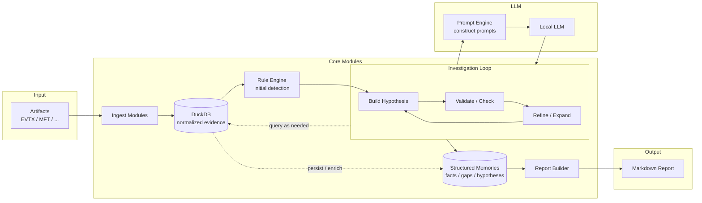
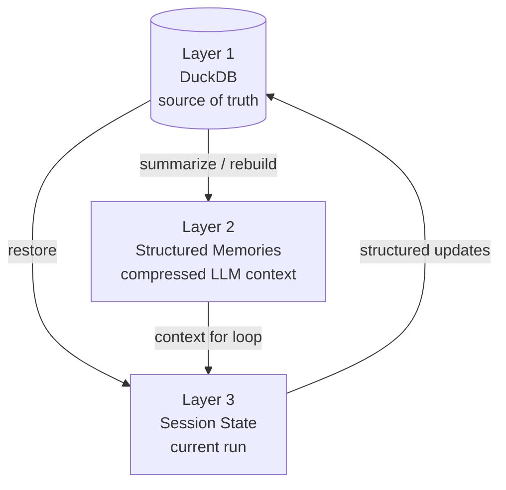
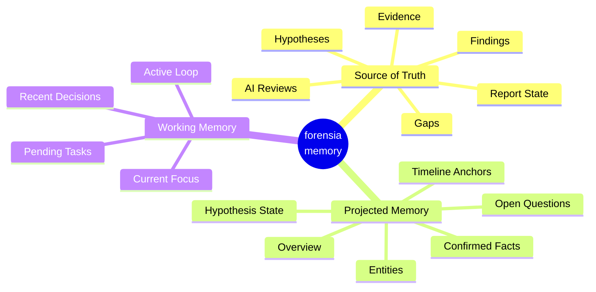
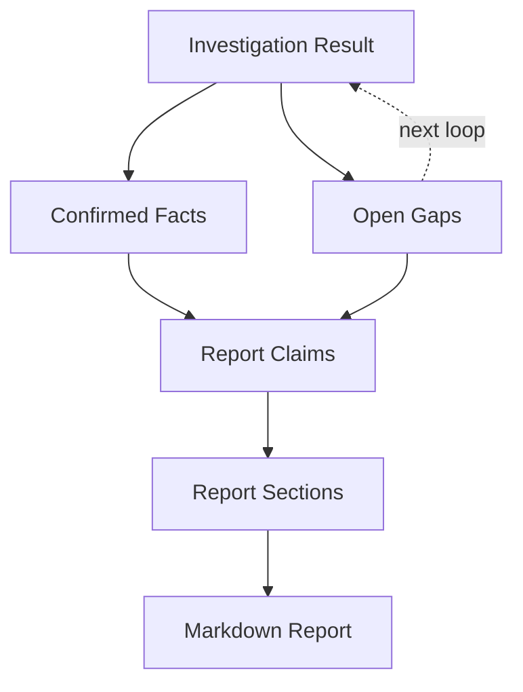

# forensia

あなたの代わりに週末作業してくれるAIフォレンジック調査員。

## 概要

`forensia` (= forensic-ai) は、一般的な個人所有のデスクトップPCで、
ローカルLLMで調査できることを目的したミニマルなフォレンジック調査支援ツールです。

`qwen3.5-9b` や `gemma4-e2b` といった小規模モデルでも精度の高い調査ができるように、
ルールベース検知やハードコードされたプロンプトを利用して、細かい単位の推論ループを行うアーキテクチャで設計しています。


## なぜ作ったか

Claude のモデル性能が上がった？素晴らしい！ GPT も追従？未来はきっと明るいですね。
でもフォレンジックのような機微な情報を扱う技術者にはあまり関係のないことです。

インシデントに関する情報は、当然外部に出せません。クラウドにも。
疑心暗鬼に陥っている人たちならば、自分たちが新たなインシデントを産まないようにオフラインで作業するでしょう。私もそうです。

かといってオフラインで動く LLM に仕事を任せられるでしょうか。
試してみました。**とても無理です。**

なぜなら、彼らは厳格なプロンプトを与えなければ指示を誤解するし、あまり長い文章は読めないし、健忘症です。
なので、私はこれを **アーキテクチャで解決** できないかと考えました。

それから、インシデントの相談というのはたいてい金曜日に来ます。あるいは長期休みの前に。
このロジックは以下のとおりです。

まず、攻撃者は土日の人がいない時間を狙い、システムを侵害します。  
月曜に担当者が異変に気づきます。でも家に帰ることのほうが重要なので報告はしません。  
火曜の朝、ミーティングで「もしかするとインシデントかもしれない」と共有され、社内調査が開始します。  
水曜の終わり頃になって、ようやくインシデントらしいと諦めがつきます。  
木曜にベンダへ相談しようという話になり、当社の営業に連絡が来ますが、残念ながらレイテンシがあります。  
金曜の朝あなたのところにリクエストが届き、月曜に報告をくださいという話になっています。データはまだ届いていません。  

もううんざりです。あなたの代わりに週末作業してくれる人はいないでしょうか。
いません。AIの友人以外は。

## システムの概念図

forensia は、EVTX や MFT などのアーティファクトを正規化して DuckDB に格納し、Rule Engine による初期検出を行います。

その結果を起点に仮説を組み立て、ローカル LLM には Prompt Engine 経由で小さく構造化されたタスクだけを渡します。LLM は調査全体を一度に判断するのではなく、仮説の検証、再解釈、次に確認すべきポイントの提案を反復的に行います。

各ループの結果は Structured Memories として蓄積されます。これは単なる会話履歴ではなく、確認済みの事実、未解決の gap、重要なエンティティ、仮説の状態を圧縮・再構成した、LLM の健忘症を補うための中間記憶です。

最終的に Report Builder が Structured Memories を再解釈し、Markdown レポートを生成します。




## 設計原則

### 1. **孤独に戦う**

インシデントに関する生ログや調査結果を外部サービスに送らない。  
取り込み、検出、仮説検証、記憶、レポート生成までを、一般的な個人所有のデスクトップ PC 上で完結できることを重視する。

巨大な解析基盤やクラウドサービス、インターネットに依存せず、PC一台あれば解析ができることを前提とする。


### 2. **弱さは構造で補う**

LLM を「賢い調査官」として扱うのではなく、  
構造化された調査ループの中で使うための道具として扱うこと。

LLM に調査全体を丸投げしない。仮説を作る、検証方針を出す、結果を確認する、レポートの一部を書く、といった小さな仕事だけを渡す。

モデルの賢さではなく、タスク分解、ルールベース検知、構造化プロンプト、検証可能な出力によって調査を進める。


### 3. **AIの出力を信じない**

AI の出力を真実として扱わない。  
正規化されたアーティファクト、ルール検出結果、仮説、検証結果、レポートの中間状態は DuckDB に保存し、あとから辿れるようにする。

Rule Engine による初期検出を起点に仮説を作り、その仮説を検証し、何が確認され、何が否定され、何がまだ分かっていないのかを継続的に更新する。


### 4. **時間は湯水のごとく使う**

一度の実行で完璧な結論を出すことを目指さない。  
各ループの結果を Structured Memories として蓄積し、確認済みの事実、未解決の gap、重要なエンティティ、仮説の状態を次の調査ループに再利用する。

レポートも最後にまとめて書くのではなく、調査中に少しずつ育てる。  
不足している情報は次の調査対象に戻し、同じケースに対して何度でも再実行できるようにする。


## 主要コンポーネントの責務

| 層 | パッケージ | 責務 |
|---|---|---|
| 取込 | `forensia.ingest` | `*.evtx` / `$MFT` を `evtx2es` / `mft2es` Python API で JSONL 化 |
| 正規化 | `forensia.normalize` | ECS 形式 (`winlog.*`) / `header.*` から DuckDB のカラムへマップ |
| ルール | `forensia.rules` | YAML ルールの `query:` を DuckDB で実行、ATT&CK Technique 付き Finding を生成 |
| LLM I/O | `forensia.ai.lmstudio` | `chat_completion()` の httpx ラッパ。タイムアウト 5min |
| 構造化応答 | `forensia.ai.json_response` | JSON Schema バリデーション + 1-shot retry |
| 計画 / 検証 | `forensia.ai.planner` / `.checker` | 広域 PLAN・仮説 PLAN・CHECK。SQL の allowlist 検査 |
| ループ制御 | `forensia.ai.investigator` | PDCA + gap 仮説再注入 + section 並列更新 + 停止判定 |
| 報告書 | `forensia.report.writer` | section の準備 → LLM → DB UPSERT。並列対応のため 3 段分割 |
| 永続化 | `forensia.db.database` / `forensia.core.session` | DuckDB 接続 + Pydantic セッション状態モデル |
| メモリ | `forensia.core.memory` | `overview.md` / `hosts/` / `users/` / `hypotheses/` の LLM 入力用キャッシュ。サイズ上限超過で自動圧縮 |
| API | `forensia.api` / `forensia.web` | FastAPI による DTO 配信 + SSE |
| UI | `web_ui/` | Svelte 5 + Vite + Tailwind CSS (Catppuccin Mocha) |


## 長期記憶の仕組み

forensia の記憶は、役割と寿命の異なる 3 層で構成されています。

小型ローカル LLM は長い文脈を保持できず、過去の判断も忘れます。  
そのため forensia では、調査状態の正本を DuckDB に保存しつつ、LLM に読ませるための Structured Memories を生成します。実行中の一時的な状態は Session State に保持し、次回実行時には DuckDB から復元します。



| 層                       | 場所            | 寿命      | 役割                                                        |
| ----------------------- | ------------- | ------- | --------------------------------------------------------- |
| **Persistent State**    | `case.duckdb` | ケース消去まで | 調査状態の正本。証拠、Finding、仮説、gap、レポート中間状態を保持する                   |
| **Structured Memories** | `memory/*.md` | 再生成可能   | DuckDB から作られる LLM 入力用コンテキスト。事実、gap、エンティティ、仮説、時系列を圧縮・再構成する |
| **Session State**       | プロセスメモリ       | 1 回の実行中 | 現在の focus、active loop、pending task など、実行中だけ必要な状態を保持する     |

memory/*.md は正本ではありません。
人間が読みやすく、LLM が扱いやすい形に整えた派生表現です。必要であれば case.duckdb から再生成できます。

## 記憶モデル

forensia の記憶は、単なる会話履歴ではありません。  
DuckDB に保存された正本の調査状態から、LLM が次の判断に使いやすい形へ射影された「調査用の脳内メモリ」です。

AI 調査員は、証拠そのものをすべて抱え込むのではなく、確認済みの事実、重要なエンティティ、時系列の起点、未解決の gap、仮説の状態を圧縮された記憶として参照します。現在の実行中だけ必要な focus や pending task は Working Memory として扱い、結果は構造化されて DuckDB に戻されます。



### 記憶設計上の特徴

- **DB から再開できる**  
  調査状態の正本は DuckDB に保存される。`memory/` は LLM 入力用の派生コンテキストであり、削除されても再生成できる。

- **必要な情報だけを渡す**  
  LLM にすべての記憶を毎回渡さない。Overview を基本コンテキストとし、ホスト、ユーザー、仮説、gap などの詳細は必要に応じて追加する。

- **記憶を圧縮・再構成する**  
  Structured Memories は会話履歴ではない。確認済みの事実、未解決の gap、重要なエンティティ、時系列、仮説状態を、次の調査に使える形へ圧縮する。

- **LLM の出力を正本にしない**  
  LLM の応答は構造化された結果として DuckDB に保存される。`memory/*.md` から DuckDB へ直接書き戻す経路は持たない。

- **過去の判断を再利用する**  
  confirmed / refuted になった仮説や確認済みの事実を次回以降の調査に引き継ぎ、重複調査を避ける。

- **レポートも調査ループに戻す**  
  レポート生成中に見つかった不足情報は gap として扱い、次の調査ループに戻す。


## 調査ループの仕組み

forensia は、ログを一度スキャンして終わるツールではありません。  
Rule Engine による初期検出を起点に仮説を作り、その仮説を証拠で検証し、結果を記憶とレポートへ反映します。

不足している情報は gap として残り、次の調査ループで再び仮説の材料になります。  
これにより、実行を重ねるほど「何が分かったか」「何が否定されたか」「まだ何が足りないか」が整理されていきます。

```mermaid
flowchart LR
    A["Rule Findings<br/>initial leads"]
    B["Hypotheses<br/>what might have happened"]
    C["Validation<br/>query evidence"]
    D["Verdict<br/>confirmed / refuted / inconclusive"]
    E["Structured Memories<br/>facts / gaps / hypothesis state"]
    F["Report Draft<br/>claims / sections / open questions"]
    G["Open Gaps<br/>next investigation seeds"]

    A --> B --> C --> D
    D --> E
    D --> F
    F --> G
    G --> B
````

### 仮説の状態

仮説は、調査ループの中で状態を持ちます。

```mermaid
stateDiagram-v2
    [*] --> active : rule finding / report gap / new lead
    active --> confirmed : supporting evidence found
    active --> refuted : counter evidence found
    active --> inconclusive : not enough evidence
    inconclusive --> active : try another validation
    confirmed --> [*]
    refuted --> [*]
```

* `active`: 現在検証中の仮説
* `confirmed`: 証拠によって支持された仮説
* `refuted`: 証拠によって否定された仮説
* `inconclusive`: まだ判断できない仮説

confirmed / refuted になった仮説は次回以降も記憶され、同じ調査を繰り返さないために使われます。

### gap の扱い

レポート生成や仮説検証の途中で、証拠不足・未確認事項・外部確認が必要な点が見つかった場合、それらは gap として保存されます。

gap はすべてを自動で仮説に戻すのではなく、種類ごとに扱いを分けます。

| gap type               | 意味                      | 扱い                 |
| ---------------------- | ----------------------- | ------------------ |
| `queryable`            | DuckDB 内の証拠で確認できる不足情報   | 次の仮説・検証対象に戻す       |
| `external_required`    | WHOIS、EDR、AD台帳など外部情報が必要 | Open Questions に残す |
| `human_required`       | 業務妥当性や担当者確認が必要          | 人間の確認事項にする         |
| `report_clarification` | 報告書上の説明不足               | レポート修正対象にする        |

これにより、検証不能な gap が調査ループを汚染することを防ぎます。

### レポートは最後に書くものではない

forensia では、レポートは最終段階で一気に生成するものではありません。
調査ループの結果をもとに、確認済みの事実、未解決の gap、仮説の状態を少しずつ反映していきます。



レポート中に不足している情報が見つかれば、それは次の調査ループに戻されます。
つまり、レポートは単なる出力ではなく、調査を進めるための作業面でもあります。

### 再実行で深くなる

同じケースに対して `investigate` を再実行すると、過去の仮説、確認済みの事実、否定された可能性、未解決の gap が引き継がれます。

そのため、forensia は一度の実行で完璧な結論を出すことを目指しません。
一晩回し、翌朝に結果を確認し、必要なら続きを回す。そうした使い方を前提にしています。

---

## 信頼性の担保

「AI が言ったから」では誰も納得しない。forensia はトレーサビリティと安全性を構造で保証する。

### SQL の安全性

`forensia.ai.planner.validate_select_sql()`:

- `SELECT` または `WITH` で始まる文だけ許可
- 複数文（`;` 区切り）禁止
- `INSERT / UPDATE / DELETE / DROP / ALTER / CREATE / ATTACH / DETACH / COPY / PRAGMA / TRUNCATE / MERGE / REPLACE` を含む文を拒否
- `FROM` / `JOIN` で参照するテーブルが `evtx_events / mft_entries / mft_timeline / findings / ai_reviews / investigation_sessions / investigation_steps` のホワイトリストに含まれていない場合は拒否

LLM が破壊的 SQL を出すこと自体は許す（小型モデルなら頻発する）が、**実行する前に必ず弾かれる**。
バリデーション失敗時は 1 回だけリトライさせ、それでも壊れていればその仮説の SQL 要求は諦める（無限ループ防止）。

### Finding のトレーサビリティ

- すべての Finding は `evidence_id`（イベント単位のハッシュ）で元レコードに紐付く
- ルール YAML には `attack:` で MITRE ATT&CK Technique ID が紐付き、Finding に伝搬する
- `allowlist.yaml` で `rule_id × target_user / src_ip / process_name` 等の組み合わせを `status='suppressed'` に落とす（誤検知のホワイトリスト）
- 削除はしない。UI でトグルすれば再表示できる

### LLM I/O の完全記録

- `ai_logs/` に全リクエスト・レスポンスを保存
- `investigation_steps` テーブルに `phase ∈ {plan-broad, plan-hypothesis, do, check, act}` で `input_json` と `output_json` を全件残す
- `ai_reviews` は Finding/仮説単位に最新の verdict + report_text を UPSERT、過去版は `investigation_steps` 側にある

### 4 値 verdict のセマンティクス

CHECK が返す verdict は 4 値:

| 値 | 意味 | 動作 |
|---|---|---|
| `confirmed` | 仮説を裏付ける証拠あり | 仮説を resolve、status=`confirmed` |
| `refuted` | 仮説を否定する証拠あり | 仮説を resolve、status=`refuted` |
| `inconclusive` | 証拠不十分 | 同仮説で別 SQL を提案、ループ継続 |
| `new_finding` | 仮説とは独立した不審事象を発見 | 別仮説候補として `new_hypotheses` に追加 |

「分からなければ判断保留」を選択肢として持つことで、小型モデルが無理に断定する圧力を下げている。

---

## 要件

- Python 3.14+
- [uv](https://github.com/astral-sh/uv)
- LM Studio（`review` / `investigate` / `run` で LLM を使う場合）。Qwen3 8B / Llama 3.1 8B クラスを想定
- Node.js 20+（ブラウザ UI を開発・再ビルドする場合）

## インストール

```bash
git clone https://github.com/sumeshi/forensia
cd forensia
uv sync
```

## 設定

`.env` を作成して LLM の接続先と動作を設定する。

```dotenv
LLM_BASE_URL="http://127.0.0.1:1234"
LLM_MODEL="qwen/qwen3-8b"
LLM_MAX_TOKENS=4096

# 推論は英語、出力は日本語（小規模モデルの品質向上）
LLM_THINKING_LANGUAGE=en
LLM_OUTPUT_LANGUAGE=ja

# 報告書セクション並列化（1 = 順次、推奨 4〜8）
LLM_REPORT_PARALLELISM=4

# メモリファイルの自動圧縮閾値（バイト）
LLM_MEMORY_MAX_BYTES=16384
```

| 変数 | 説明 | デフォルト |
|---|---|---|
| `LLM_BASE_URL` | LM Studio の API ベース URL | — |
| `LLM_MODEL` | 使用するモデル名 | — |
| `LLM_MAX_TOKENS` | 1 回のレスポンスの最大トークン数 | `4096` |
| `LLM_THINKING_LANGUAGE` | 内部推論言語 | `en` |
| `LLM_OUTPUT_LANGUAGE` | レポートなど人間向け出力の言語 | `ja` |
| `LLM_REPORT_PARALLELISM` | section 並列実行数 | `1` |
| `LLM_MEMORY_MAX_BYTES` | memory/*.md の自動圧縮閾値 | `16384` |

---

## 使い方

### 一括実行

```bash
# ルールのみ（LLM なし）
forensia run ./input --out ./case001 --profile windows-basic

# PDCA 調査込み（4 並列で section fill）
forensia run ./input --out ./case001 --profile windows-basic \
  --max-iter 50 --report-parallelism 4
```

### ステップ実行

```bash
forensia init case001                              # ケースディレクトリ作成
forensia ingest case001 ./input                    # EVTX/MFT → JSONL
forensia normalize case001                         # JSONL → DuckDB
forensia analyze case001 --profile windows-basic   # ルール実行 → findings

forensia review case001                            # Finding を LLM で 1 回レビュー

# 継続調査ループ（仮説検証 + 報告書記入 + gap フィードバック統合）
# 同じケースで何度でも再実行可能。前回の resolved 仮説と report_sections は DB から復元
forensia investigate case001 --max-iter 50 --no-progress-limit 5 \
  --report-parallelism 4

# 仮説追求なしで report_sections だけ 1 サイクル更新
forensia report-write case001 --report-parallelism 4

# HTML / Markdown レポート生成（LLM 不要、report_sections を読むだけ）
forensia report case001

# ブラウザ UI（Svelte SPA + API）
forensia serve case001 --host 127.0.0.1 --port 8000
```

`forensia report` は **純粋レンダラ**。LLM 呼び出しゼロ。実質的な報告書記入は `investigate` の中で行われる。

### ブラウザ UI のビルド

```bash
cd web_ui
pnpm install
pnpm dev      # 開発時（Vite dev server）
pnpm build    # 配布時（forensia serve から配信される web_ui/dist/）
```

---

## ケース構成

```
case001/
  manifest.yaml
  allowlist.yaml     # (任意) finding 抑制ルール
  raw/               # 変換済み JSONL（再処理の元データ）
  db/
    case.duckdb      # 調査の真実（後述のテーブル群）
  findings/          # finding-XXXX.json
  report_template/   # 報告書テンプレ（init 時にパッケージ同梱からコピー、編集可）
  ai_logs/           # LLM の入出力ログ（全件）
  memory/            # LLM 入力用キャッシュ（真実は DB 側）
    overview.md      # 調査全体の俯瞰サマリー（常時 LLM に渡す）
    hosts/           # 機器ごとの被疑度・確認済みアクティビティ
    users/           # ユーザーごとの怪しい挙動サマリー
    hypotheses/      # 仮説ごとの根拠・反証
    evidence/
      suspicious.md  # 怪しいと判断した evidence_id のリスト
  reports/
    report.html      # 最終レポート（forensia report が DB からレンダー）
    report.md        # 報告書 Markdown 版
```

### DB テーブル（`case.duckdb`）

| テーブル | 役割 |
|---|---|
| `evtx_events` / `mft_entries` / `mft_timeline` | 正規化済みエビデンス |
| `findings` | ルール検出 + 調査由来の Finding (`status` ∈ `accepted` / `suppressed`) |
| `ai_reviews` | Finding / 仮説に対する LLM の最新評価（UPSERT） |
| `hypotheses` | 仮説の永続化。`status` ∈ `active` / `confirmed` / `refuted`、`origin` ∈ `broad_plan` / `check_new` / `report_gap` |
| `report_sections` | 8 セクションの本文・confidence・status (`draft`/`stable`/`approved`)・gaps・update_count |
| `progress_events` | SSE 配信用の進捗永続ログ（ブラウザ起動時のリプレイ用） |
| `investigation_sessions` / `investigation_steps` | 実行履歴。全 PDCA フェーズの input/output JSON を保存 |

---

## 組み込みルール

`src/forensia/rulepacks/windows/` に 61 本同梱。各ルールに ATT&CK Technique ID 付き。

| カテゴリ | ルール |
|---|---|
| 認証・ログオン | 4624(Type3/9/10), 4625, 4648, 4672 |
| Kerberos / NTLM | 4768(TGT), 4769(ST), 4771(事前認証失敗), 4776(NTLM) |
| 認証相関 | ブルートフォース成功(4625×5→4624 10分), ログオン→ログクリア(30分), アカウント作成→Admin追加(30分) |
| RDP | 4778, 4779, LSM 21/24/25, RCM 1149 |
| プロセス実行 | 4688 PowerShell, 4688 LOLBas(15種), 4104 エンコード, PowerShell 400/4103/4105 |
| 永続化 | 4697/7045(サービスインストール), 7040/7036(サービス変更), 4698/4699/TaskSched 106/141(タスク) |
| アカウント操作 | 4720/4722/4726, 4723/4724, 4732/4728/4729/4756, 4738/4740 |
| 横展開・共有 | 5140, ログオン後サービス/タスク(15分相関) |
| ログ改ざん・監査 | 1100, 1102/104, 1104, 4616, 4719 |
| Defender | 1116, 1117, 5001, 5001→4688(60分相関) |
| 起動・シャットダウン | System 41/1074/6008 |

### ルール追加

`src/forensia/rulepacks/` 以下に YAML を置くと自動で読み込まれる。

```yaml
id: my-rule-id
title: Rule title
severity: high
confidence: 0.8
tags: [windows]
attack: [T1078]
query: |
  SELECT evidence_id, timestamp, computer, target_user
  FROM evtx_events
  WHERE event_id = 4624
finding:
  title: "Finding title for {target_user}"
  summary: "{timestamp} に {computer} で検出"
```

Profile YAML で使うルールパックを指定:

```yaml
# src/forensia/profiles/windows-basic.yaml
name: windows-basic
rulepacks: [windows]
# rule_ids: [...]    # 指定すれば白リストとして機能（ransomware-basic 等で利用）
```

---

## DuckDB への直接クエリ

```bash
duckdb case001/db/case.duckdb
```

```sql
-- RDP ログオン一覧
SELECT timestamp, computer, target_user, src_ip
FROM evtx_events
WHERE event_id = 4624 AND logon_type = '10'
ORDER BY timestamp;

-- Finding 一覧（信頼度順）
SELECT finding_id, title, severity, confidence, status
FROM findings
ORDER BY confidence DESC;

-- 仮説の現在地（active のみ）
SELECT hypothesis_id, description, origin, status
FROM hypotheses
WHERE status = 'active';

-- 報告書セクションの状態
SELECT section_key, status, update_count, confidence,
       json_array_length(gaps) AS gap_count
FROM report_sections
ORDER BY section_key;

-- 調査セッション履歴
SELECT session_id, started_at, finished_at, iterations, status
FROM investigation_sessions;
```

---

## 注意事項

- LLM は Finding の説明生成・仮説立案・SQL 提案・報告書記入・メモリ更新を担当する。**最終判断は人間が行う。**
- LLM が提案する SQL は SELECT / WITH のみ許可。書き込み系は構造的に拒否される。
- すべての Finding は `evidence_id` で元イベントに紐付いており、UI / SQL から証拠を辿れる。
- `raw/` の JSONL は再処理の元データとして削除しない。
- 「報告書 100% Approved」は AI が探索枯渇を宣言した時にしか到達しない。`draft / stable` のままなら、まだ深掘りの余地がある。
