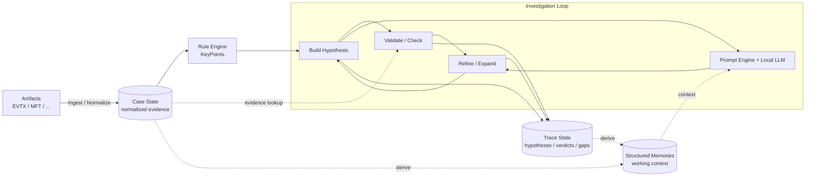
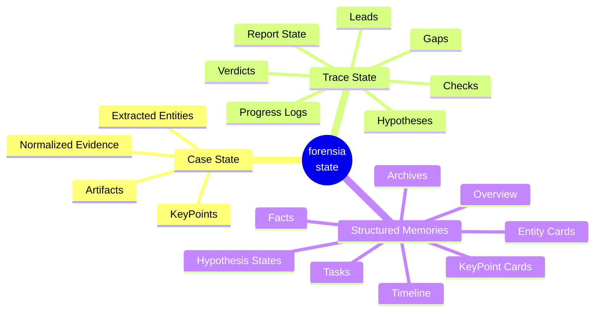

# forensia


あなたの代わりに週末作業してくれるAIフォレンジック調査員。

## 概要

`forensia` (= forensic-ai) は、ローカルLLMを活用して Windows フォレンジック調査の自動化および調査支援を行うツールです。

`gemma4-e2b` や `qwen3.5-9b` といった小規模なローカルLLMでも実用的な推論ができるように、LLMにデータ全体を丸投げするのではなく、原本由来の証拠データ、ルールベース検知の結果、用途ごとに定義されたプロンプト、構造化された記憶を組み合わせながら、細かい単位で仮説の生成、検証を繰り返す設計をしています。


## 開発の背景

Claude のモデル性能が上がった？素晴らしい！ GPT も追従している？未来はきっと明るいですね。  

でも、セキュリティインシデントに関する機微な情報を扱う技術者にはあまり関係のないことです。このような情報は当然、外部に出せません。もちろんクラウド環境にも。  
疑心暗鬼に陥っている人たちならば、自分たちが新たなセキュリティインシデントを産まないようにオフラインで作業するでしょう。私もそうです。

では、オフラインで動く LLM にこのような仕事を任せられるでしょうか。  
試してみました。**とても無理です。**

なぜなら、彼らは厳格なプロンプトを与えなければ指示を曲解するし、あまり長い文章は読めないし、健忘症です。  
なので、私はこれを **アーキテクチャで解決** できないかと考えました。


## 解決したいこと

インシデントの相談というのはたいていが金曜日に来ます。あるいは長期休みの前に。このロジックは以下のとおりです。

- まず、攻撃者は土日の人がいない時間を狙い、システムを侵害します。  
- 月曜に担当者が異変に気づきます。でも家に帰ることのほうが重要なので報告はしません。  
- 火曜の朝、ミーティングで「もしかするとインシデントかもしれない」と共有され、社内調査が開始します。  
- 水曜の終わり頃になって、ようやくインシデントらしいと諦めがつきます。  
- 木曜にベンダへ相談しようという話になり、あなたの会社の営業に連絡が来ますが、残念ながら技術者との間にはレイテンシがあります。  
- 金曜の朝あなたのところにリクエストが届き、月曜に報告をくださいという話になっています。調査対象のデータは、まだ届いていません。  

もううんざりです。あなたの代わりに週末作業してくれる人はいないでしょうか？  
いません。AIの友人以外は。


## 設計原則

### 1. **孤独に戦う**

完全にオフラインでも動作し続けることを重視します。  
ネットワークに繋がれたシステムを週末放置しておけば、月曜の朝に見るのはランサムウェアの脅迫画面かもしれません。

最小システム要件は、eBayで150ドルで買えるGPUにそれが動かせるPC、電力だけです。


### 2. **AIの出力を信じない**

AI を「賢い調査員」として扱わない。  
人間がAIに使われることがあってはいけません。彼らは歯車です。人間が彼らを使うのです。

検知結果から仮説の生成、検証方針の提案、結果の確認、レポート作成などあらゆるタスクをひとくちサイズに分割して何度も推論を重ねつつ処理します。


### 3. **時間は湯水のごとく使う**

一度の実行で完璧な結論を出すことを目指しません。

ひとつの仮説に対して何度も推論を重ね、その過程や記憶を観測可能な形で構造化します。これによって、なぜその結論に至ったのかを人間が理解できるようにします。  
報告書も最後にまとめて書くのではなく、調査の進行に合わせて継続的に更新していきます。


## システム概念図

forensia は、EVTX や MFT などのアーティファクトを DuckDB に正規化し、調査中に参照する証拠データとして保持します。

まず検知ルールで、不審なイベントや注目すべき痕跡を KeyPoints として列挙します。  
次に、それらを起点に仮説を作り、ローカル LLM に小さな検証タスクとして渡します。LLM は調査全体を一度に判断するのではなく、仮説の検証、結果の解釈、次に確認すべき点の提案を繰り返します。

各ループの結果は Structured Memories に整理されます。  
これは単なる会話履歴ではなく、確認済みの事実、未解決の gap、重要なエンティティ、仮説の状態を保持する調査ノートです。

上記のループを繰り返しながら、レポートを継続的に更新し、「何が分かったか」「何が否定されたか」「何が足りないか」を整理していきます。





## 仮説検証ループの流れ

次のループを繰り返しながら、調査状態を整理します。

1. KeyPoints と既存の調査状態から、追うべき仮説を追加・更新し、active hypotheses を順に検証する
2. 仮説を検証するためのクエリや確認観点を生成する
3. DuckDB 上の証拠データを参照して検証する
4. 結果を `confirmed` / `refuted` / `inconclusive` / `newlead` のいずれかに判定する
5. 確認済みの事実、未解決の gap、重要エンティティ、レポート状態を更新する
6. 残った gap や新しい lead を次のサイクルに戻す

| 判定 | 意味 |
|---|---|
| `confirmed` | 仮説を支持する証拠がある |
| `refuted` | 仮説を否定する証拠がある |
| `inconclusive` | 判断材料が不足している |
| `newlead` | 元の仮説とは別に追うべき不審点が見つかった |


## 長期記憶の構造

forensia の長期記憶は、LLMの会話ヒストリではありません。  
証拠データ、調査履歴、LLMに渡す作業記憶を分離して管理します。



### 3 層の記憶

下記のように、不変の証拠層、追記型の履歴層、再生成可能な作業記憶層という、寿命と信頼度の異なる3種の記憶を使い分けることによって、LLMへ与える情報量を制限しつつ、出力が証拠から乖離しないよう制御します。

| 種類 | 場所 | 役割 |
|---|---|---|
| Case State | `db/case.duckdb` | 取り込んだアーティファクトを正規化した証拠データ。証拠の追加などを除き原則としてimmutable。 |
| Trace State | `db/trace.duckdb` | 仮説、検証結果、gap、レポート状態、進捗ログ、調査によって変化する履歴。原則としてappend-only。 |
| Structured Memories | `memory/**/*.md` | Case State と Trace State から、LLM に渡すために再構成したコンテキスト。regeneratable。 |

Structured Memories は、より詳細には下記のようなファイル群で構成されています。

- `memory/`
  - `overview.md`: 常時読む, 要約圧縮する, Overview。ケース全体の短い要約、調査範囲、主要な発見、全体方針。
  - `tasks.md`: 常時読む, 要約圧縮する, Active Tasks。現在の調査ループで残っている gap、lead、未解決タスクの要約。
  - `facts.md`: 優先的に読む, 要約圧縮しない, Active Facts。現在の調査で参照中の確認済み事実。
  - `timeline.md`: 必要なときに読む, 要約圧縮しない, Active Timeline。現在の調査で重要な時刻アンカー。
  - `entities/`: 必要なときに読む, 要約圧縮しない, Entity Cards。現在の調査で重要度が上がったエンティティのカード。
    - `user/`
      - `admin.md`
    - `host/`
      - `DESKTOP-01.md`
    - `ip/`
      - `192.168.1.10.md`
  - `keypoints/`: 必要に応じて読む, 要約圧縮しない, KeyPoint Cards。現在の findings snapshot から同期される注目点のカード。
    - `KP-0001.md`
  - `hypotheses/`: 必要に応じて読む, 要約圧縮しない, Hypothesis States。仮説ごとの現在状態。ファイル名は安定した hypothesis id ベースで、`hypotheses/<hypothesis_id>.md` として参照できる。
    - `H-1.md`
  - `archive/`: 必要に応じて読む, 要約圧縮しない, Archives。過去の判断や解決済み項目の控え。
    - `refuted.md`: 否定済み仮説の控え。
    - `resolved_gaps.md`: 解決済み gap の控え。
    - `timeline_archive.md`: 古いタイムラインの退避先。
  - `evidence/`: 必要に応じて読む, 要約圧縮しない, Evidence Notes。`evidence/suspicious.md` として check フェーズで LLM が指定した不審証拠を蓄積。
    - `suspicious.md`
  - `details/`: 必要に応じて読む, 要約圧縮しない, Detail Records。fact index の詳細本文。
    - `fact-NNN.md`: `facts.md` インデックス行の詳細本文。

なお、LLM のリクエスト / レスポンス本文は `ai_logs/` に保存されます。
これは調査状態の正本ではなく、「AI に何を渡し、何が返ったか」を後から人間が監査するための可観測性ログです。


## クイックスタート

```bash
pip install forensia
```

`.env` を作成して、ローカル LLM の接続先を設定します。

```bash
LLM_BASE_URL="http://127.0.0.1:1234"
LLM_MODEL="google/gemma-4-e2b"
```

EVTX や MFT などのアーティファクトを `input/` に置いて実行します。

```bash
forensia run ./input --out ./case001 --profile windows-basic
```

`run` は、取り込み、正規化、ルール検知、仮説検証、レポート生成までをまとめて実行します。
LLM が未設定の場合、仮説検証はスキップされます。

## 使い方

### 一括実行

```bash
forensia run ./input --out ./case001 --profile windows-basic
```

より長く調査ループを回したい場合は、`--max-iter` を指定します。(デフォルトでは20)

```bash
forensia run ./input --out ./case001 --profile windows-basic --max-iter 50
```

テンプレートを差し替えて調査・レポート生成したい場合は、`--template-dir` を使います。

```bash
forensia run ./input --out ./case001 --template-dir ./my-templates
```

出力先を初期化してやり直す場合は、`--init` を指定します。
このとき `raw/` `findings/` `reports/` と再解析用の実行結果はクリアされますが、`memory/` と `ai_logs/` は保持されます。

```bash
forensia run ./input --out ./case001 --profile windows-basic --init
```

### 調査を続ける

同じケースに対して `investigate` を再実行すると、前回までの仮説、gap、Structured Memories、レポート状態を引き継いで調査を続けます。
`investigate` は LLM が必須です。`LLM_BASE_URL` と `LLM_MODEL` を `.env` または CLI オプションで設定してください。

```bash
forensia investigate case001 --max-iter 50
forensia investigate case001 --template-dir ./my-templates
```

### 追加エビデンスを入れる

追加で EVTX / MFT などが届いた場合は、同じケースに取り込みます。
既に取り込まれたファイルは hash により重複を避けます。

```bash
forensia add case001 ./input
```

### レポートを生成する

既存のレポート状態からレポートを出力します。

```bash
forensia report case001
```

LLM を使ってレポートセクションを再生成したい場合は、`report-write` を使います。
`report-write` は LLM が必須です。`LLM_BASE_URL` と `LLM_MODEL` を `.env` または `--llm-base-url` / `--model` で設定してください。

```bash
forensia report-write case001
forensia report-write case001 --template-dir ./my-templates
```

テンプレートを編集したい場合は、同梱テンプレートを任意の場所へ書き出せます。

```bash
forensia templates-export ./my-templates
```

### UI で確認する

ケースの調査状態やレポートの途中経過をブラウザで確認します。

```bash
forensia serve case001 --host 127.0.0.1 --port 8000
```


## 注意事項

- このツールの目的は、あなたの代わりに報告書の材料を探すことです。出力結果は必ず人間が検証してください
- オフラインでの動作を前提とした設計ですが、環境のインストールやLLMの設定には別途準備が必要です。
- forensia はまだ開発中です。あなたの[貢献](CONTRIBUTING.md)を歓迎します！
