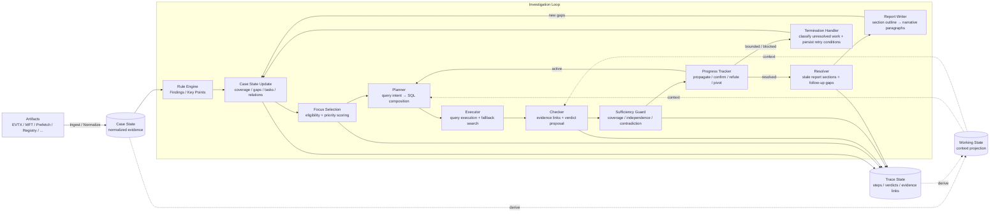
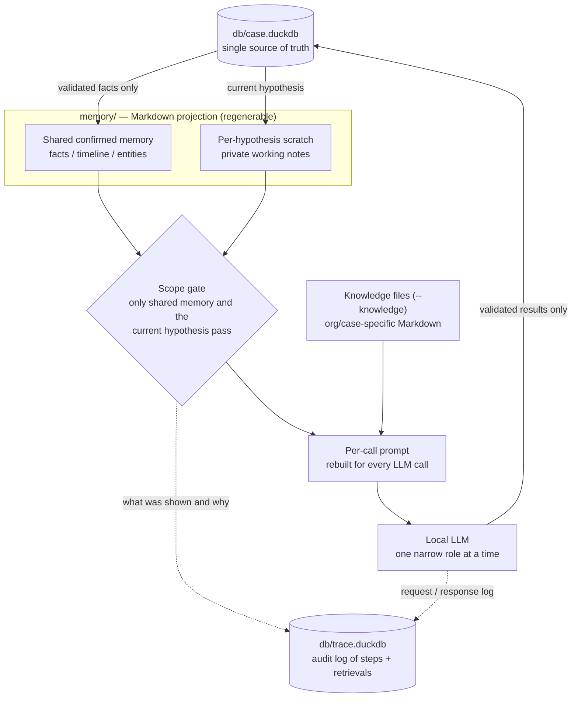

# forensia


**Your local AI assistant for weekend forensic work.**

---

## Overview

**forensia is an experimental local-LLM harness for Windows digital forensic investigations.** You give it artifacts that have already been acquired from a target machine (EVTX, MFT, Prefetch, Registry hives), and it uses a local LLM to generate and verify investigation hypotheses and to continuously update a report. It does not collect evidence from live systems, and the model is only asked to handle one narrow step at a time.

Incident data is often too sensitive to send anywhere — sometimes it cannot even leave the machine. So forensia is designed to run fully offline, on hardware a small CSIRT can actually afford, with small local models in the 4B–8B range. Models that small misread instructions, lose long context, and repeat mistakes; the harness exists to compensate for exactly that. It is not an AI wrapper for speeding up existing tools, but an architectural experiment in treating a weak LLM as one component of an investigation loop.

Three principles drive the design:

1. **Fight alone** — keep working fully offline, in isolated environments.
2. **Do not over-expect from the LLM** — the model only gets tasks that are hard to build statically (hypothesis generation, interpretation, report prose). Everything deterministic — evidence search, priority scoring, state transitions, persistence — runs in code.
3. **Spend time like water** — no perfect conclusion in one pass. Hold multiple hypotheses, iterate with bounded stopping conditions, and update the report continuously as the investigation progresses.

## Screenshots


Investigation cockpit showing case progress, hypotheses, findings, and report sections.


Generated forensic report with evidence-backed findings and investigation context.

## Quick start

### Requirements

* Python 3.14 or later
* Windows forensic artifacts that have already been collected: EVTX, MFT, Prefetch, and/or Registry hive files
* An OpenAI-compatible LLM server, typically local (e.g. LM Studio or a llama.cpp server), for hypothesis testing and report writing

forensia itself does not require a GPU; model speed and quality depend on the backend serving the LLM.

### Installation

```bash
pip install forensia
```

You can also use:

```bash
uvx forensia investigate case001 ./input --profile windows-basic
uv tool install forensia
```

For development:

```bash
git clone https://github.com/sumeshi/forensia.git
cd forensia
uv sync --dev
```

### LLM backend configuration

Point forensia at your model endpoint with environment variables or a local `.env` file:

```bash
export LLM_BASE_URL="http://127.0.0.1:1234"
export LLM_MODEL="google/gemma-4-e4b"
```

You can start from the example file:

```bash
cp .env.example .env
```

Do not commit `.env`. Note that "local tool" does not automatically mean "no data leaves the machine": if `LLM_BASE_URL` points to a cloud or external endpoint, prompts containing case-derived evidence and summaries will be sent there. For sensitive investigations, use a local or offline LLM backend.

### Run an investigation

Place artifacts in an input directory and run:

```bash
forensia investigate case001 ./input --profile windows-basic
```

Other common operations:

```bash
forensia investigate case001 --max-iter 50    # continue an existing case with more cycles
forensia add case001 ./new-input              # ingest additional evidence
forensia report case001 --write               # regenerate report sections with the LLM (reports are also visible in the web UI)
forensia templates-export ./my-templates      # export the packaged templates
forensia investigate case001 ./input --template-dir ./my-templates   # use custom report templates
forensia investigate case001 ./input --knowledge ./knowledge.sample  # inject organization-specific knowledge
forensia serve case001 --port 8000            # open the local web UI (cockpit)
```

### What gets generated

The `case_dir` argument (`case001` above) becomes the case directory itself — forensia does not nest output under a separate build folder:

```
case001/
├─ raw/                 · Parsed artifact records (JSONL) staged during ingest
├─ db/case.duckdb       · Normalized evidence + hypotheses + findings + report sections
├─ db/trace.duckdb      · Investigation steps and retrieval telemetry
├─ memory/              · Regenerable Markdown projection used to build LLM context
├─ ai_logs/             · Raw LLM input/output logs (per-phase JSON)
├─ report_template/     · Case-local copy of editable report templates and formats
├─ reports/             · report.md / report.html / structured CSV / UI snapshots
├─ findings/            · Per-rule finding details
├─ allowlist.yaml       · Per-case suppression rules for known-benign findings
└─ manifest.yaml        · Case metadata
```

> **Before you rely on the output**
>
> * Auto-generated findings require human verification against the source evidence before use. They must not feed legal or disciplinary decisions directly, and they do not replace the original evidence.
> * Work on read-only copies of artifacts, never on originals.
> * Case directories contain evidence-derived data (databases, memory files, AI logs). Do not publish them. See [SECURITY.md](SECURITY.md).

## Current capabilities

What works today:

* Ingestion and normalization of EVTX, MFT, Prefetch, and Windows Registry artifacts into DuckDB through the same staged adapter pipeline. Registry records retain their dataset and contributor provenance; because the parser cannot prove per-plugin completeness, Registry coverage remains partial and an empty result is not treated as evidence of absence. The current adapter interface can be used to add other artifact types, although it is not yet stable (see [docs/extending.md](docs/extending.md)).
* A rule engine that produces findings, key points, and hypothesis seeds from declarative rulepacks.
* A case-aware investigation loop: hypothesis seeding, deterministic next-best-focus selection, SQL query planning and composition, execution with fallback search, evidence sufficiency reconciliation, verdict propagation, and finding extraction.
* Lightweight hypothesis relationships (`parent_of`, `prerequisite_for`, `derived_from`, `contradicts`, `alternative_to`, and `supersedes`) stored in DuckDB and validated in Python, without a graph database.
* Evidence coverage and observability tracking that distinguishes a negative query result from unavailable, incomplete, failed, or unsupported evidence sources. Raw artifact timestamps remain available while sentinel, overflow, parser-invalid, and case-window outliers are excluded from analysis ranges with reason counts.
* Incremental report generation from templates, refreshed as findings are confirmed, exported as Markdown and HTML.
* A local web UI (`forensia serve`) showing investigation progress, findings, hypotheses, report sections, timeline data, and evidence references.
* Knowledge injection from a local folder of Markdown files (`--knowledge`), used to bring organization- or case-specific context into prompts.

In the configurations tested during development — small local models such as `google/gemma-4-e4b` and `qwen/qwen3.5-9b` served through an OpenAI-compatible local server — the models are not reliable enough to drive a long, unstructured investigation on their own. forensia's architecture exists to compensate for exactly that. Larger or newer models may behave differently; the harness does not assume any specific model.

## Architecture

At the center of forensia is the repetition of hypothesis and verification. Simplified:

1. Ingest traces and normalize them into an investigable form
2. Generate hypotheses, seeded by rule-based detections
3. Select the next hypothesis to verify
4. Search the actual evidence and verify the hypothesis
5. Judge and record the result, and reflect it in the report
6. Return unresolved questions to the next cycle

Only work where a language model is genuinely useful — generation and interpretation — goes to the LLM; everything deterministic runs in code.



A weak LLM would get lost running this loop alone, so it is held together by three pillars:

**1. Hypothesis verification bound to evidence.** LLM output is never stored as fact directly; the actual evidence is searched and checked first. Verdicts are managed as five states (`confirmed`, `refuted`, `inconclusive`, `untestable`, `newlead`), and code re-checks the referenced evidence, independence, contradictions, and observability before anything settles. A zero-row result is not refutation: only when the evidence source exists, the window is covered, and the result is still empty does refutation come into view. Hypothesis generation is seeded by rules that declare investigative intent — what was detected, why it matters, what to check next — rather than left to the model's imagination:

```yaml
id: windows-security-4624-rdp-logon
query: SELECT ... FROM evtx_events WHERE event_id = 4624 AND logon_type = '10'
finding:
  title: RDP logon for {target_user}
hypotheses:
- id: lateral_movement_via_rdp
  description: RDP logon from {src_ip} to {computer} may indicate lateral movement
  confirm_when: { co_observed_event_ids: [4624], same_host: true, within_minutes: 5 }
  refute_when: { zero_rows: true }
  follow_up_questions:
  - Was this RDP session followed by process execution (4688) on {computer}?
correlate_with:
- { event_ids: [4625, 4768, 4776], rationale: preceding failures or kerberos/NTLM auth }
```

**2. Structured memory.** Three layers: **Case State** (`case.duckdb`, the single source of truth — evidence, findings, hypotheses, tasks, report progress), **Trace State** (`trace.duckdb` — why each state was reached: per-step I/O, judgments, focus-selection scores), and **Working State** (a regenerable projection that rebuilds, per LLM call, only the context the current role needs). Unconfirmed information is isolated per hypothesis and never leaks into another. External knowledge in the [OKF format](https://cloud.google.com/blog/products/data-analytics/how-the-open-knowledge-format-can-improve-data-sharing) is selected deterministically and injected as reference material, never as instructions.



**3. Auditability of the investigation process.** Information is managed by role — **Evidence** (normalized rows), **Finding** (observed phenomena), **Hypothesis** (interpretations to verify), **Claim** (assertions in the report, linked to their grounds), **Gap** (missing information) — so unverified hypotheses cannot become remembered facts. The report itself is investigation state: tables come from code, prose comes from the LLM paragraph by paragraph, and every section records the evidence it used. Excluded or suppressed data is never deleted; the value and the reason for exclusion are kept as state. What matters is not that the AI believes it is right, but that a human can verify correctness afterwards.

Full details are in [docs/architecture.md](docs/architecture.md) and [docs/data-model.md](docs/data-model.md).

### Design choices

* **The investigation loop lives outside the model.** Rather than giving an LLM direct control of analysis tools, forensia turns results into the next question, selects evidence, and carries unresolved work forward through deterministic orchestration.
* **Own rules instead of Sigma reuse.** Rule ecosystems like [Sigma](https://github.com/sigmahq/sigma) encode what to detect; forensia's rules additionally encode what to investigate next, so they carry intent and hypothesis hints alongside detection SQL.
* **No internal Tool Calling.** Small local models handle it unreliably, and depending on a specific model's implementation would narrow the choice of backends. The backend is only asked for OpenAI-compatible `chat/completions` with role-specific structured output; execution, validation, routing, and state transitions stay in code.

## Roadmap

The current goal is not a tool accurate enough to replace practice; it is to find out how much of what static rules and fixed processing cannot handle can be covered architecturally with a weak local LLM.

* **Broadening the evidence.** Today's traces ([EVTX](https://github.com/sumeshi/evtx2es), [MFT](https://github.com/sumeshi/mft2es), [Prefetch](https://github.com/sumeshi/prefetch2es)) came first because they fit a uniform pipeline. Browser records, registry data, and other messier traces will be added where the effort is lower and the payoff higher — full coverage is not the goal.
* **Multi-host support.** Real incidents rarely involve one machine. Each host must be treated independently while accounts, IPs, processes, and timelines are examined across them — a large design change.
* **Measuring investigation quality.** In local trials with the [CFReDS](https://cfreds-archive.nist.gov/data_leakage_case/data-leakage-case.html) data-leakage case, runs have come close to the answer on 8–9 of 12 questions (a handful of runs, one model and configuration — not an official result). Beyond answer accuracy, evaluation will also track hypothesis diversity, memory duplication, and LLM call patterns, since chasing benchmark answers alone can degrade the investigation itself.

Benchmark notes are in [BENCHMARK.md](BENCHMARK.md), with ground-truth answers in [BENCHMARK-ANSWERS.md](BENCHMARK-ANSWERS.md). The repository does not include forensic datasets; obtain them from the original public sources. Benchmark-specific behavior should come from templates, profiles, or rules — never from hidden assumptions in the core engine.

## Development status and contributing

forensia is in **early development**. The architecture, internal schemas, templates, rule formats, command-line interface, and repository layout may change significantly. Treat it as a working research prototype, and remember that auto-generated findings always require human verification.

Contributions are welcome. A few notes to make them land smoothly:

* Core architecture is the current priority, so improvements to the generic engine are the most impactful contributions right now.
* forensia prefers declarative changes: detection knowledge, investigation hints, schema cards, and report behavior should go into rulepacks and templates before core code.
* Rule and template formats are still likely to change. For larger rule additions, please open an issue first so we can discuss the direction before you invest time.

See [CONTRIBUTING.md](CONTRIBUTING.md) for the package map, call-flow diagrams, and development guidelines. Concrete extension recipes are in [docs/extending.md](docs/extending.md), with the full document index in [docs/README.md](docs/README.md).

## Safety notes

The warning under [What gets generated](#what-gets-generated) covers the essentials — human verification, read-only artifact handling, and not publishing case directories. See [SECURITY.md](SECURITY.md) for the full data-handling and disclosure policy, including guidance on cloud vs. local LLM endpoints.

## License

forensia is released under the [MIT License](LICENSE).
