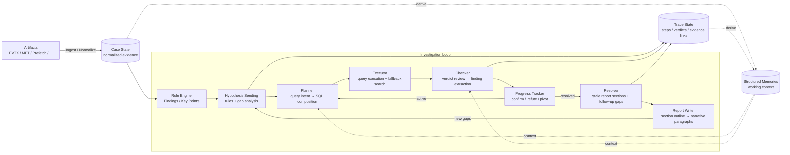

# forensia


**Your local AI assistant for weekend forensic work.**

---


Investigation cockpit showing case progress, hypotheses, findings, and report sections.


Generated forensic report with evidence-backed findings and investigation context.

## Overview

`forensia` blends **forensics** and **AI**.

It is an experimental tool for assisting Windows forensic investigations with local LLMs. The goal is not to throw an entire case at a model and hope it behaves like a senior analyst. Instead, forensia builds a harness around the model: the investigation is broken into small, inspectable steps — collecting evidence, generating hypotheses, checking them against source-derived data, extracting findings, and continuously updating a report — and the model is only asked to handle one narrow step at a time.

The project starts from two practical constraints:

> Forensic data is sensitive. It often cannot be sent to a hosted AI service, and sometimes cannot leave the local machine at all. Also, a model large enough to work through a whole case on its own can be prohibitively expensive to run locally.

So forensia bets on the opposite approach: small local models, made useful by the architecture around them.

Models such as `google/gemma-4-e4b` or `qwen/qwen3.5-9b` are not strong enough to read everything, remember everything, and reason correctly for hours without help. forensia therefore combines normalized evidence, rule-based signals, structured prompts, deterministic checks, and persistent memory so that the model is never asked to solve the whole case at once.

## Development status

forensia is in **early development**.

The architecture, internal schemas, templates, rule formats, command-line interface, and repository layout may change significantly. The current design should be treated as a working research prototype rather than a stable platform.

Contributions are welcome, and breaking changes are expected. Because of that, work on the core logic is the most valuable kind of contribution. Case-specific pieces such as individual rules are lower priority: they move quickly, and depending on your needs it may be easier to maintain them in your own fork — tuned per user or per engagement — rather than upstream.

## Why this exists

Modern frontier models are impressive. Claude gets better, GPT gets better, and the future looks bright.

But that does not help much when you are handling sensitive incident-response data.

In many real investigations, the evidence cannot leave the organization. It cannot be uploaded to a cloud API. It may not even be safe to work on a network-connected machine. If you are paranoid enough to investigate an incident properly, you may also be paranoid enough to work offline. In the most sensitive cases, even the analysis environment may need to remain isolated, be wiped, or be disposed of afterwards.

So the question is:

> Can an offline LLM help with forensic work?

I tried.

**Not directly.**

Small local models misunderstand strict instructions, lose track of long context, forget previous reasoning, and sometimes repeat the same bad inference again and again. The solution is not to pretend they are smarter than they are. The solution is architecture.

forensia is an attempt to make weak models useful by surrounding them with structure.

## The weekend problem

Incident requests often arrive on Fridays.

The pattern is familiar:

* Attackers compromise systems when nobody is watching.
* Someone notices something strange on Monday.
* It is discussed internally on Tuesday.
* By Wednesday, people admit that it may be an incident.
* On Thursday, someone decides to ask a vendor.
* On Friday morning, the request reaches the engineer.
* The report is expected by Monday.
* The data has not arrived yet.

This is exhausting.

It would be nice if someone could work through the weekend for you.

There is no such person.

There may be an AI friend.

## Design principles

### 1. Fight alone

forensia is designed to keep working in offline or isolated environments.

If a system involved in an investigation is left connected to the network over the weekend, the thing waiting on Monday morning may not be a progress report. It may be a ransomware note.

The minimal operating assumption is intentionally modest: a local machine, a cheap GPU if available, storage, and electricity.

### 2. Do not trust the AI

forensia does not treat the model as a brilliant investigator.

The model is a component. It is not the authority.

The system divides work into small roles: identifying gaps, drafting hypotheses, planning queries, composing SQL, reviewing verdicts, extracting findings, outlining sections, and writing paragraphs. Each role is intentionally narrow enough that its purpose can be stated in one sentence.

Anything that can be decided deterministically should be handled by code, not by the model. SQL validation, duplicate-query detection, structured routing, fallback behavior, evidence mapping, and consistency checks should be predictable and auditable.

A model verdict is not accepted just because the model says it is true. Claims must be grounded in actual query results and source-derived evidence. If a finding cannot be tied back to evidence, it should not become durable memory.

### 3. Spend time, not trust

forensia does not try to produce a perfect conclusion in one pass.

Instead, it repeatedly generates, tests, refines, and records hypotheses. The investigation process itself should be observable. A human should be able to ask:

> Why did the system believe this?

and trace the answer back to evidence, intermediate reasoning, and report output.

The report is not written only at the end. It is continuously refreshed as the investigation progresses. Confirmed findings update the report; unresolved gaps can feed the next investigation cycle.

## What forensia is not

forensia is not intended to be a simple wrapper around existing detection rules.

There are already many valuable rule ecosystems, such as Sigma rules, and they represent a large amount of human knowledge. But simply feeding those results to an LLM and asking for a summary is not the main goal here.

That would make the AI a summarizer of detections.

forensia is trying to explore something different:

> AI-assisted investigation, not AI-generated detection summaries.

Rules are still important. The project includes key rules where they help the investigation. But the more important design idea is this:

> **Rules should express investigative intent, not only detection logic.**

This is the single most important idea behind forensia's rule design. A good rule should not just record what was detected — it should help the system understand what the user may want to investigate next. As models improve, this intent-rich structure should become more valuable: the model can read not only what was detected, but why that detection matters and where the investigation should go.

## Architecture at a glance

forensia works as an investigation loop.



At a high level:

1. Artifacts such as EVTX, MFT, Prefetch, browser data, or email traces are ingested and normalized.
2. Rules produce findings, key points, and possible hypotheses.
3. The system drafts and tests hypotheses in small steps.
4. SQL queries are generated, validated, executed, and checked.
5. Confirmed evidence becomes structured findings and durable memory.
6. Report sections are refreshed as new findings are confirmed.
7. Gaps in the report can feed the next investigation cycle.

The model is used where language and judgment are useful. Code is used where determinism and auditability matter.

This separation is central to the project.

## Why retrieval matters

A major lesson from this project is that weaker models need more than prompts.

They need the right information at the right time.

When a model starts from insufficient context, it may make a wrong inference. If that wrong inference is then repeated back into later prompts, the model can rediscover the same mistaken idea again and again. This creates a loop of bad reasoning.

The long-term direction for forensia is therefore strongly tied to retrieval-augmented generation.

A future version should be able to use a local “second brain”: a folder of documents, notes, reports, playbooks, references, and user-collected knowledge. The system should index that material with full-text search, retrieve relevant fragments when needed, and pass them to the model as context.

This is similar in spirit to the kind of search engine being explored in `sumeshi/roughsearch`.

The point is not to make the prompt longer. The point is to trigger the right neurons.

For local models, good retrieval may be as important as the model itself.

## Efficiency by architecture

forensia is designed to make local LLMs useful without pretending they are frontier models.

Important techniques include:

* **Declarative knowledge layers**
  Rules, schema cards, report templates, question specifications, and investigation hints should be editable as YAML or Markdown where possible.

* **Evidence availability profiles**
  The system should know what evidence exists before asking the model to reason about it. A hypothesis that depends on unavailable telemetry should be marked as untestable, not treated as false.

* **Small prompts for small tasks**
  The model should not receive the entire case. It should receive only the context needed for the current task.

* **Deterministic gates**
  The system should verify that model claims are supported by actual evidence before accepting them.

* **Structured memory**
  Confirmed facts, entities, timelines, hypotheses, and findings should be stored in durable, inspectable formats.

* **Incremental reporting**
  Reports should evolve with the investigation rather than being generated as a final black box.

* **Human auditability**
  Outputs should link back to evidence wherever possible. The human investigator remains responsible for the final judgment.

## Quick start

### Requirements

* Python 3.14 or later
* Windows forensic artifacts such as EVTX, MFT, Prefetch, browser data, or related evidence
* A local OpenAI-compatible LLM server for hypothesis testing and report writing
  Examples include LM Studio or llama.cpp server.

### Installation

```bash
pip install forensia
```

You can also use:

```bash
uvx forensia ...
uv tool install forensia
```

For development:

```bash
git clone https://github.com/sumeshi/forensia.git
cd forensia
uv sync --dev
```

### Local LLM configuration

Set your local model endpoint with environment variables or a local `.env` file:

```bash
export LLM_BASE_URL="http://127.0.0.1:1234"
export LLM_MODEL="google/gemma-4-e4b"
```

You can start from the example file:

```bash
cp .env.example .env
```

Do not commit `.env`.

### Run an investigation

Place artifacts in an input directory and run:

```bash
forensia investigate case001 ./input --profile windows-basic
```

To run more investigation cycles:

```bash
forensia investigate case001 ./input --profile windows-basic --max-iter 50
```

To use custom report templates:

```bash
forensia investigate case001 ./input --template-dir ./my-templates
```

### Continue an existing case

```bash
forensia investigate case001 --max-iter 50
```

### Add more evidence

```bash
forensia add case001 ./new-input
```

### Generate or refresh a report

```bash
forensia report case001
forensia report case001 --write
forensia report case001 --write --template-dir ./my-templates
```

### Export templates

```bash
forensia templates-export ./my-templates
```

### Open the local UI

```bash
forensia serve case001 --host 127.0.0.1 --port 8000
```

The UI provides a cockpit for investigation progress, findings, hypotheses, report sections, timeline data, and evidence references.

## Safety notes

* forensia is an investigation aid, not a replacement for human review.
* Always verify findings against source evidence.
* Use a local or offline LLM for sensitive investigations.
* If `LLM_BASE_URL` points to a cloud or external endpoint, prompts may include case-derived evidence or summaries.
* Do not publish real case directories, raw evidence, reports, AI logs, memory files, DuckDB databases, email stores, disk images, or other investigation artifacts.
* See `SECURITY.md` for more details.

## Contributing

forensia is designed to prefer declarative changes where possible.

If you want to add detection knowledge, investigation hints, schema cards, report behavior, or structured question handling, start with the rulepacks and template layers before modifying core code.

Core code should stay focused on generic mechanisms. Case-specific pieces such as individual rules may be better discussed first. They tend to move quickly, and some may be better maintained as external profiles or forks tuned for a specific user, dataset, or engagement.

See `CONTRIBUTING.md` for development guidelines.

## Benchmarks

Benchmark-related notes are documented in `BENCHMARK.md`.
Ground-truth answers for the scored questions are documented in `BENCHMARK-ANSWERS.md`. These are derived from the public NIST CFReDS dataset and are intended for evaluation reference only — do not optimize code or prompts against specific answers (see `CONTRIBUTING.md`).

The repository does not include large forensic datasets or derived case directories for size, license, and sensitivity reasons. Obtain benchmark data from the original public sources when needed, extract artifacts into a local working directory, and run forensia against that local copy.

Example:

```bash
forensia templates-export ./benchmark-templates
forensia investigate benchmark-output ./path/to/extracted-artifacts --profile windows-basic --template-dir ./benchmark-templates
forensia report benchmark-output
```

Benchmark templates and scoring-oriented configuration may be documented separately from the core project. The important architectural goal is that benchmark-specific behavior should come from templates, profiles, or rules, not from hidden assumptions in the core engine.

## Future plans

Important future directions include:

* stronger retrieval-augmented generation
* a local second-brain style knowledge folder
* integration with full-text search over user-collected references
* more declarative investigation profiles
* clearer separation between generic engine logic and case-specific knowledge
* better template documentation
* more stable contribution boundaries as the project matures

The long-term goal is not merely to automate reports.

The goal is to build an offline investigation assistant that can use evidence, rules, memory, retrieval, and human intent to help answer the question:

> What actually happened?

And, just as importantly, to let a human trace exactly how that answer was reached — and decide whether to trust it.
