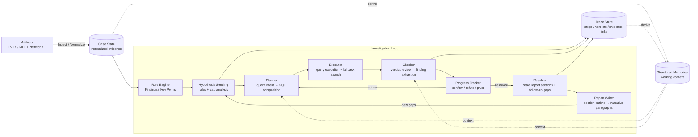
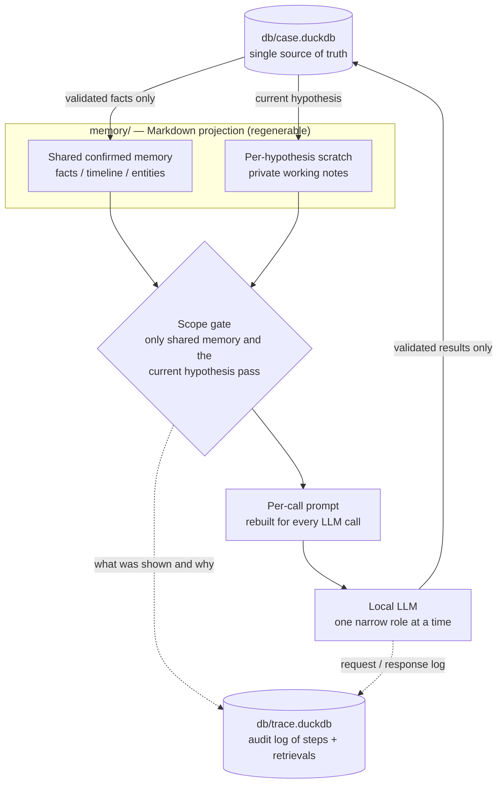

# forensia


**Your local AI assistant for weekend forensic work.**

---


Investigation cockpit showing case progress, hypotheses, findings, and report sections.


Generated forensic report with evidence-backed findings and investigation context.

## Overview

`forensia` blends **forensics** and **AI**.

It is an experimental tool for assisting Windows forensic investigations with local LLMs. It does not collect evidence from live systems: you give it artifacts that have already been acquired (EVTX, MFT, Prefetch), and it ingests and normalizes them, generates and tests hypotheses against the normalized data, extracts findings, and continuously updates a report. The model is only asked to handle one narrow step at a time.

Two ideas drive the design:

1. **Small local models, made useful by architecture.** Forensic data is sensitive — it often cannot be sent to a hosted AI service, and sometimes cannot leave the local machine at all. A model large enough to work through a whole case on its own can be impractical or expensive to run locally. So forensia surrounds resource-constrained local models with normalized evidence, rule-based signals, structured prompts, deterministic checks, and persistent memory, so the model is never asked to solve the whole case at once.
2. **Rules should express investigative intent, not only detection logic.** A good rule does not just record what was detected — it tells the system why the detection matters and what to investigate next.

Incident requests tend to arrive on Friday, with a report expected by Monday. It would be nice if someone could work through the weekend for you. There is no such person. There may be an AI friend.

## Quick start

### Requirements

* Python 3.14 or later
* Windows forensic artifacts that have already been collected: EVTX, MFT, and/or Prefetch files
* An OpenAI-compatible LLM server, typically local (e.g. LM Studio or a llama.cpp server), for hypothesis testing and report writing

forensia itself does not require a GPU; model speed and quality depend on the backend serving the LLM.

### Installation

```bash
pip install forensia
```

You can also use:

```bash
uvx forensia investigate case001 ./input --profile windows-basic
uv tool install forensia
```

For development:

```bash
git clone https://github.com/sumeshi/forensia.git
cd forensia
uv sync --dev
```

### LLM backend configuration

Point forensia at your model endpoint with environment variables or a local `.env` file:

```bash
export LLM_BASE_URL="http://127.0.0.1:1234"
export LLM_MODEL="google/gemma-4-e4b"
```

You can start from the example file:

```bash
cp .env.example .env
```

Do not commit `.env`. Note that "local tool" does not automatically mean "no data leaves the machine": if `LLM_BASE_URL` points to a cloud or external endpoint, prompts containing case-derived evidence and summaries will be sent there. For sensitive investigations, use a local or offline LLM backend.

### Run an investigation

Place artifacts in an input directory and run:

```bash
forensia investigate case001 ./input --profile windows-basic
```

To run more investigation cycles:

```bash
forensia investigate case001 ./input --profile windows-basic --max-iter 50
```

To use custom report templates:

```bash
forensia investigate case001 ./input --template-dir ./my-templates
```

To inject organization-specific knowledge into prompts:

```bash
forensia investigate case001 ./input --knowledge ./knowledge.sample
```

Other common operations:

```bash
forensia investigate case001 --max-iter 50    # continue an existing case
forensia add case001 ./new-input              # add more evidence
forensia report case001                       # re-render report files from existing sections (no LLM)
forensia report case001 --write               # regenerate report sections with the LLM, then render
forensia templates-export ./my-templates      # export the packaged templates
forensia serve case001 --port 8000            # open the local web UI (cockpit)
```

### What gets generated

Each case produces a self-contained directory:

```
dist/<case>/
├─ raw/                 · Original artifacts (ingest input)
├─ db/case.duckdb       · Normalized evidence + hypotheses + findings + report sections
├─ db/trace.duckdb      · Investigation steps and retrieval telemetry
├─ memory/              · LLM persistent memory (Markdown, human-readable)
├─ ai_logs/             · Raw LLM input/output logs (per-phase JSON)
├─ reports/             · report.md / report.html / structured CSV / UI snapshots
├─ findings/            · Per-rule finding details
├─ allowlist.yaml       · Finding identifiers to suppress
└─ manifest.yaml        · Case metadata
```

> **Before you rely on the output**
>
> * Auto-generated findings require human verification against the source evidence before use. They must not feed legal or disciplinary decisions directly, and they do not replace the original evidence.
> * Work on read-only copies of artifacts, never on originals.
> * Case directories contain evidence-derived data (databases, memory files, AI logs). Do not publish them. See [SECURITY.md](SECURITY.md).

## Current capabilities

What works today:

* Ingestion and normalization of EVTX, MFT, and Prefetch artifacts into DuckDB. The current adapter interface can be used to add additional artifact types, although it is not yet stable (see [docs/extending.md](docs/extending.md)).
* A rule engine that produces findings, key points, and hypothesis seeds from declarative rulepacks.
* An LLM-driven investigation loop: hypothesis seeding, SQL query planning and composition, execution with fallback search, verdict review, and finding extraction.
* Incremental report generation from templates, refreshed as findings are confirmed, exported as Markdown and HTML.
* A local web UI (`forensia serve`) showing investigation progress, findings, hypotheses, report sections, timeline data, and evidence references.
* Knowledge injection from a local folder of Markdown files (`--knowledge`): the specified files are loaded and injected into prompts. There is no full-text indexing, search, or ranking yet.

Not yet implemented (see [Roadmap](#roadmap)): indexed retrieval (full-text search, ranking, fragment selection) over a general-purpose local document collection, browser and email artifact adapters, and stable rule/template formats.

### Tested model configurations

In the configurations tested during development — small local models such as `google/gemma-4-e4b` and `qwen/qwen3.5-9b` served through an OpenAI-compatible local server — the models are not reliable enough to drive a long, unstructured investigation on their own: they may misread strict instructions, lose track of long context, and repeat bad inferences. forensia's architecture exists to compensate for exactly that. Larger or newer models may behave differently; the harness does not assume any specific model.

## Design principles

### 1. Offline first

forensia is designed to keep working in offline or isolated environments.

Investigation environments are often isolated for good reasons: regulatory requirements, contractual obligations, evidence preservation, and data classification. And if a compromised system is left connected to the network over the weekend, the thing waiting on Monday morning may not be a progress report — it may be a ransom note.

The minimal operating assumption is a local machine, with a GPU if available.

### 2. Do not trust the AI

The model is a component, not the authority.

The system divides work into small roles: identifying gaps, drafting hypotheses, planning queries, composing SQL, reviewing verdicts, extracting findings, outlining sections, and writing paragraphs. Each role is narrow enough that its purpose can be stated in one sentence. Anything that can be decided deterministically is handled by code, not by the model.

**Current safeguards** (enforced in code today):

* LLM-generated SQL is restricted to validated read-only queries before execution: a single `SELECT` statement, keyword filtering, a table-name allowlist, and a dry run. This is a robustness measure against model mistakes, not a hardened security boundary.
* Routing, template matching, duplicate-query detection, fallback search, and output formatting run deterministically on the code side.
* Hypothesis verdict values are validated against a declared taxonomy; bypassing the validator is treated as a bug.
* Only validated query results are written back to the case database; findings link back to the queries and evidence rows that produced them.
* `--max-llm-calls` provides a hard cap on LLM usage per session.

**Known limitations**: whether a query result actually confirms a hypothesis is still an LLM judgment. A plausible-looking false positive can pass the structural checks and reach the report — which is why human verification of findings remains mandatory.

### 3. Spend time, not trust

forensia does not try to produce a perfect conclusion in one pass. It repeatedly generates, tests, refines, and records hypotheses, and the process itself is observable: a human should be able to ask *"why did the system believe this?"* and trace the answer back through evidence, intermediate reasoning, and report output.

The report is not written only at the end. It is continuously refreshed as the investigation progresses; unresolved gaps feed the next investigation cycle.

### 4. Rules express investigative intent

forensia is not a wrapper around existing detection rules, and not an AI summarizer of detections. Rule ecosystems such as Sigma encode a large amount of human knowledge about *what to detect*; forensia's rules additionally encode *what to investigate next* — why a detection matters and where the investigation should go. As models improve, this intent-rich structure should become more valuable, not less.

## Architecture at a glance

forensia works as an investigation loop.



At a high level:

1. Collected artifacts (EVTX, MFT, Prefetch) are ingested and normalized.
2. Rules produce findings, key points, and possible hypotheses.
3. The system drafts and tests hypotheses in small steps.
4. SQL queries are generated, validated, executed, and checked.
5. Confirmed evidence becomes structured findings and durable memory.
6. Report sections are refreshed as new findings are confirmed.
7. Gaps in the report can feed the next investigation cycle.

The model is used where language and judgment are useful. Code is used where determinism and auditability matter. This separation is central to the project.

### Memory and context

forensia does not treat the model's context window as memory. Instead:

* `case.duckdb` is the single source of truth: normalized evidence and all persistent investigation objects.
* `memory/` is a human-readable Markdown projection of confirmed facts, entities, and timelines, used to assemble prompts. It can be regenerated from the database.
* Each hypothesis gets private scratch notes. A scope gate prevents one hypothesis from reading another's scratch work: memory paths requested by the model are checked against a per-scope allowlist in code (rejecting out-of-scope and traversal paths), not merely left out of the prompt. This keeps a bad inference in one thread from leaking into another.
* Prompts are rebuilt for every LLM call from a compact index; the model can request specific memory files on demand instead of receiving everything.
* `trace.duckdb` records what was retrieved, shown, and rejected for each call, so context assembly is auditable after the fact.



The full data model, including the memory index format and retrieval telemetry, is documented in [docs/data-model.md](docs/data-model.md) and [docs/architecture.md](docs/architecture.md).

## Roadmap

The main lesson from this project so far: small local models need more than good prompts — they need to retrieve the smallest set of relevant context for the current task, at the right time. When a model starts from insufficient context, it makes a wrong inference; when that inference is fed back into later prompts, it rediscovers the same mistake repeatedly.

The long-term direction is therefore strongly tied to retrieval:

* A local "second brain". Today's `--knowledge` option only injects the specified Markdown files into prompts; the goal is general-purpose retrieval — indexing a folder of the user's own documents, notes, reports, and playbooks with full-text search, and pulling only the relevant fragments into prompts on demand. This is similar in spirit to the search engine explored in [sumeshi/roughsearch](https://github.com/sumeshi/roughsearch), which may eventually serve as the retrieval layer for this feature.
* More artifact adapters (browser data, email traces).
* More declarative investigation profiles, and a clearer separation between generic engine logic and case-specific knowledge.
* Better template documentation and more stable rule/template formats.

The long-term goal is not merely to automate reports. It is to build an offline investigation assistant that can use evidence, rules, memory, retrieval, and human intent to help answer *"what actually happened?"* — and to let a human trace exactly how that answer was reached, and decide whether to trust it.

## Benchmarks

Benchmark-related notes are documented in [BENCHMARK.md](BENCHMARK.md).
Ground-truth answers for the scored questions are documented in [BENCHMARK-ANSWERS.md](BENCHMARK-ANSWERS.md). These are derived from the public NIST CFReDS dataset and are intended for evaluation reference only — do not optimize code or prompts against specific answers (see [CONTRIBUTING.md](CONTRIBUTING.md)).

The repository does not include large forensic datasets or derived case directories for size, license, and sensitivity reasons. Obtain benchmark data from the original public sources, extract artifacts into a local working directory, and run forensia against that local copy:

```bash
forensia templates-export ./benchmark-templates
forensia investigate benchmark-output ./path/to/extracted-artifacts --profile windows-basic --template-dir ./benchmark-templates
forensia report benchmark-output   # render the report from the investigated sections (add --write to regenerate them)
```

Benchmark-specific behavior should come from templates, profiles, or rules — never from hidden assumptions in the core engine.

## Development status and contributing

forensia is in **early development**. The architecture, internal schemas, templates, rule formats, command-line interface, and repository layout may change significantly. Treat it as a working research prototype, and remember that auto-generated findings always require human verification.

Contributions are welcome. A few notes to make them land smoothly:

* Core architecture is the current priority, so improvements to the generic engine are the most impactful contributions right now.
* forensia prefers declarative changes: detection knowledge, investigation hints, schema cards, and report behavior should go into rulepacks and templates before core code.
* Rule and template formats are still likely to change. For larger rule additions, please open an issue first so we can discuss the direction before you invest time.

See [CONTRIBUTING.md](CONTRIBUTING.md) for the package map, call-flow diagrams, and development guidelines. Concrete extension recipes are in [docs/extending.md](docs/extending.md), with the full document index in [docs/README.md](docs/README.md).

## Safety notes

* forensia is an investigation aid, not a replacement for human review. Always verify findings against source evidence.
* Do not use auto-generated findings directly for legal or disciplinary decisions.
* If `LLM_BASE_URL` points to a cloud or external endpoint, prompts may include case-derived evidence or summaries. Use a local or offline LLM for sensitive investigations.
* Do not publish real case directories, raw evidence, reports, AI logs, memory files, DuckDB databases, email stores, disk images, or other investigation artifacts.
* See [SECURITY.md](SECURITY.md) for details.

## License

forensia is released under the [MIT License](LICENSE).
