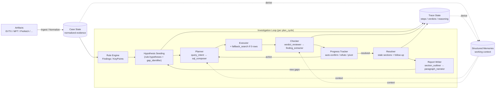

# forensia


あなたの代わりに週末作業してくれるAIフォレンジック調査員。

## 概要

`forensia` (= forensic-ai) は、ローカルLLMを活用して Windows フォレンジック調査の自動化および調査支援を行うツールです。

`gemma3-4b` や `qwen3-8b` といった小規模なローカルLLMでも実用的な推論ができるように、LLMにデータ全体を丸投げするのではなく、原本由来の証拠データ、ルールベース検知の結果、用途ごとに定義されたプロンプト、構造化された記憶を組み合わせながら、細かい単位で仮説の生成、検証を繰り返す設計をしています。


## 開発の背景

Claude のモデル性能が上がった?素晴らしい! GPT も追従している?未来はきっと明るいですね。

でも、セキュリティインシデントに関する機微な情報を扱う技術者にはあまり関係のないことです。このような情報は当然、外部に出せません。もちろんクラウド環境にも。
疑心暗鬼に陥っている人たちならば、自分たちが新たなセキュリティインシデントを産まないようにオフラインで作業するでしょう。私もそうです。

では、オフラインで動く LLM にこのような仕事を任せられるでしょうか。
試してみました。**とても無理です。**

なぜなら、彼らは厳格なプロンプトを与えなければ指示を曲解するし、あまり長い文章は読めないし、健忘症です。
なので、私はこれを **アーキテクチャで解決** できないかと考えました。


## 解決したいこと

インシデントの相談というのはたいていが金曜日に来ます。あるいは長期休みの前に。このロジックは以下のとおりです。

- まず、攻撃者は土日の人がいない時間を狙い、システムを侵害します。
- 月曜に担当者が異変に気づきます。でも家に帰ることのほうが重要なので報告はしません。
- 火曜の朝、ミーティングで「もしかするとインシデントかもしれない」と共有され、社内調査が開始します。
- 水曜の終わり頃になって、ようやくインシデントらしいと諦めがつきます。
- 木曜にベンダへ相談しようという話になり、あなたの会社の営業に連絡が来ますが、残念ながら技術者との間にはレイテンシがあります。
- 金曜の朝あなたのところにリクエストが届き、月曜に報告をくださいという話になっています。調査対象のデータは、まだ届いていません。

もううんざりです。あなたの代わりに週末作業してくれる人はいないでしょうか?
いません。AIの友人以外は。


## 設計原則

### 1. **孤独に戦う**

完全にオフラインでも動作し続けることを重視します。
ネットワークに繋がれたシステムを週末放置しておけば、月曜の朝に見るのはランサムウェアの脅迫画面かもしれません。

最小システム要件は、eBayで150ドルで買えるGPUにそれが動かせるPC、電力だけです。


### 2. **AIの出力を信じない**

AI を「賢い調査員」として扱わない。
人間がAIに使われることがあってはいけません。彼らは歯車です。人間が彼らを使うのです。

検知結果から仮説の生成、検証方針の提案、結果の確認、レポート作成などあらゆるタスクをひとくちサイズに分割して何度も推論を重ねつつ処理します。役割は `gap_identifier` / `hypothesis_drafter` / `query_intent_planner` / `sql_composer` / `verdict_reviewer` / `finding_extractor` / `section_outliner` / `paragraph_narrator` のように細かく分割し、それぞれが 1 文で目的を言える粒度に絞っています。

決定論的に決まる処理(SQL の妥当性検証、仮説の同一性判定、構造化質問のルーティングと表組み、フォールバック SQL の生成、重複クエリ検出)は LLM に渡さず、必ずコード側で処理します。LLM を「ルーティング」「リトライ」「フォーマット整形」に使わないことで、出力の予測可能性と監査性を保ちます。


### 3. **時間は湯水のごとく使う**

一度の実行で完璧な結論を出すことを目指しません。

ひとつの仮説に対して何度も推論を重ね、その過程や記憶を観測可能な形で構造化します。これによって、なぜその結論に至ったのかを人間が理解できるようにします。
報告書も最後にまとめて書くのではなく、調査の進行に合わせて継続的に更新していきます。

LLM への入出力は `ai_logs/` に保存され、durable な結論は必ず DuckDB のテーブルに格納されます。evidence_id / finding_id / hypothesis_id によって元証拠まで辿れるため、後から「なぜそう判断したのか」を人間が監査できます。

## アーキテクチャ概観



ループは `plan_cycle` 単位で進み、各サイクルで次の流れを 1 周します。

1. **broad_plan**: `gap_identifier` が未カバーの観測点を抽出し、`hypothesis_drafter` がそれぞれに対し仮説を 1 つずつ起案。コード側で類似仮説を dedup。
2. **plan**: `query_intent_planner` が「何を取りに行くか」を JSON で出し、`sql_composer` が schema_card を見て SELECT 文を生成。
3. **execute**: DuckDB に対し SELECT を発行。0 行のときに限り rule 側の `fallback_search` 宣言が決定論的に発火。
4. **check**: `verdict_reviewer` が verdict を出し、confirmed のときだけ `finding_extractor` が構造化 finding を抽出。
5. **track**: `HypothesisProgressTracker` が confirm_when / 連続 0-row / フィンガープリント重複を見て auto-confirm / auto-refute / pivot を機械的に判定。
6. **resolve**: 仮説が確定すると関連レポートセクションが `stale` 化、follow-up 質問が新たな仮説に投入。
7. **report**: `section_outliner` がレイアウトを決め、`paragraph_narrator` が段落単位で本文を生成。レポートから出た gap は次サイクルの仮説に戻る。

## 効率性のための設計

ローカル LLM の処理時間と精度を両立するため、以下の工夫を施しています。

- **宣言層への知識集約**:Event ID 解説、Logon Type、検知ルール、フォールバック手順、レポートセクションのスタイル指示などは `src/forensia/rulepacks/_schema/` 配下の YAML / Markdown にまとめてあり、Python 側は generic に消費するだけです。新しい攻撃手法や調査観点は YAML 編集で追加できます。
- **schema_card と SQL クックブック**:planner は intent の `target_table` に応じて `_schema/*.yaml` の schema_card を切り替え、`information_schema` から live スキーマを併記します。SQL クックブックは event_id 列挙 / 時間範囲 / GROUP BY / COALESCE / MFT path LIKE / Prefetch の 6 種で、LLM が SQL をゼロから合成しなくて済むようにしています。SQL バリデーション失敗時は `sql_composer` のみを最大 3 回リトライし、巨大プロンプト全体を送り直しません。
- **LLM サーバ障害への耐性**:`chat_completion` は HTTP 5xx / 接続エラー / タイムアウトを最大 3 回まで指数バックオフ(2 / 4 / 8 秒)でリトライします。リトライ枯渇後は `_run_broad_plan_step` が再 raise して投資調査全体を停止させ、空のレポート生成を抑止します。
- **mid-investigation の UI 同期**:調査中は `progress_events.json` に加えて `hypotheses` / `findings` / `attack_coverage` / `report_sections` / `stats` 等の軽量スナップショットを 5 秒間隔で書き出し、webui が長時間調査の途中でも実状態を表示できるようにしています。
- **記憶の圧縮と分離**:`overview.md` は閾値超過時に LLM で要約圧縮し、`facts.md` / `timeline.md` などは構造を保持。仮説検証中の暫定情報は `memory/scratch/H-NNN/` に隔離され、confirmed 時に共有記憶へ昇格、refuted 時は archive へ退避します。これによって未確証の暫定情報が他仮説の検証に汚染することを防ぎます。
- **段落単位の汚染防止**:レポート生成では `paragraph_narrator` が 1 段落ずつ独立して書き、他セクションの本文や全 top-finding を見ません。ブロック間で共有するのは 120 字程度のサマリのみで、序文の使い回しや無関係な finding の流入を構造的に避けています。
- **QuestionSpec による構造化質問**:テンプレートの見出しやコメントは `question_routing.yaml` の安定した `answer_spec` に解決されます。シャットダウン時刻、最終ログオン、メールデータファイル、クラウド同期痕跡などの定型質問は LLM に自由回答させず、決定論的 SQL / builder / CSV/JSON export で処理します。
- **クエリの正規化フィンガープリント**:重複クエリ検出は sqlglot AST ベースで、空白や別名差を無視して「意味的に同じクエリを 2 回出した」を判定します。LLM が同じ問いを言い換えて繰り返すことによる無限ループを防ぎます。
- **LLM 呼び出し総数の硬上限(opt-in)**:`--max-llm-calls N` を超えると `RuntimeError` で停止します。クラウド API への暴走防止用の安全弁で、ローカル LLM 前提の既定値は `0`(無制限)。phase 別の集計は `ai_logs/` から確認できます。

## クイックスタート

```bash
pip install forensia
```

`.env` を作成してローカル LLM の接続先を設定します。

```dotenv
LLM_BASE_URL="http://127.0.0.1:1234"
LLM_MODEL="qwen/qwen3-8b"
# For reasoning models (gemma-4-E*, qwen3-thinking), add budget for reasoning_content.
LLM_REASONING_RESERVE_TOKENS=0
```

アーティファクト (EVTX / MFT / Prefetch など) を `input/` に置き、次を実行します。

```bash
forensia investigate case001 ./input --profile windows-basic
```

`investigate` は取り込み、正規化、ルール検知、仮説検証、レポート生成までを一括で実行します。LLM が未設定の場合、仮説検証フェーズはスキップされます。

## 使い方

### 一括実行 (新規ケース)

```bash
forensia investigate case001 ./input --profile windows-basic
```

長く調査ループを回す場合は `--max-iter` を指定します(既定 20)。

```bash
forensia investigate case001 ./input --profile windows-basic --max-iter 50
```

レポートテンプレートを差し替えるときは `--template-dir` を使います。

```bash
forensia investigate case001 ./input --template-dir ./my-templates
```

出力先を初期化してやり直す場合は `--rerun` を指定します。既存の `raw/` は保持しつつ、正規化テーブル、仮説、レポート本文、section agent の履歴、構造化質問の解決結果などの派生状態を消して再構築します。

```bash
forensia investigate case001 ./input --profile windows-basic --rerun
```

### 調査を続ける (既存ケース)

既存ケースに対して `investigate` を実行すると、前回までの仮説・gap・記憶・レポート状態を引き継いで調査を続けます。`input_dir` は省略可能です。

```bash
forensia investigate case001 --max-iter 50
forensia investigate case001 --template-dir ./my-templates
```

### 追加エビデンスの取り込み

追加で EVTX / MFT などが届いた場合は既存ケースに `add` で取り込みます。重複は hash で避けられます。

```bash
forensia add case001 ./input
```

### レポート

既存のレポート状態から Markdown / HTML を出力します。

```bash
forensia report case001
```

LLM でレポートセクションを再生成するには `--write` フラグを追加します。

```bash
forensia report case001 --write
forensia report case001 --write --template-dir ./my-templates
```

構造化質問の回答は Markdown 本文に加えて `reports/structured/answers.json` と個別 CSV に保存されます。どのテンプレートブロックがどの QuestionSpec に解決されたかは `reports/debug/<section>_questions.json` と `reports/api/section_questions.json` で確認できます。

同梱テンプレートを任意の場所に書き出すには:

```bash
forensia templates-export ./my-templates
```

### UI で確認する

調査状態とレポートの途中経過をブラウザで確認できます。

```bash
forensia serve case001 --host 127.0.0.1 --port 8000
```

UI 画面 (cockpit) は次で構成されます。

- **Header / KPI バー**: ケース名、現在 phase、LLM モデル、Events / Findings / Hypotheses / Open Gaps の 4 KPI。severity / verdict 内訳が積み棒で併記されます。
- **Event Volume**: 全期間を day 粒度で表示し、年→月→日のピッカーで絞り込みます。日まで絞ると hour 粒度に切り替わります。EVTX channel 別の積み棒に検知件数を折れ線で重ねます。
- **Report Draft Progress**: 各セクションの状態 (`draft` / `stable` / `ai_exhausted` / `human_reviewed`) と進捗。
- **ATT&CK Coverage**: `findings.attack` を tactic × technique のマトリックスで集計。
- **Cockpit**: 現在実行中のクエリ / focus 仮説、Active / Resolved Hypotheses / Latest Reasoning タブ、Open Gaps。
- **Top Rules / Top Entities**: 発火ルール上位と、`memory/entities/` から検出された重要 entity。Entity は kind ごとにグルーピングされ、各カードの role / notes 行を2行プレビューします。
- **Details**: findings / steps / sessions / activity / mft の生データタブ。

## 注意事項

- このツールの目的はレポートの材料を半自動で集めることであり、出力結果は必ず人間が検証してください。
- オフライン動作を前提に設計していますが、ローカル LLM の準備 (モデルダウンロード、推論サーバの起動)は別途必要です。
- forensia は開発中のソフトウェアです。実装上の詳細、リポジトリ構成、内部不変条件などは [docs/](docs/) を参照してください。

## ベンチマーク

このツールは `./templates/` にあるベンチマーク専用テンプレートを使用して、DFIR 推論精度を評価できます。ベンチマーク用の Scored Question も通常のレポートテンプレートと同じ QuestionSpec / structured answer 経路で処理されます。

    forensia investigate benchmark-output ./sample/DESKTOP-001 --profile windows-basic --template-dir ./templates
    forensia report benchmark-output

詳細は [BENCHMARK.md](./BENCHMARK.md) を参照してください。
