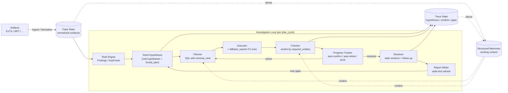
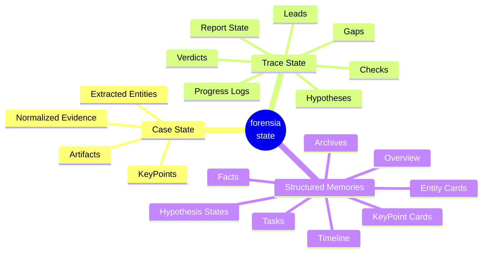

# forensia


あなたの代わりに週末作業してくれるAIフォレンジック調査員。

## 概要

`forensia` (= forensic-ai) は、ローカルLLMを活用して Windows フォレンジック調査の自動化および調査支援を行うツールです。

`gemma4-e2b` や `qwen3.5-9b` といった小規模なローカルLLMでも実用的な推論ができるように、LLMにデータ全体を丸投げするのではなく、原本由来の証拠データ、ルールベース検知の結果、用途ごとに定義されたプロンプト、構造化された記憶を組み合わせながら、細かい単位で仮説の生成、検証を繰り返す設計をしています。


## 開発の背景

Claude のモデル性能が上がった？素晴らしい！ GPT も追従している？未来はきっと明るいですね。  

でも、セキュリティインシデントに関する機微な情報を扱う技術者にはあまり関係のないことです。このような情報は当然、外部に出せません。もちろんクラウド環境にも。  
疑心暗鬼に陥っている人たちならば、自分たちが新たなセキュリティインシデントを産まないようにオフラインで作業するでしょう。私もそうです。

では、オフラインで動く LLM にこのような仕事を任せられるでしょうか。  
試してみました。**とても無理です。**

なぜなら、彼らは厳格なプロンプトを与えなければ指示を曲解するし、あまり長い文章は読めないし、健忘症です。  
なので、私はこれを **アーキテクチャで解決** できないかと考えました。


## 解決したいこと

インシデントの相談というのはたいていが金曜日に来ます。あるいは長期休みの前に。このロジックは以下のとおりです。

- まず、攻撃者は土日の人がいない時間を狙い、システムを侵害します。  
- 月曜に担当者が異変に気づきます。でも家に帰ることのほうが重要なので報告はしません。  
- 火曜の朝、ミーティングで「もしかするとインシデントかもしれない」と共有され、社内調査が開始します。  
- 水曜の終わり頃になって、ようやくインシデントらしいと諦めがつきます。  
- 木曜にベンダへ相談しようという話になり、あなたの会社の営業に連絡が来ますが、残念ながら技術者との間にはレイテンシがあります。  
- 金曜の朝あなたのところにリクエストが届き、月曜に報告をくださいという話になっています。調査対象のデータは、まだ届いていません。  

もううんざりです。あなたの代わりに週末作業してくれる人はいないでしょうか？  
いません。AIの友人以外は。


## 設計原則

### 1. **孤独に戦う**

完全にオフラインでも動作し続けることを重視します。  
ネットワークに繋がれたシステムを週末放置しておけば、月曜の朝に見るのはランサムウェアの脅迫画面かもしれません。

最小システム要件は、eBayで150ドルで買えるGPUにそれが動かせるPC、電力だけです。


### 2. **AIの出力を信じない**

AI を「賢い調査員」として扱わない。  
人間がAIに使われることがあってはいけません。彼らは歯車です。人間が彼らを使うのです。

検知結果から仮説の生成、検証方針の提案、結果の確認、レポート作成などあらゆるタスクをひとくちサイズに分割して何度も推論を重ねつつ処理します。


### 3. **時間は湯水のごとく使う**

一度の実行で完璧な結論を出すことを目指しません。

ひとつの仮説に対して何度も推論を重ね、その過程や記憶を観測可能な形で構造化します。これによって、なぜその結論に至ったのかを人間が理解できるようにします。  
報告書も最後にまとめて書くのではなく、調査の進行に合わせて継続的に更新していきます。


## システム概念図

forensia は、EVTX や MFT などのアーティファクトを DuckDB に正規化し、調査中に参照する証拠データとして保持します。

まず検知ルールで、不審なイベントや注目すべき痕跡を KeyPoints として列挙します。  
次に、それらを起点に仮説を作り、ローカル LLM に小さな検証タスクとして渡します。LLM は調査全体を一度に判断するのではなく、仮説の検証、結果の解釈、次に確認すべき点の提案を繰り返します。

各ループの結果は Structured Memories に整理されます。  
これは単なる会話履歴ではなく、確認済みの事実、未解決の gap、重要なエンティティ、仮説の状態を保持する調査ノートです。

上記のループを繰り返しながら、レポートを継続的に更新し、「何が分かったか」「何が否定されたか」「何が足りないか」を整理していきます。





## 仮説検証ループの流れ

調査は **rule 宣言を起点に駆動される** 短いループです。LLM はループ全体ではなく、各ステップで小さな判断のみを担当します。

1. **Seed**: 検知ルールが findings を出し、ルール側に `hypotheses` 宣言があればそれを仮説雛形として active 入りさせる。同時に broad_plan が現状の gap から追加仮説を提案する。
2. **Plan**: planner LLM が仮説 1 件に対し SQL を 1 本提案する。スキーマカード (`_schema/evtx_events.yaml` の `columns` / `json_field_extractors`) を必ず prompt に渡すため、存在しないカラム参照や JSON 抽出ミスが構造的に防がれる。
3. **Execute**: SQL を DuckDB に発行。0 行だった場合に限り、rule 側の `fallback_search` 宣言（`keyword_in_raw_json` / `related_event_ids` / `artifact_table` の順次フェーズ）が **planner を介さず** 自動実行される。
4. **Check**: checker LLM が `required_entities` の共起と時間順序で verdict を出す。「直接的な因果」「全過程の証明」といった逃げ口上は禁止語として明示。
5. **Track**: `HypothesisProgressTracker` が以下を判定:
    - rule 由来 hyp は `rule.confirm_when.co_observed_event_ids` を、broad_plan 由来 hyp は `hypothesis.confirm_when.co_observed_event_ids` を rows が満たせば → **auto-confirmed**
    - 連続 3 回の 0-row inconclusive → **auto-refuted**
    - 同じ query fingerprint の重複 → planner に **pivot 指示**
    - planner が SQL も template も出せず `confirm_when` も空のため fallback すら組めない hyp → 即 **auto-refuted** (`no executable evidence path`)
6. **Resolve**: 仮説が confirmed/refuted になった瞬間に rule 宣言の `report_sections` を `stale` 化、`follow_up_questions` を新規仮説として注入。
7. **Report**: section refresh は stale フラグの立った section を優先処理。生成した report の gap を次サイクルの仮説に戻す。

アクティブ仮説数は `MAX_ACTIVE_HYPOTHESES = 8` で上限。`_merge_active_hypotheses` が新規追加分をこの値で打ち切り、既存仮説の update には影響しない。

| 判定 | 意味 |
|---|---|
| `confirmed` | 仮説の required_entities が共起する証拠が揃った |
| `refuted` | 矛盾証拠 or 連続 0-row で否定 |
| `inconclusive` | 一部 entity のみ観測、欠落 entity を rationale で明示 |
| `newlead` | 元の仮説とは別に追うべき不審点が見つかった |

### この設計が「効率よく調査する」ために狙うこと

- **rule に知識を集約**: 仮説テンプレ・確証条件・関連 event_id・fallback・follow-up・対応 section はすべて rule YAML に宣言し、Python 側は generic に消費するだけ。新しい攻撃手法は YAML 1 枚で追加できる。
- **LLM の手探りを構造で抑える**: kill-chain 段階別の決まった event_id 集合を rule 宣言から渡すことで、planner が「ログオン試行を再走査」「7045 を再走査」と意味のない探索を繰り返すのを防ぐ。
- **無限ループを宣言的に停止**: `HypothesisProgressTracker` が verdict 履歴と fingerprint 重複から自動で refuted/pivot に持っていく。LLM が `inconclusive` を返し続けても 3 イテレーションで打ち切られる。
- **report と investigation の同期**: 仮説確定の瞬間に該当 section を stale 化するため、確証が出てから report に反映されるまでのラグが最小。confirmed/refuted 仮説は writer に直接渡るので、調査成果が本文に必ず流れる。


## 宣言層 (`_schema/`) の構成

ルール本体 (`rulepacks/*.yaml`) とは別に、`src/forensia/rulepacks/_schema/` 配下に「ルールが参照する共有スキーマ」と「LLM プロンプトに injection する DFIR 知識」を分離して置いている。Python 側は YAML/MD を読むだけで、知識の追加はファイル編集で完結する。

| ファイル | 役割 |
|---|---|
| `evtx_events.yaml` / `mft_entries.yaml` / `mft_timeline.yaml` / `prefetch_executions.yaml` / `findings.yaml` | DB テーブルのスキーマカード。各 YAML は (a) `core_columns` (planner プロンプトに見せる重要列の絞り込み、8〜13 列)、(b) `column_descriptions` (列の用途を 1 行で説明)、(c) `columns` (validator 用の全列リスト)、(d) `json_field_extractors` (NULL 列の raw_json フォールバック) を持つ。planner prompt にはこの 5 テーブル分を `<SCHEMA_CARDS>` ブロックで一括 injection。 |
| `event_ids.yaml` / `logon_types.yaml` | Event ID と Logon Type の DFIR 解説。`_dfir_playbook(phase)` 経由で system prompt に展開。 |
| `app_catalog.yaml` / `artifact_inference.yaml` | Prefetch / MFT / Registry / File 痕跡 → 推定アプリケーション の対応表 (約 28 エントリ)。Application Catalog として prompt 内に narrative 注入される。 |
| `false_positive_rules.yaml` | 既知の FP パターン。検知結果の絞り込みと、prompt の FP Reduction セクションの両方で利用。 |
| `dfir_ioc_catalog.yaml` | アンチフォレンジック・クラウド同期・メール・Recycle Bin など、ルール検知に乗りにくい補助 IOC 辞書。 |
| `question_routing.yaml` | benchmark / section の question_type ごとに `expected_answer_shape` と `evidence_chain` を宣言。block agent prompt に shape spec を injection し、primary 0-row 時に chain の次のエントリを deterministic に試す。 |
| `verdict_taxonomy.yaml` | 4 階層 (`hypothesis_verdict` / `section_verdict` / `benchmark_status` / `claim_status`) の verdict 値のホワイトリストと、層間の変換マッピング。 |
| `playbook/*.md` | フェーズ別 (`broad_plan` / `hypothesis_plan` / `check` / `report_section` / `section_agent_plan` / `section_agent_check`) の DFIR プレイブック本文。inline literal を `prompts.py` から外出ししたもの。`<CRITICAL_RULES>` / `<FORBIDDEN_PATTERNS>` / `<SCHEMA_CONSTRAINTS>` の XML タグ付き。 |

### Verdict taxonomy の強制

`verdict_taxonomy.yaml` で宣言された値以外を DB に書けないよう、書き込み境界の 3 箇所で `forensia.core.verdicts.assert_valid_verdict` を呼んでいる:

- `hypothesis_manager.py:_upsert_hypothesis()` — hypothesis_verdict
- `section_agent.py:_store_section_run()` — section_verdict (normalize map で `sufficient`→`block_supported` 等を吸収)
- `report/writer.py:_normalize_benchmark_answer()` — benchmark_status

加えて `Hypothesis.verdict` / `HistoryEntry.verdict` に Pydantic `@field_validator` を持たせ、Python オブジェクト生成時点でも弾く。

### プロンプトの組み立て

LLM への入力は固定文字列ではなく、フェーズと文脈に応じて 5 段階で組み立てている:

1. **DFIR プレイブック注入 (phase-aware)** — `_dfir_playbook(phase)` が `_schema/playbook/<phase>.md` を読む。planning 系 (`broad_plan`, `hypothesis_plan`) では Application Catalog / Artifact-to-Application Inference / FP Reduction を **意図的に省略** (これらは evidence 解釈用)。interpretation 系 (`check`, `report_section`, `section_agent_check`) では全部入り。
2. **スキーマカード + SQL クックブック注入** — planner / checker に 5 テーブル分の `<SCHEMA_CARDS>` (core_columns + 説明) と `<SQL_COOKBOOK>` (event_id 列挙 / 時間範囲 / GROUP BY / COALESCE / MFT path / Prefetch の 6 パターン) を渡す。LLM が SQL を 1 から書かずに済むようにする。
3. **動的コンテキスト** — case の time_range、`uncovered_keypoints`、active/resolved hypotheses、recent history、observed_keypoints を役割ごとの builder で挿入。hypothesis は `_slim_hypothesis_dump` で null/空フィールドを落として serialize、findings は `_slim_findings` が同一 rule pattern を `count` 付き 1 行に集約。
4. **SQL リトライ + フォールバック** — planner が無効な SQL を返したら `_retry_query_once` が最大 3 回まで修正リクエスト。それでも組めなければ `_fallback_planned_query_from_hypothesis` が `hypothesis.confirm_when.co_observed_event_ids` から `SELECT … FROM evtx_events WHERE event_id IN (…) ORDER BY timestamp LIMIT 500` を deterministic に生成。check phase は必ず走る。
5. **トークン予算ガード** — `_assemble_messages_with_budget()` が system を保護したまま user/dynamic 側のみ trim する。LLM 呼び出し総数は `LLMCallLogger` が記録し、`investigate(max_llm_calls=...)` の閾値を超えると `RuntimeError`。

### レポート品質ゲート

各 section の body 生成後に `_quality_gate_section` が静的チェックを走らせ、検出ごとに gap を追加し confidence を下げる。現状の検査項目:

- Placeholder entity / template marker / heading mismatch / timeline 非時系列 / recommendations の証拠強度 / verdict 言語の inflation / 本文への raw evidence ダンプ
- `LLM_OUTPUT_LANGUAGE` と本文の検出言語の乖離 (JA 期待で EN body 等)
- 未解決マーカー (`?` / `TBD` / `要確認` / `未調査` 等)
- 実質本文 80 字未満 / bullet のみで narrative なし / 重複段落
- hedge 表現 (`may` / `could` / `思われる`) + finding_id / timestamp の引用なし
- 「証拠 / 根拠」と書いてあるのに finding_id 引用なし
- レンジ外 timestamp (将来年 / 1990 未満) — NTFS overflow 等の混入検出


## 長期記憶の構造

forensia の長期記憶は、LLMの会話ヒストリではありません。  
証拠データ、調査履歴、LLMに渡す作業記憶を分離して管理します。



### 3 層の記憶

下記のように、不変の証拠層、追記型の履歴層、再生成可能な作業記憶層という、寿命と信頼度の異なる3種の記憶を使い分けることによって、LLMへ与える情報量を制限しつつ、出力が証拠から乖離しないよう制御します。

| 種類 | 場所 | 役割 |
|---|---|---|
| Case State | `db/case.duckdb` | 取り込んだアーティファクトを正規化した証拠データ。証拠の追加などを除き原則としてimmutable。 |
| Trace State | `db/trace.duckdb` | 仮説、検証結果、gap、レポート状態、進捗ログ、調査によって変化する履歴。原則としてappend-only。 |
| Structured Memories | `memory/**/*.md` | Case State と Trace State から、LLM に渡すために再構成したコンテキスト。regeneratable。 |

Structured Memories は、より詳細には下記のようなファイル群で構成されています。

- `memory/`
  - `overview.md`: 常時読む, 要約圧縮する, Overview。ケース全体の短い要約、調査範囲、主要な発見、全体方針。
  - `tasks.md`: 常時読む, 要約圧縮する, Active Tasks。現在の調査ループで残っている gap、lead、未解決タスクの要約。
  - `facts.md`: 優先的に読む, 要約圧縮しない, Active Facts。現在の調査で参照中の確認済み事実。
  - `timeline.md`: 必要なときに読む, 要約圧縮しない, Active Timeline。現在の調査で重要な時刻アンカー。
  - `entities/`: 必要なときに読む, 要約圧縮しない, Entity Cards。現在の調査で重要度が上がったエンティティのカード。
    - `user/`
      - `admin.md`
    - `host/`
      - `DESKTOP-01.md`
    - `ip/`
      - `192.168.1.10.md`
  - `keypoints/`: 必要に応じて読む, 要約圧縮しない, KeyPoint Cards。現在の findings snapshot から同期される注目点のカード。
    - `KP-0001.md`
  - `hypotheses/`: 必要に応じて読む, 要約圧縮しない, Hypothesis States。仮説ごとの現在状態。ファイル名は安定した hypothesis id ベースで、`hypotheses/<hypothesis_id>.md` として参照できる。
    - `H-1.md`
  - `archive/`: 必要に応じて読む, 要約圧縮しない, Archives。過去の判断や解決済み項目の控え。
    - `refuted.md`: 否定済み仮説の控え。
    - `resolved_gaps.md`: 解決済み gap の控え。
    - `timeline_archive.md`: 古いタイムラインの退避先。
  - `evidence/`: 必要に応じて読む, 要約圧縮しない, Evidence Notes。`evidence/suspicious.md` として check フェーズで LLM が指定した不審証拠を蓄積。
    - `suspicious.md`
  - `details/`: 必要に応じて読む, 要約圧縮しない, Detail Records。fact index の詳細本文。
    - `fact-NNN.md`: `facts.md` インデックス行の詳細本文。

なお、LLM のリクエスト / レスポンス本文は `ai_logs/` に保存されます。
これは調査状態の正本ではなく、「AI に何を渡し、何が返ったか」を後から人間が監査するための可観測性ログです。

### 仮説単位の作業記憶分離 (scratch)

`memory/` は「現在の調査全体で共有して良い事実」だけを持ち、仮説検証中の暫定情報は別ディレクトリに隔離する。

| 場所 | 内容 |
|---|---|
| `memory/scratch/H-NNN/` | 個別仮説の検証中に LLM が書き出した provisional な facts / timeline / tasks。 |
| `memory/scratch/global/` | hypothesis_id が紐づかない暫定メモ。 |
| `archive/scratch/H-NNN/` | refuted 仮説の scratch を退避した先。 |

書き込み振り分けは `_apply_memory_updates` が `hypothesis_id` と `verdict` を見て行う。仮説が `confirmed` になった瞬間に `promote_hypothesis_scratch()` が scratch を `memory/` 本体へ昇格し、`refuted` のときは `archive_hypothesis_scratch()` で archive に移送する。Investigation context loader は対象仮説の scratch のみを読むため、未確証の暫定情報が無関係な仮説の検証に汚染することはない。

### Benchmark block 向けの限定ビュー (`EvidenceOnlyMemory`)

仮説検証ループと benchmark / appendix の block 生成は同じ memory を読むと汚染するため、`core/memory.py:EvidenceOnlyMemory` が wrapper として facts / keypoints / entities のみを露出する。block agent への memory 受け渡しは `memory_for_section(memory, benchmark_mode=...)` を 1 箇所通すルールに統一しており、`section_refresher.py` / `report/writer.py` の 2 箇所だけが呼び出し側になる。


## 一貫性チェックと運用ツール

宣言層 (`_schema/`)、ルール、Python コード、ドキュメントが乖離しないよう、ルール側を正と見なした audit スクリプト群を用意している。

| コマンド | 役割 |
|---|---|
| `scripts/audit_schema_coverage.py` | ルール YAML の `query` フィールド (SQL) を sqlglot で AST 解析し、参照されている `event_id` 集合を抽出。`event_ids.yaml` / `question_routing.yaml` のカバレッジを照合する。 |
| `scripts/regenerate_playbook.py` | `_schema/playbook/*.md` 内の `<!-- AUTO-FROM: ... -->` マーカーで囲まれたセクションを、対応する YAML から再生成する。`--check` で乖離検出 (exit 1)、引数なしで書き込み。 |
| `scripts/cycle_summary.py <case_dir>` | `progress_events.json` をパースし、cycle ごとの hypothesis 数 delta と benchmark 進捗を Markdown table 化する。 |
| `forensia doctor` | 上記スクリプトと pytest をまとめて実行する複合チェック。Schema coverage / Playbook drift / Verdict taxonomy enforcement の AST スキャン / Test suite を順に走らせ、各項目を ✓/✗ で表示し、いずれか fail なら exit 1。 |

加えて `core/case.py` で case metadata に `source_timezone` を持たせ、`report/writer.py:_render_timestamp_with_timezone()` で全タイムスタンプの表示時にゾーン情報を付与する。重複クエリ検出 (`investigator.py:_query_fingerprint`) は sqlglot AST ベースの正規化 SQL ハッシュで、空白や別名違いに惑わされずに「同じことをやろうとしている」を判定する。


## クイックスタート

```bash
pip install forensia
```

`.env` を作成して、ローカル LLM の接続先を設定します。

```bash
LLM_BASE_URL="http://127.0.0.1:1234"
LLM_MODEL="google/gemma-4-e2b"
```

EVTX や MFT などのアーティファクトを `input/` に置いて実行します。

```bash
forensia run ./input --out ./case001 --profile windows-basic
```

`run` は、取り込み、正規化、ルール検知、仮説検証、レポート生成までをまとめて実行します。
LLM が未設定の場合、仮説検証はスキップされます。

## 使い方

### 一括実行

```bash
forensia run ./input --out ./case001 --profile windows-basic
```

より長く調査ループを回したい場合は、`--max-iter` を指定します。(デフォルトでは20)

```bash
forensia run ./input --out ./case001 --profile windows-basic --max-iter 50
```

テンプレートを差し替えて調査・レポート生成したい場合は、`--template-dir` を使います。

```bash
forensia run ./input --out ./case001 --template-dir ./my-templates
```

出力先を初期化してやり直す場合は、`--init` を指定します。
このとき `raw/` `findings/` `reports/` と再解析用の実行結果はクリアされますが、`memory/` と `ai_logs/` は保持されます。

```bash
forensia run ./input --out ./case001 --profile windows-basic --init
```

### 調査を続ける

同じケースに対して `investigate` を再実行すると、前回までの仮説、gap、Structured Memories、レポート状態を引き継いで調査を続けます。
`investigate` は LLM が必須です。`LLM_BASE_URL` と `LLM_MODEL` を `.env` または CLI オプションで設定してください。

```bash
forensia investigate case001 --max-iter 50
forensia investigate case001 --template-dir ./my-templates
```

### 追加エビデンスを入れる

追加で EVTX / MFT などが届いた場合は、同じケースに取り込みます。
既に取り込まれたファイルは hash により重複を避けます。

```bash
forensia add case001 ./input
```

### レポートを生成する

既存のレポート状態からレポートを出力します。

```bash
forensia report case001
```

LLM を使ってレポートセクションを再生成したい場合は、`report-write` を使います。
`report-write` は LLM が必須です。`LLM_BASE_URL` と `LLM_MODEL` を `.env` または `--llm-base-url` / `--model` で設定してください。

```bash
forensia report-write case001
forensia report-write case001 --template-dir ./my-templates
```

テンプレートを編集したい場合は、同梱テンプレートを任意の場所へ書き出せます。

```bash
forensia templates-export ./my-templates
```

### UI で確認する

ケースの調査状態やレポートの途中経過をブラウザで確認します。

```bash
forensia serve case001 --host 127.0.0.1 --port 8000
```

UI 画面 (cockpit) の構成:

- **Header / KPI バー**: ケース名、現在 phase、LLM モデル、Events / Findings / Hypotheses / Open Gaps の 4 KPI。Findings タイルには severity 内訳 (High/Medium/Low)、Hypotheses タイルには verdict 内訳 (Active/Confirmed/Refuted/Inconclusive) の細い積み棒が併記される。
- **Event Volume**: 全期間を day 粒度で表示。年→月→日のボタン式ピッカーで範囲を絞り込み、日まで絞ると hour 粒度に切り替わる。EVTX channel 別の積み棒に detected (検知済 finding) の件数を折れ線で重ね描画。ノイズ timestamp (1601 / 3220 / 30828 等の Windows epoch / int64 overflow) は API 側で除外。
- **Report Draft Progress**: 各 section の status (`draft` / `stable` / `ai_exhausted` / `human_reviewed`) と進捗。
- **ATT&CK Coverage**: `findings.attack` を tactic × technique のマトリックスで集計。
- **Cockpit (進行中の調査)**: AI Activity (今走っているクエリ・focus hypothesis) と、Active Hypotheses / Latest Reasoning をタブ切替で表示する Hypotheses パネル、Open Gaps を縦に並べる。
- **Top Rules / Top Entities**: 発火ルール上位と、`memory/entities/` から検出された重要 entity (user / host / ip 等)。
- **Details**: findings / steps / sessions / activity / mft の生データタブ。


## 注意事項

- このツールの目的は、あなたの代わりに報告書の材料を探すことです。出力結果は必ず人間が検証してください
- オフラインでの動作を前提とした設計ですが、環境のインストールやLLMの設定には別途準備が必要です。
- forensia はまだ開発中です。あなたの[貢献](CONTRIBUTING.md)を歓迎します！
