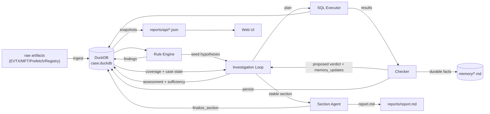
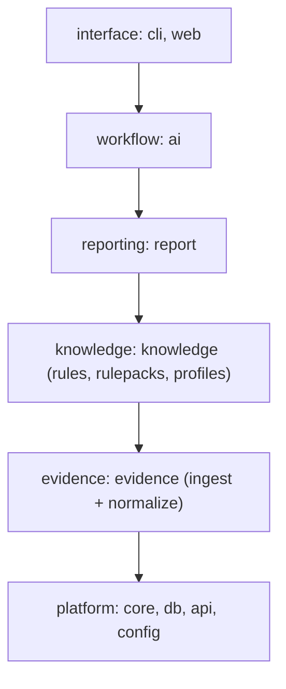
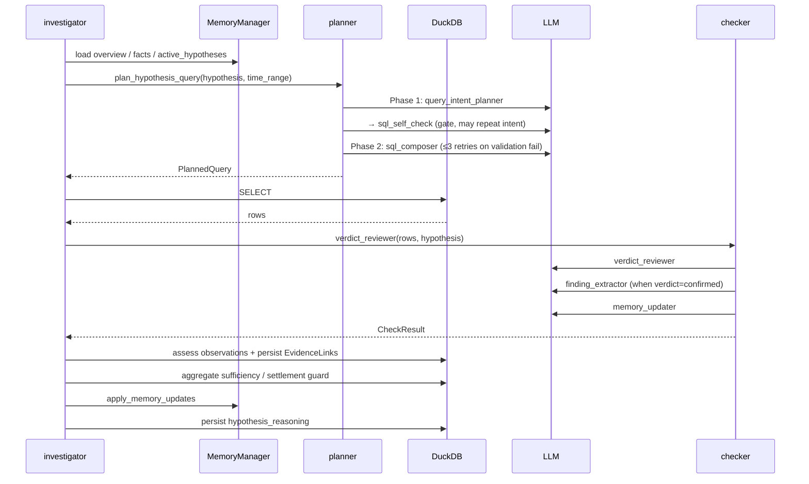
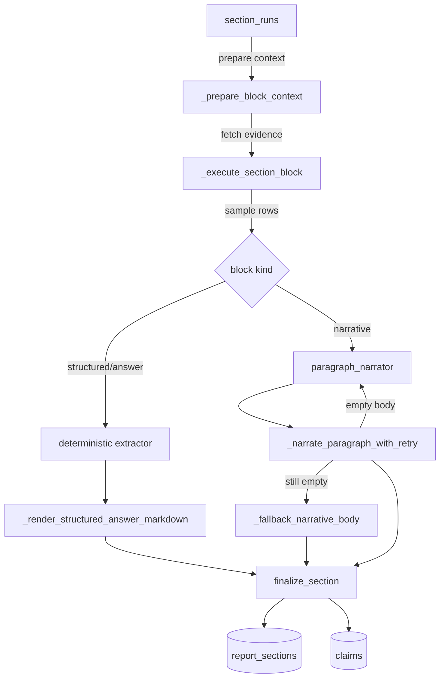

# Architecture

Overview of the current implementation of forensia. It objectively describes data flow and responsibility separation. When you change code, update this document in the same PR.

Details are split into separate documents:
- Data definitions → [data-model.md](data-model.md)
- File-level responsibilities → [code-map.md](code-map.md)
- LLM role specification → [llm-roles.md](llm-roles.md)

---

## 1. Pipeline overview



Registry hives enter through the same artifact adapter dispatch as EVTX, MFT,
and Prefetch. `evidence/registry.py` detects `REGF` content, treats directory
layout as a grouping candidate only, and keeps unattributed primaries separate.
`.LOG`/`.LOG1`/`.LOG2` files are admitted only as non-empty companions to a matching
primary; they are not standalone datasets. The adapter streams the pinned `reg2es`
generator output to raw JSONL. The Registry normalization boundary projects
lossless records, contributor provenance, conservative completeness, and
Coverage through the existing normalize/coverage dispatchers.
For content replacement, an unattributed dataset may supersede only an older
unattributed dataset with the same complete set of operational member paths.
Those paths establish replacement lineage only; they never establish dataset
identity or group directory neighbors.

The existing SQL schema-card/allow-list exposes `registry_artifacts` and
`registry_timeline`; `registry-<sha256>` IDs use the generic evidence lookup
and report evidence map. Valid Registry timestamps are fed into the existing
`case_timeline` table. Coverage remains partial when plugin completeness is
unproven, so an empty Registry result is not treated as a refutation.

LLM working Memory is a bounded projection, not another evidence authority. Finding
cards are selected round-robin across the existing report finding themes and retain
individual finding/evidence IDs plus theme drill-down IDs. Scope cards rank all observed
host/time candidates and never delete or hide authoritative evidence.

Entry points:
- User perspective: `forensia investigate <case> <input_dir>` ([src/forensia/cli/app.py](../src/forensia/cli/app.py))
- Internal implementation: `await investigate(...)` ([src/forensia/ai/investigation/investigator.py](../src/forensia/ai/investigation/investigator.py))

---

## 2. Data flow per stage

### 2.1 Ingest

Input: EVTX / MFT / Prefetch / Registry hives under `raw/`
Output: DuckDB normalized evidence and timeline tables

| Input | Parser | Output table |
|---|---|---|
| `*.evtx` | `evtx2es` → JSONL | `evtx_events` |
| `$MFT` | `mft2es` → entries JSONL | `mft_entries` + derived `mft_timeline` |
| `*.pf` | `prefetch2es` → JSONL | `prefetch_executions` + `prefetch_timeline` |
| REGF primary hive (+ matching `.LOG1`/`.LOG2`) | `reg2es` → JSONL | `registry_artifacts` + `registry_timeline` |

Each row carries an `evidence_id`, which is the identifier that ties evidence together across the entire pipeline (see [data-model.md](data-model.md#11-normalized-evidence-data) for the naming convention).

`ingest_all` passes the hash keys of newly generated JSONL files to
`normalize_all`. Normalization therefore replaces only added/updated sources;
calling `normalize_all` without keys remains the explicit full-rebuild path.
Artifact replacement uses set-based `INSERT ... SELECT` inside a transaction.
MFT timeline rows are expanded from the eight normalized entry timestamps in
DuckDB, avoiding a second parser pass and duplicate timeline JSONL.

Around each successful adapter replacement, `normalize_all` compares only
evidence IDs already referenced by Hypotheses, Claims, or report sections. If a
referenced ID disappears, its assessed EvidenceLink remains as history while
the Hypothesis and Claim move to review and the affected section becomes stale.
Unchanged IDs do not trigger invalidation; large evidence tables are not copied
into an in-memory snapshot.

At ingest completion, `case.extract_time_range(db.conn)` stores the MIN/MAX timestamp from `evtx_events` into `case._time_range_*`, which is later passed to SQL generation prompts.

### 2.2 Dependency layers

Dependencies point downward in this order; a lower layer must not import a
higher layer:



`scripts/check_imports.py` enforces this direction and rejects stale exception
entries. The only current exception is `api/cache.py → report`, where API
snapshots assemble report-owned projections. Do not add an exception without
documenting why the responsibility cannot move to the higher layer.

Placement decision:

1. HTTP or command handling goes in `web/` or `cli/`.
2. Investigation orchestration and LLM loops go in `ai/`.
3. Report evidence selection, section lifecycle, or rendering goes in the
   corresponding `report/answers`, `report/sections`, or `report/render` family.
4. Declarative forensic vocabulary and readers go in `knowledge/rulepacks/`, `knowledge/rules/`, or
   `knowledge/`.
5. Artifact parsing/loading goes in `evidence/` (per-artifact module with ingest + normalize halves).
6. Reusable storage, DTO, configuration, and case primitives go in the platform
   packages only when they do not depend on workflow behavior.

### 2.3 Rule Engine

Input: normalized tables + YAML under [src/forensia/knowledge/rulepacks/](../src/forensia/knowledge/rulepacks/)
Output: `findings` table

Each rule yaml declares `query` (SQL), `finding` (template), `attack` (MITRE), `hypotheses` (verification types), and `fallback_search` (alternative when 0 rows).

```yaml
# Example: windows-security-4624-logon
attack:
  - tactic: initial-access
    technique_id: T1078
    technique_name: Valid Accounts
query: |
  SELECT evidence_id, timestamp, computer, target_user, logon_type
  FROM evtx_events
  WHERE event_id = 4624 AND logon_type IN ('2','10')
```

The engine runs the SQL, fills the `finding` template with the rows, and INSERTs into `findings`. The `attack` field is kept as a JSON string and later aggregated into a tactic × technique matrix by `list_attack_coverage_dto` in downstream stages.

### 2.4 Investigation Loop

The main loop in [ai/investigator.py](../src/forensia/ai/investigation/investigator.py) (cycle body in [ai/investigation_cycle.py](../src/forensia/ai/investigation/investigation_cycle.py)) combines deterministic case-state selection with the existing plan/execute/check/report stages.



Main stages:

1. **broad_plan**: `gap_identifier` extracts uncovered observation points, and `hypothesis_drafter` drafts a hypothesis per gap
2. **select**: `selection.py` filters blocked/unobservable/exhausted candidates and ranks eligible hypotheses from deterministic priority components. The full score breakdown is stored in Trace.
3. **plan**: The query-intent kernel first validates the typed bounded action menu: the initial phase permits `memory.read_more` or `sql.query`, while the post-expansion phase permits only `sql.query`. Scope-safe memory loading and the existing `sql_self_check` → `sql_composer` path run only after that gate. `plan_hypothesis_query` ([ai/planner.py](../src/forensia/ai/investigation/planner.py)) stops with a traceable invalid-action reason and does not compose SQL when the action is unknown, malformed, or ineligible.
4. **execute/check**: Issues a safe SELECT, applies fallback behavior and obtains the Checker's proposed verdict. The existing hypothesis SQL execution records a versioned `ToolReceipt` and one-attempt `RetrievalEvaluation` inside the same `trace.investigation_steps.output_json`; the receipt records query/provenance/result observations only and does not assign Evidence roles or consume checker verdicts.
5. **assessment/sufficiency/settlement**: `assess_evidence_group` classifies each adequate observation group from `VerificationSpec`, observation fields and provenance; it never reads the checker verdict. Links from the same query share a conservative derivation group. Sufficiency ignores legacy links without an assessment ID, and Settlement does not pass through checker `refuted` / `untestable` proposals without an assessed contradiction or an explicit observable/unavailable auto condition.
6. **relate/resolve**: Checker-derived hypotheses receive validated parent edges. Verdict effects unblock, block or flag adjacent hypotheses without changing them to an incompatible status.
7. **report/gaps**: Refreshes Claims and sections, synchronizes normalized Gap/Task lifecycle, and projects authoritative tasks into Markdown Memory.

On termination, active hypotheses are atomically classified as `deferred`,
`blocked`, `needs_review`, or `untestable`; none remain silently active. Each
classification creates a bidirectionally linked Gap and Task with a persisted
retry condition. A later ingest reactivates only work whose required capability
or source condition became satisfiable. The stop reason code remains stable for
automation, while classification counts are stored separately in
`investigation_state.stop_summary`.

For the input/output schema of each LLM role, see [llm-roles.md](llm-roles.md).

**Additional behavior:**

- **auto-rulepacks**: `resolve_active_packs` ([rules/loader.py](../src/forensia/knowledge/rules/loader.py)) automatically enables rulepacks whose `applies_when.artifact_families` match the case's evidence families. Use `--no-auto-rulepacks` for the legacy behavior. Controlled by the `auto_rulepacks` argument of `investigator.investigate`.
- **playbook budget control**: `_dfir_playbook` ([ai/prompts/prompt_playbook.py](../src/forensia/ai/prompts/prompt_playbook.py)) narrows Event ID narratives to IDs that exist in the case so they stay under the user-configurable `FORENSIA_SYSTEM_PROMPT_BUDGET_CHARS`, and drops sections in priority order when the budget is exceeded. The combined plan/check budget is independently configurable with `FORENSIA_PROMPT_BUDGET_TOKENS`; when unset it scales with the system-character budget.
- **automatic timeline assembly**: The `case_timeline` table ([db/schema.py](../src/forensia/db/schema.py)) is deterministically fed with the first-evidence timestamp of findings (severity ≥ medium) and the decisive query row of resolved hypotheses (`feed_findings_to_timeline` in [rules/engine.py](../src/forensia/knowledge/rules/engine.py)). `memory/timeline.md` is a projection regenerated from this table.
- **timezone support**: `infer_timezone` ([normalize/timezone.py](../src/forensia/evidence/timezone.py)) infers the offset from events such as 4616 system time changes. It is stored in `case.source_timezone` ([core/case.py](../src/forensia/core/case.py)), and `_render_timestamp_with_timezone` ([report/render/markdown.py](../src/forensia/report/render/markdown.py)) renders a dual UTC + local display.

### 2.4 Section Agent (report generation)

Input: `findings` + `hypothesis_reasoning` + `section_facts` + `memory/*.md` + REPORT_KEYPOINTS
Output: `report_sections` + `claims` + `section_evidence` + `report.md`



Per-block processing:
- **structured**: Routed by the question template (`question_routing.yaml`) and executes SQL / builder / extraction logic deterministically. Output is a tabular Markdown + JSON/CSV export
- **narrative**: `section_outliner` fixes the layout → `paragraph_narrator` generates one paragraph → if the body is empty it retries once with a coaching turn → if still empty, `_fallback_narrative_body` generates it locally

For narrative evidence gathering, each block persists its plan/query/check runs.
The next iteration receives the latest runs, including the checker's
`missing_questions`; those unresolved questions are also added to external
knowledge retrieval terms. This makes retrieval progressively narrower instead
of repeating the section title on every pass. System and combined-message limits
follow the configured prompt budgets, preserving the task/schema, recent trace
tail, and selected reference
snippets while compacting broad catalogs and oversized dynamic data.

Hypothesis memory uses a hierarchical, scope-tagged index for progressive
disclosure. Core confirmed memory and relevant entity/keypoint cards are loaded
first; the current hypothesis card/scratch can be requested by exact path. Other
hypothesis scratch/history is excluded both from the index and by a loader-side
allow-list. Memory-index, `read_more`, and report knowledge selections emit
observational rows to the separate `trace.duckdb`; this telemetry never feeds
ranking automatically. The `read_more` loader also reports its actual scope
decision and one-attempt retrieval evaluation to its existing callback; it does
not create a second receipt store.

The final Markdown is assembled by `build_report_markdown_from_db` ([report/render/writer.py](../src/forensia/report/render/writer.py)) from `report_sections`, and `_strip_narrative_status_lines` ([report/sections/section_quality.py](../src/forensia/report/sections/section_quality.py)) strips internal metadata (such as `**Status:**` lines) from non-appendix sections.

Hypothesis SQL receipts reuse the existing `query_fingerprint`, Coverage
projection, planner validation/dry-run observations, fallback behavior, and
`_save_step` persistence. Empty results remain observations: retrieval
evaluation marks Coverage-unknown empties as partial and never turns them into
negative evidence or a verdict. Bounded fallback results retain their pre-limit
row count and truncation flag in both the checker summary and SQL receipt.

---

## 3. Report generation details

### 3.1 Section organization

Markdown templates under `report_template_dir` declare the layout per `section_key`. The standard set is:

```
1_overview        · Executive Summary, Classification, Scope, Impact, Key Findings, Conclusion
2_timeline        · Time Basis, Log Integrity, Phase Summary, Chronological Events
3_technical       · Incident Progression, Systems/Accounts, Execution, Network, Files, Antiforensics
4_gaps            · Limitations, Unresolved/Untestable Hypotheses, Evidence Gaps, Follow-up
5_recommendations · Containment, Action Plan, Eradication/Recovery, Risk Reduction, Residual Risk
```

The bundled generic report intentionally ends at section 5. `6_appendix` is an
optional external-template convention used by the benchmark to render structured
questions; it is not copied into ordinary cases or exported with bundled defaults.

Each section is decomposed into multiple **blocks** (heading units) and processed sequentially by `run_section_block_agent` ([ai/sections/section_agent.py](../src/forensia/ai/sections/section_agent.py)).

### 3.2 Keypoint catalog

`REPORT_KEYPOINTS` ([report/answers/keypoint_catalog.py](../src/forensia/report/answers/keypoint_catalog.py)) registers "predefined queries available to a section" as a mapping. Each entry is a `(label, resolver)` pair where `resolver(db) → list[dict]`. Representative examples:

- `overview_top_findings` — high/critical findings sorted by confidence
- `overview_hosts` — `evtx_events.computer` aggregation
- `host_execution_activity` — 4688 + 1059 family
- `host_persistence_activity` — 4697 / 4698 / 7045 / 13
- `account_logon_patterns` — 4624/4625/4634/4647
- `unresolved_hypotheses_summary` — list of hypotheses whose verdict is not yet settled
- `recommendations_findings` — all findings sorted by severity
- `appendix_findings_catalog` — full catalog for the appendix

`_default_keypoints_for_section` ([report/answers/keypoint_catalog.py](../src/forensia/report/answers/keypoint_catalog.py)) selects a keypoint by section_key prefix and block-heading keywords.

### 3.3 Structured Answer

When an external template set defines `6_appendix`, each question in that section
is processed as a structured answer.

| Step | Location |
|---|---|
| Question template definition | `src/forensia/knowledge/rulepacks/_schema/question_routing.yaml` |
| answer_spec → builder routing | `questions.resolve_question_spec` |
| SQL execution / extractor call | `ai/sections/section_answers.py` (`_format_structured_answer` / `_format_question_answer`) |
| Markdown rendering | `report/answers/answer_store.py` (`_render_structured_answer_markdown`) |
| JSON / CSV export | `report/answers/answer_store.py` (`_persist_structured_answer` → `reports/structured/`) |

Status is one of `answered` / `partial` / `not_found` / `not_searched` / `wrong_query` / `insufficient_evidence`. `### Missing Reason` is omitted when status=answered and the result is effectively empty (`[]` / `["none"]` / `["no match"]` etc).

---

## 4. API snapshots and UI

To keep the Web UI up to date during an investigation, `reports/api/*.json` is written out in two tiers.

| Write function | Timing | Files included |
|---|---|---|
| `write_volatile_api_snapshots` | every 5 seconds during an investigation | `hypotheses.json`, `stats.json`, `findings.json`, `attack_coverage.json`, `report_sections.json`, `hypothesis_reasoning.json`, `hypotheses_reasoning_latest.json`, `entities.json` |
| `write_full_api_snapshots` | full platform refresh | Above plus evidence source/Coverage, investigation state, normalized Gaps/Tasks, hypothesis relations and evidence links |
| `write_progress_snapshot` | on every progress emit | `progress_events.json` |
| `write_full_api_snapshots` | at CLI exit + when section_refresher completes | above + `case.json`, `sessions.json`, `claims.json`, `mft_timeline.json`, `session_steps.json`, `ai_reviews.json`, `report_brief.json`, `event_volume_*.json` |

FastAPI handlers ([src/forensia/web/app.py](../src/forensia/web/app.py)) read snapshots first and fall back to direct live DB reads only when a snapshot is absent.

The UI ([web_ui/](../web_ui/)) polls snapshots through Svelte stores and updates the display reactively.

---

## 5. Case directory structure

```
dist/<case>/
├─ raw/                 · Parsed artifact records (JSONL) staged during ingest
├─ db/case.duckdb       · Normalized tables + hypotheses + findings + report_sections
├─ memory/              · LLM persistent memory (overview.md, facts.md, entities/, hypotheses/, scratch/)
├─ ai_logs/             · Raw LLM input/output logs (per-phase JSON, for debugging)
├─ reports/
│  ├─ report.md         · Final report Markdown
│  ├─ report.html       · Same content as HTML
│  ├─ report_brief.json · Structured summary for LLM context
│  ├─ api/*.json        · UI snapshots
│  ├─ debug/            · Per-section trace dumps
│  ├─ evidence/*.json   · Raw evidence per section
│  └─ structured/*.csv  · CSV export of structured answers
├─ findings/            · Per-rule finding details
├─ allowlist.yaml       · Finding identifiers to suppress
├─ manifest.yaml        · Case metadata
└─ report_template/     · Project-specific templates (optional)
```

---

## 6. Configuration

| Environment variable | Role | Default |
|---|---|---|
| `LLM_BASE_URL` | URL of the OpenAI-compatible LLM server | (required) |
| `LLM_MODEL` | Model name | (required) |
| `LLM_REASONING_RESERVE_TOKENS` | max_tokens addition reserved for reasoning | 0 |
| `LLM_OUTPUT_LANGUAGE` | Output language (`ja` / `en`) | `ja` (`.env.example` sets `en`) |
| `LLM_MAX_TOKENS` | max_tokens for normal output | 4096 |
| `LLM_OUTAGE_WALL_CLOCK_BUDGET_S` | Total time budget (seconds) to wait for LLM server recovery | 28800 |
| `LLM_OUTAGE_PROBE_INTERVAL_S` | Interval (seconds) between recovery probes | 60 |

Configuration is accessed via `get_llm_settings()` in `src/forensia/config.py`. `.env` is loaded by `python-dotenv`.

### Report admission and semantic progress

Report gaps are admission requests represented by the existing `report_gaps`
row. `investigation_tasks` carries ownership and retry state for non-hypothesis
work. Admission links equivalent existing work first, then validates a
normalized `VerificationSpec` before persisting a new Hypothesis. Report
content cannot set priority or verdict. Termination observes durable
Gap/Task/Hypothesis lifecycle, assessed evidence, contradiction, and Coverage
changes; body length and formatting are not progress.
