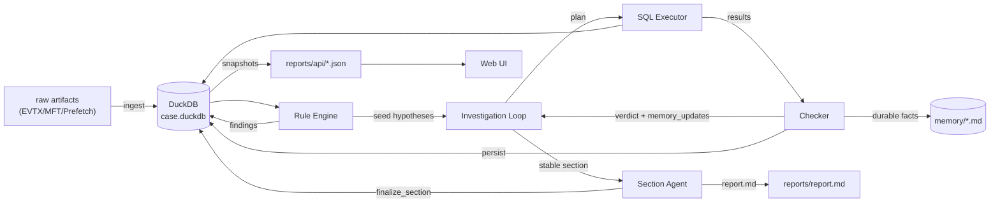
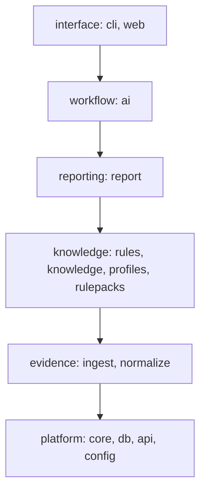
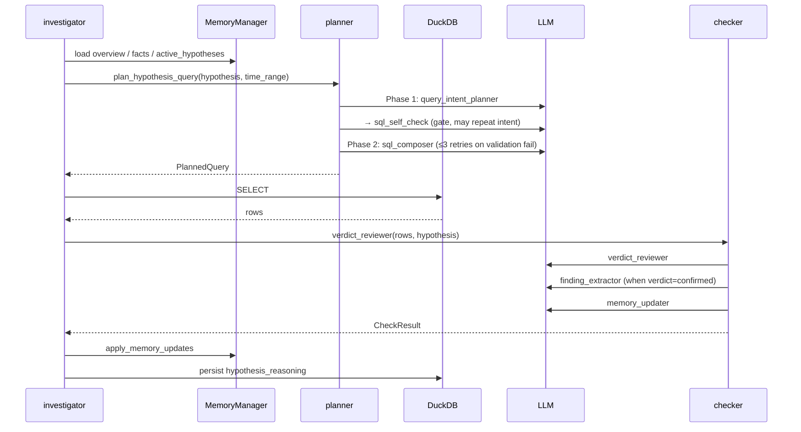
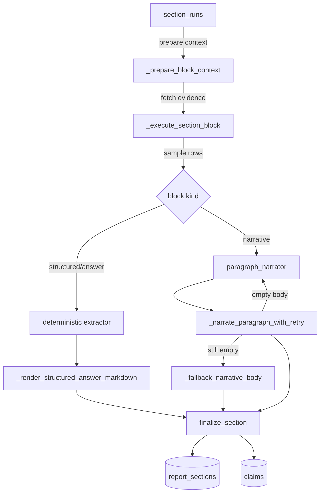

# Architecture

Overview of the current implementation of forensia. It objectively describes data flow and responsibility separation. When you change code, update this document in the same PR.

Details are split into separate documents:
- Data definitions → [data-model.md](data-model.md)
- File-level responsibilities → [code-map.md](code-map.md)
- LLM role specification → [llm-roles.md](llm-roles.md)

---

## 1. Pipeline overview



Entry points:
- User perspective: `forensia investigate <case> <input_dir>` ([src/forensia/cli/app.py](../src/forensia/cli/app.py))
- Internal implementation: `await investigate(...)` ([src/forensia/ai/investigator.py](../src/forensia/ai/investigator.py))

---

## 2. Data flow per stage

### 2.1 Ingest

Input: EVTX / MFT / Prefetch under `raw/`
Output: DuckDB normalized tables (`evtx_events`, `mft_entries`, `mft_timeline`, `prefetch_executions`, `prefetch_timeline`)

| Input | Parser | Output table |
|---|---|---|
| `*.evtx` | `evtx2es` → JSONL | `evtx_events` |
| `$MFT` | `mft2es` → entries JSONL | `mft_entries` + derived `mft_timeline` |
| `*.pf` | `prefetch2es` → JSONL | `prefetch_executions` + `prefetch_timeline` |

Each row carries an `evidence_id`, which is the identifier that ties evidence together across the entire pipeline (see [data-model.md](data-model.md#11-normalized-evidence-data) for the naming convention).

`ingest_all` passes the hash keys of newly generated JSONL files to
`normalize_all`. Normalization therefore replaces only added/updated sources;
calling `normalize_all` without keys remains the explicit full-rebuild path.
Artifact replacement uses set-based `INSERT ... SELECT` inside a transaction.
MFT timeline rows are expanded from the eight normalized entry timestamps in
DuckDB, avoiding a second parser pass and duplicate timeline JSONL.

At ingest completion, `case.extract_time_range(db.conn)` stores the MIN/MAX timestamp from `evtx_events` into `case._time_range_*`, which is later passed to SQL generation prompts.

### 2.2 Dependency layers

Dependencies point downward in this order; a lower layer must not import a
higher layer:



`scripts/check_imports.py` enforces this direction and rejects stale exception
entries. The only current exception is `api/cache.py → report`, where API
snapshots assemble report-owned projections. Do not add an exception without
documenting why the responsibility cannot move to the higher layer.

Placement decision:

1. HTTP or command handling goes in `web/` or `cli/`.
2. Investigation orchestration and LLM loops go in `ai/`.
3. Report evidence selection, section lifecycle, or rendering goes in the
   corresponding `report/answers`, `report/sections`, or `report/render` family.
4. Declarative forensic vocabulary and readers go in `rulepacks/`, `rules/`, or
   `knowledge/`.
5. Artifact parsing/loading goes in `ingest/` or `normalize/`.
6. Reusable storage, DTO, configuration, and case primitives go in the platform
   packages only when they do not depend on workflow behavior.

### 2.3 Rule Engine

Input: normalized tables + YAML under [src/forensia/rulepacks/](../src/forensia/rulepacks/)
Output: `findings` table

Each rule yaml declares `query` (SQL), `finding` (template), `attack` (MITRE), `hypotheses` (verification types), and `fallback_search` (alternative when 0 rows).

```yaml
# Example: windows-security-4624-logon
attack:
  - tactic: initial-access
    technique_id: T1078
    technique_name: Valid Accounts
query: |
  SELECT evidence_id, timestamp, computer, target_user, logon_type
  FROM evtx_events
  WHERE event_id = 4624 AND logon_type IN ('2','10')
```

The engine runs the SQL, fills the `finding` template with the rows, and INSERTs into `findings`. The `attack` field is kept as a JSON string and later aggregated into a tactic × technique matrix by `list_attack_coverage_dto` in downstream stages.

### 2.4 Investigation Loop

The main loop in [ai/investigator.py](../src/forensia/ai/investigator.py) (cycle body in [ai/investigation_cycle.py](../src/forensia/ai/investigation_cycle.py)) runs 7 steps per `plan_cycle`.



7 steps:

1. **broad_plan**: `gap_identifier` extracts uncovered observation points, and `hypothesis_drafter` drafts a hypothesis per gap
2. **plan**: Two-phase: Phase 1 (intent) runs `query_intent_planner` → `sql_self_check` gate (retries intent when blocked), Phase 2 (composer) runs `sql_composer` (retries composer only up to 3 times on SQL validation failure). `plan_hypothesis_query` ([ai/planner.py](../src/forensia/ai/planner.py))
3. **execute**: Isssues a SELECT to DuckDB. When 0 rows are returned, the rule-side `fallback_search` declaration fires deterministically
4. **check**: `verdict_reviewer` returns a verdict, and the code-side consistency gate cross-checks that the claim matches the result rows. Only when `confirmed` does `finding_extractor` extract a structured finding and persist it to `findings`
5. **track**: `HypothesisProgressTracker` decides auto-confirm / refute / untestable / pivot from `confirm_when` / consecutive 0-row / query duplication / absent telemetry
6. **resolve**: Report sections tied to a resolved hypothesis are marked stale, and follow-up questions are injected as new hypotheses
7. **report**: `section_outliner` fixes the layout, and `paragraph_narrator` generates paragraph bodies

For the input/output schema of each LLM role, see [llm-roles.md](llm-roles.md).

**Additional behavior:**

- **auto-rulepacks**: `resolve_active_packs` ([rules/loader.py](../src/forensia/rules/loader.py)) automatically enables rulepacks whose `applies_when.artifact_families` match the case's evidence families. Use `--no-auto-rulepacks` for the legacy behavior. Controlled by the `auto_rulepacks` argument of `investigator.investigate`.
- **playbook budget control**: `_dfir_playbook` ([ai/prompts/prompt_playbook.py](../src/forensia/ai/prompts/prompt_playbook.py)) narrows Event ID narratives to IDs that exist in the case so they stay under `FORENSIA_SYSTEM_PROMPT_BUDGET_CHARS` (default 24000), and drops sections in priority order when the budget is exceeded.
- **automatic timeline assembly**: The `case_timeline` table ([db/schema.py](../src/forensia/db/schema.py)) is deterministically fed with the first-evidence timestamp of findings (severity ≥ medium) and the decisive query row of resolved hypotheses (`feed_findings_to_timeline` in [rules/engine.py](../src/forensia/rules/engine.py)). `memory/timeline.md` is a projection regenerated from this table.
- **timezone support**: `infer_timezone` ([normalize/timezone.py](../src/forensia/normalize/timezone.py)) infers the offset from events such as 4616 system time changes. It is stored in `case.source_timezone` ([core/case.py](../src/forensia/core/case.py)), and `_render_timestamp_with_timezone` ([report/render/markdown.py](../src/forensia/report/render/markdown.py)) renders a dual UTC + local display.

### 2.4 Section Agent (report generation)

Input: `findings` + `hypothesis_reasoning` + `section_facts` + `memory/*.md` + REPORT_KEYPOINTS
Output: `report_sections` + `claims` + `section_evidence` + `report.md`



Per-block processing:
- **structured**: Routed by the question template (`question_routing.yaml`) and executes SQL / builder / extraction logic deterministically. Output is a tabular Markdown + JSON/CSV export
- **narrative**: `section_outliner` fixes the layout → `paragraph_narrator` generates one paragraph → if the body is empty it retries once with a coaching turn → if still empty, `_fallback_narrative_body` generates it locally

The final Markdown is assembled by `build_report_markdown_from_db` ([report/render/writer.py](../src/forensia/report/render/writer.py)) from `report_sections`, and `_strip_narrative_status_lines` ([report/sections/section_quality.py](../src/forensia/report/sections/section_quality.py)) strips internal metadata (such as `**Status:**` lines) from non-appendix sections.

---

## 3. Report generation details

### 3.1 Section organization

Markdown templates under `report_template_dir` declare the layout per `section_key`. The standard set is:

```
1_overview        · Executive Summary, Evidence Scope, Key Findings
2_timeline        · Log Integrity, Chronological Events
3_technical       · Systems and Accounts, Execution and Persistence, Network Activity
4_gaps            · Evidence Gaps, Recommended Next Steps
5_recommendations · Immediate Actions, Short-Term Improvements, Long-Term Initiatives
6_appendix        · Structured answers (Q1, Q2, ...)
```

Each section is decomposed into multiple **blocks** (heading units) and processed sequentially by `run_section_block_agent` ([ai/sections/section_agent.py](../src/forensia/ai/sections/section_agent.py)).

### 3.2 Keypoint catalog

`REPORT_KEYPOINTS` ([report/answers/keypoint_catalog.py](../src/forensia/report/answers/keypoint_catalog.py)) registers "predefined queries available to a section" as a mapping. Each entry is a `(label, resolver)` pair where `resolver(db) → list[dict]`. Representative examples:

- `overview_top_findings` — high/critical findings sorted by confidence
- `overview_hosts` — `evtx_events.computer` aggregation
- `host_execution_activity` — 4688 + 1059 family
- `host_persistence_activity` — 4697 / 4698 / 7045 / 13
- `account_logon_patterns` — 4624/4625/4634/4647
- `unresolved_hypotheses_summary` — list of hypotheses whose verdict is not yet settled
- `recommendations_findings` — all findings sorted by severity
- `appendix_findings_catalog` — full catalog for the appendix

`_default_keypoints_for_section` ([report/answers/keypoint_catalog.py](../src/forensia/report/answers/keypoint_catalog.py)) selects a keypoint by section_key prefix and block-heading keywords.

### 3.3 Structured Answer

Each question in the `6_appendix` section is processed as a structured answer.

| Step | Location |
|---|---|
| Question template definition | `src/forensia/rulepacks/_schema/question_routing.yaml` |
| answer_spec → builder routing | `questions.resolve_question_spec` |
| SQL execution / extractor call | `ai/sections/section_answers.py` (`_format_structured_answer` / `_format_question_answer`) |
| Markdown rendering | `report/answers/answer_store.py` (`_render_structured_answer_markdown`) |
| JSON / CSV export | `report/answers/answer_store.py` (`_persist_structured_answer` → `reports/structured/`) |

Status is one of `answered` / `partial` / `not_found` / `not_searched` / `wrong_query` / `insufficient_evidence`. `### Missing Reason` is omitted when status=answered and the result is effectively empty (`[]` / `["none"]` / `["no match"]` etc).

---

## 4. API snapshots and UI

To keep the Web UI up to date during an investigation, `reports/api/*.json` is written out in two tiers.

| Write function | Timing | Files included |
|---|---|---|
| `write_volatile_api_snapshots` | every 5 seconds during an investigation | `hypotheses.json`, `stats.json`, `findings.json`, `attack_coverage.json`, `report_sections.json`, `hypothesis_reasoning.json`, `hypotheses_reasoning_latest.json`, `entities.json` |
| `write_progress_snapshot` | on every progress emit | `progress_events.json` |
| `write_full_api_snapshots` | at CLI exit + when section_refresher completes | above + `case.json`, `sessions.json`, `claims.json`, `mft_timeline.json`, `session_steps.json`, `ai_reviews.json`, `report_brief.json`, `event_volume_*.json` |

FastAPI handlers ([src/forensia/web/app.py](../src/forensia/web/app.py)) read snapshots first and fall back to direct live DB reads only when a snapshot is absent.

The UI ([web_ui/](../web_ui/)) polls snapshots through Svelte stores and updates the display reactively.

---

## 5. Case directory structure

```
dist/<case>/
├─ raw/                 · Original artifacts (ingest input)
├─ db/case.duckdb       · Normalized tables + hypotheses + findings + report_sections
├─ memory/              · LLM persistent memory (overview.md, facts.md, entities/, hypotheses/, scratch/)
├─ ai_logs/             · Raw LLM input/output logs (per-phase JSON, for debugging)
├─ reports/
│  ├─ report.md         · Final report Markdown
│  ├─ report.html       · Same content as HTML
│  ├─ report_brief.json · Structured summary for LLM context
│  ├─ api/*.json        · UI snapshots
│  ├─ debug/            · Per-section trace dumps
│  ├─ evidence/*.json   · Raw evidence per section
│  └─ structured/*.csv  · CSV export of structured answers
├─ findings/            · Per-rule finding details
├─ allowlist.yaml       · Finding identifiers to suppress
├─ manifest.yaml        · Case metadata
└─ report_template/     · Project-specific templates (optional)
```

---

## 6. Configuration

| Environment variable | Role | Default |
|---|---|---|
| `LLM_BASE_URL` | URL of the OpenAI-compatible LLM server | (required) |
| `LLM_MODEL` | Model name | (required) |
| `LLM_REASONING_RESERVE_TOKENS` | max_tokens addition reserved for reasoning | 0 |
| `LLM_OUTPUT_LANGUAGE` | Output language (`ja` / `en`) | `ja` (`.env.example` sets `en`) |
| `LLM_MAX_TOKENS` | max_tokens for normal output | 4096 |
| `LLM_OUTAGE_WALL_CLOCK_BUDGET_S` | Total time budget (seconds) to wait for LLM server recovery | 28800 |
| `LLM_OUTAGE_PROBE_INTERVAL_S` | Interval (seconds) between recovery probes | 60 |

Configuration is accessed via `get_llm_settings()` in `src/forensia/config.py`. `.env` is loaded by `python-dotenv`.
