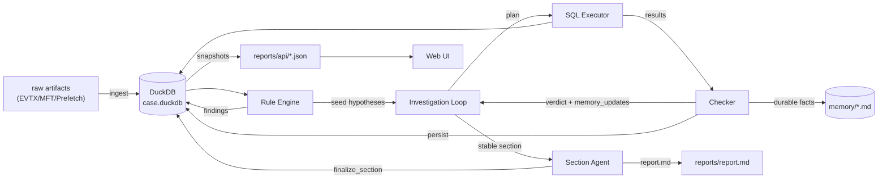
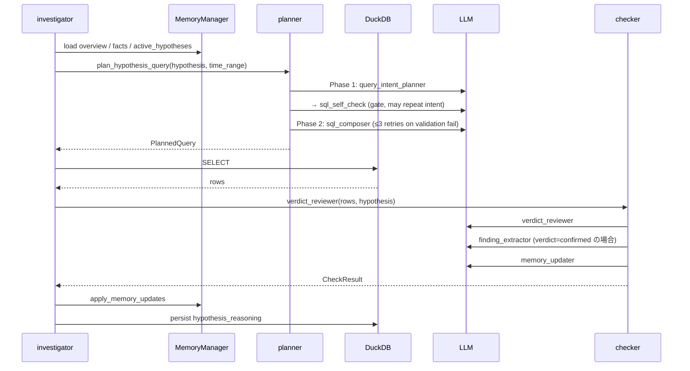
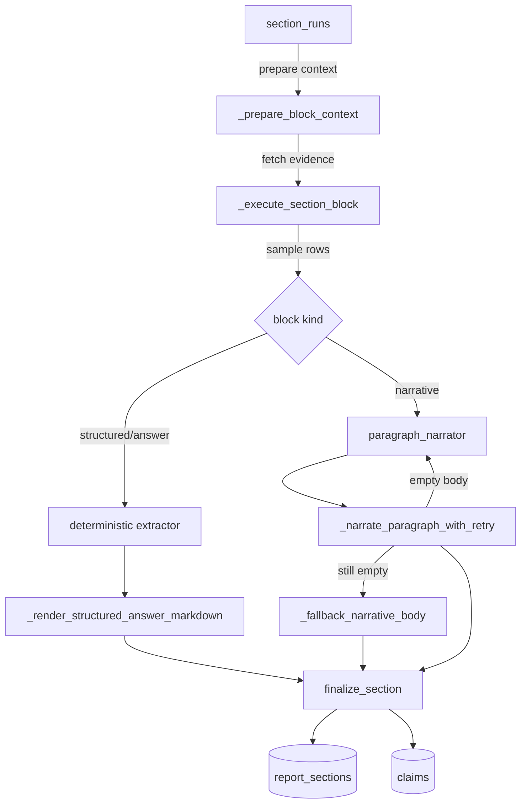

# Architecture

forensia の現在の実装の全体像。データの流れと責務の分担を客観的に記述する。コードを変更したら同じ PR でここも更新する。

詳細は別ドキュメントに分割している:
- データの定義 → [data-model.md](data-model.md)
- ファイル単位の責務 → [code-map.md](code-map.md)
- LLM ロール仕様 → [llm-roles.md](llm-roles.md)

---

## 1. パイプライン全体



エントリポイント:
- ユーザ視点: `forensia investigate <case> <input_dir>` ([src/forensia/cli.py:505](../src/forensia/cli.py#L505))
- 内部実装: `await investigate(...)` ([src/forensia/ai/investigator.py:1623](../src/forensia/ai/investigator.py#L1623))

---

## 2. ステージ別データフロー

### 2.1 Ingest

入力: `raw/` 配下の EVTX / MFT / Prefetch
出力: DuckDB の正規化テーブル (`evtx_events`, `mft_entries`, `mft_timeline`, `prefetch_executions`, `prefetch_timeline`)

| 入力 | パーサ | 出力テーブル |
|---|---|---|
| `*.evtx` | `evtx_dump` → JSONL | `evtx_events` |
| `$MFT` | `analyzeMFT` → CSV | `mft_entries` + `mft_timeline` |
| `*.pf` | `prefetch2es` → JSONL | `prefetch_executions` + `prefetch_timeline` |

各行は `evidence_id` を持ち、これが全パイプラインで証拠を貫く識別子になる (命名規則は [data-model.md](data-model.md#11-正規化された証拠データ) を参照)。

ingest 完了時に `case.extract_time_range(db.conn)` が `evtx_events` の MIN/MAX timestamp を `case._time_range_*` に保存し、以降の SQL 生成プロンプトに渡される。

### 2.2 Rule Engine

入力: 正規化テーブル + [src/forensia/rulepacks/](../src/forensia/rulepacks/) 配下の YAML
出力: `findings` テーブル

各 rule yaml は `query` (SQL), `finding` (テンプレート), `attack` (MITRE), `hypotheses` (検証種), `fallback_search` (0 行時の代替) を宣言する。

```yaml
# 例: windows-security-4624-logon
attack:
  - tactic: initial-access
    technique_id: T1078
    technique_name: Valid Accounts
query: |
  SELECT evidence_id, timestamp, computer, target_user, logon_type
  FROM evtx_events
  WHERE event_id = 4624 AND logon_type IN ('2','10')
```

エンジンは SQL を実行し、`finding` テンプレートに行を埋めて `findings` に INSERT する。`attack` フィールドは JSON 文字列として保持され、後段の `list_attack_coverage_dto` で tactic × technique マトリックスに集計される。

### 2.3 Investigation Loop

[investigator.py](../src/forensia/ai/investigator.py) のメインループは `plan_cycle` 単位で 7 ステップを 1 周する。



7 ステップ:

1. **broad_plan**: `gap_identifier` が未カバーの観測点を抽出し、`hypothesis_drafter` が gap ごとに仮説を起案
2. **plan**: 2 相構成: Phase 1 (intent) で `query_intent_planner` → `sql_self_check` gate (blocked 時は intent 再試行)、Phase 2 (composer) で `sql_composer` (SQL validation 失敗時は composer のみ最大 3 回リトライ)。`plan_hypothesis_query` ([planner.py:320](../src/forensia/ai/planner.py#L320))
3. **execute**: DuckDB に SELECT 発行。0 行時は rule 側の `fallback_search` 宣言が決定論的に発火
4. **check**: `verdict_reviewer` が verdict を出し、コード側の整合ゲートが主張と結果行の一致を照合。`confirmed` のときだけ `finding_extractor` が構造化 finding を抽出し `findings` へ永続化
5. **track**: `HypothesisProgressTracker` が `confirm_when` / 連続 0-row / クエリ重複 / 不在テレメトリから auto-confirm / refute / untestable / pivot を判定
6. **resolve**: 確定した仮説に紐づくレポートセクションを stale 化、follow-up 質問を新たな仮説に投入
7. **report**: `section_outliner` がレイアウト確定、`paragraph_narrator` が段落本文を生成

各 LLM ロールの入出力スキーマは [llm-roles.md](llm-roles.md) を参照。

**拡張機能 (R2-07 / R2-08 / R2-11 / R2-14):**

- **auto-rulepacks** (R2-07): `resolve_active_packs` ([loader.py:222](../src/forensia/rules/loader.py#L222)) がケースの証拠ファミリから `applies_when.artifact_families` に一致するルールパックを自動有効化。`--no-auto-rulepacks` で従来動作に。`investigator.investigate` ([investigator.py:1930](../src/forensia/ai/investigator.py#L1930)) の `auto_rulepacks` 引数で制御。
- **playbook 予算制御** (R2-08): `_dfir_playbook` ([prompts.py:426](../src/forensia/ai/prompts.py#L426)) が `FORENSIA_SYSTEM_PROMPT_BUDGET_CHARS` (既定 24000) を超えないよう Event ID narrative をケース存在 ID に絞り、超過時は優先順位順に sections を削除。
- **タイムライン自動組み立て** (R2-11): `case_timeline` テーブル ([schema.py:287](../src/forensia/db/schema.py#L287)) に findings (severity ≥ medium) と resolved hypothesis の decisive query row を deterministic に挿入 (`feed_findings_to_timeline` [engine.py:196](../src/forensia/rules/engine.py#L196))。`memory/timeline.md` はこのテーブルから再生成される projection。
- **タイムゾーン対応** (R2-14): `infer_timezone` ([timezone.py:8](../src/forensia/normalize/timezone.py#L8)) が 4616 システム時刻変更イベント等からオフセットを推定。`case.source_timezone` ([case.py:131](../src/forensia/core/case.py#L131)) に保存され、`_render_timestamp_with_timezone` ([writer.py:2098](../src/forensia/report/writer.py#L2098)) が UTC + ローカルの二重表示を行う。

### 2.4 Section Agent (レポート生成)

入力: `findings` + `hypothesis_reasoning` + `section_facts` + `memory/*.md` + REPORT_KEYPOINTS
出力: `report_sections` + `claims` + `section_evidence` + `report.md`



block 単位の処理:
- **structured**: 質問テンプレ (`question_routing.yaml`) で routing し、SQL / builder / 抽出ロジックを決定論で実行。結果は表組み Markdown + JSON/CSV エクスポート
- **narrative**: `section_outliner` でレイアウト確定 → `paragraph_narrator` が 1 段落生成 → 空 body なら 1 度だけ coaching turn 付きで再生成 → それでも空なら `_fallback_narrative_body` でローカル生成

最終 Markdown は `build_report_markdown_from_db` ([writer.py](../src/forensia/report/writer.py)) が `report_sections` から組み立て、`_strip_narrative_status_lines` で内部メタデータ (`**Status:**` 行など) を非 appendix セクションから除去する。

---

## 3. レポート生成の詳細

### 3.1 セクション編成

`report_template_dir` 配下の Markdown テンプレートが `section_key` ごとのレイアウトを宣言する。標準は以下:

```
1_overview        · Executive Summary, Evidence Scope, Key Findings
2_timeline        · Log Integrity, Chronological Events
3_technical       · Systems and Accounts, Execution and Persistence, Network Activity
4_gaps            · Evidence Gaps, Recommended Next Steps
5_recommendations · Immediate Actions, Short-Term Improvements, Long-Term Initiatives
6_appendix        · Structured answers (Q1, Q2, ...)
```

各セクションは複数の **block** (見出し単位) に分解されて `run_section_block_agent` ([section_agent.py:2113](../src/forensia/ai/section_agent.py#L2113)) で逐次処理される。

### 3.2 Keypoint カタログ

`REPORT_KEYPOINTS` ([writer.py](../src/forensia/report/writer.py)) が「セクションに使える事前定義クエリ」を登録する。各エントリは `(label, resolver)` で、`resolver(db) → list[dict]` を返す。代表例:

- `overview_top_findings` — confidence 順の high/critical finding
- `overview_hosts` — `evtx_events.computer` 集計
- `host_execution_activity` — 4688 + 1059 系
- `host_persistence_activity` — 4697 / 4698 / 7045 / 13
- `account_logon_patterns` — 4624/4625/4634/4647
- `unresolved_hypotheses_summary` — verdict 未確定の仮説一覧
- `recommendations_findings` — 全 finding を severity 順で
- `appendix_findings_catalog` — appendix 用フル一覧

`_default_keypoints_for_section` ([writer.py:200-](../src/forensia/report/writer.py#L200)) が section_key プレフィックスと block heading キーワードで keypoint を選ぶ。

### 3.3 Structured Answer

`6_appendix` セクションの各質問は構造化回答として処理される。

| 処理 | 場所 |
|---|---|
| 質問テンプレートの定義 | `src/forensia/rulepacks/_schema/question_routing.yaml` |
| answer_spec → builder ルーティング | `questions.resolve_question_spec` |
| SQL 実行 / extractor 呼び出し | `section_agent._format_benchmark_answer` |
| Markdown 描画 | `writer._render_structured_answer_markdown` |
| JSON / CSV エクスポート | `writer._dump_structured_*` (`reports/structured/`) |

Status は `answered` / `partial` / `not_found` / `not_searched` / `wrong_query` / `insufficient_evidence`。`### Missing Reason` は status=answered かつ実質的に空 (`[]` / `["none"]` / `["該当なし"]` 等) のとき非出力。

---

## 4. API スナップショットと UI

調査中に Web UI を最新状態に保つため、2 段階で `reports/api/*.json` を書き出す。

| 書き出し関数 | 呼び出しタイミング | 含まれるファイル |
|---|---|---|
| `write_volatile_api_snapshots` | 調査中 5 秒ごと | `hypotheses.json`, `stats.json`, `findings.json`, `attack_coverage.json`, `report_sections.json`, `hypothesis_reasoning.json`, `hypotheses_reasoning_latest.json`, `entities.json` |
| `write_progress_snapshot` | 進捗 emit のたび | `progress_events.json` |
| `write_full_api_snapshots` | CLI 終了時 + section_refresher 完了時 | 上記 + `case.json`, `sessions.json`, `claims.json`, `mft_timeline.json`, `session_steps.json`, `ai_reviews.json`, `report_brief.json`, `event_volume_*.json` |

FastAPI ハンドラ ([src/forensia/web.py](../src/forensia/web.py)) は snapshot を最優先で読み、不在のときだけ live DB 直読みに fallback する。

UI ([web_ui/](../web_ui/)) は Svelte stores で snapshot をポーリングし、リアクティブに表示を更新する。

---

## 5. ケースディレクトリ構造

```
dist/<case>/
├─ raw/                 · 元アーティファクト (ingest の入力)
├─ db/case.duckdb       · 正規化テーブル + 仮説 + finding + report_sections
├─ memory/              · LLM 永続記憶 (overview.md, facts.md, entities/, hypotheses/, scratch/)
├─ ai_logs/             · LLM 入出力の生ログ (phase 別 JSON、debug 用)
├─ reports/
│  ├─ report.md         · 最終レポート Markdown
│  ├─ report.html       · 同 HTML 変換
│  ├─ report_brief.json · LLM コンテキスト用の構造化サマリ
│  ├─ api/*.json        · UI 用 snapshot
│  ├─ debug/            · 各セクションの trace ダンプ
│  ├─ evidence/*.json   · セクション別の生 evidence
│  └─ structured/*.csv  · 構造化 answer の CSV エクスポート
├─ findings/            · ルール別 finding 詳細
├─ allowlist.yaml       · 抑制したい finding 識別子
├─ manifest.yaml        · ケースメタデータ
└─ report_template/     · プロジェクト固有のテンプレ (任意)
```

---

## 6. 設定

| 環境変数 | 役割 | デフォルト |
|---|---|---|
| `LLM_BASE_URL` | OpenAI 互換 LLM サーバの URL | (必須) |
| `LLM_MODEL` | モデル名 | (必須) |
| `LLM_REASONING_RESERVE_TOKENS` | reasoning 用の max_tokens 加算分 | 0 |
| `LLM_OUTPUT_LANGUAGE` | 出力言語 (`ja` / `en`) | `en` |
| `LLM_MAX_TOKENS` | 通常出力の max_tokens | 4096 |
| `LLM_OUTAGE_WALL_CLOCK_BUDGET_S` | LLM サーバ復旧待ちの合計時間上限 (秒) | 28800 |
| `LLM_OUTAGE_PROBE_INTERVAL_S` | 復旧確認の間隔 (秒) | 60 |

設定アクセスは `src/forensia/config.py` の `get_llm_settings()` 経由。`.env` は `python-dotenv` でロードされる。
