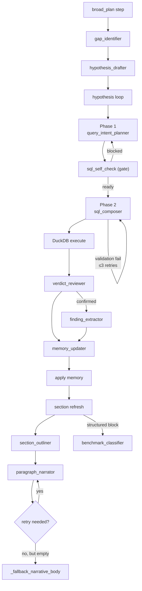

# LLM Roles

forensia は LLM の振る舞いを 11 個の「ロール」に分解し、それぞれが 1 文で目的を言える粒度に絞る設計を取る。各ロールには専用のプロンプトビルダと出力 JSON Schema が対応する。

## 1. 呼び出しレイヤ

すべての LLM 呼び出しは [src/forensia/ai/json_response.py](../src/forensia/ai/json_response.py) の `request_llm_json` / `async_request_llm_json` を経由する。

```
request_llm_json
   ↓
chat_completion (src/forensia/ai/llm_client.py)
   ↓
HTTP POST <base_url>/v1/chat/completions
```

HTTP 層の特徴:
- HTTP 5xx / connect / timeout で **最大 3 回**リトライ (指数バックオフ 2 / 4 / 8 秒)
- `response_format` に strict json_schema を試し、拒否されたら compatible (`strict: false`) → 無指定 の順に **降格**
- 降格結果は base_url 単位で `_SCHEMA_MODE_CACHE` ([llm_client.py:32-49](../src/forensia/ai/llm_client.py#L32-L49)) にキャッシュされ、次回以降は降格済みモードで送信
- 3 回リトライ枯渇後は `LLMServerUnavailableError` を投げ、呼び出し側が `outage_wait_until_recovered` で復旧を待つ

LLM 入出力の生ログは `ai_logs/<phase>-<id>.json` に保存される。

---

## 2. ロール一覧

### 2.1 投資調査ループ

`plan_hypothesis_query` ([planner.py:320](../src/forensia/ai/planner.py#L320)) は Phase 1 (intent) → Phase 2 (composer) の 2 相構成:

| 相 | ロール | 呼び出し元 | プロンプトビルダ | 出力スキーマ |
|---|---|---|---|---|
| Phase 1 | `query_intent_planner` | [planner.plan_hypothesis_query](../src/forensia/ai/planner.py#L320) | `build_query_intent_messages` | `QUERY_INTENT_SCHEMA` |
| Phase 1 | `sql_self_check` | 同上 (intent の gate) | `build_sql_self_check_messages` | `SQL_SELF_CHECK_SCHEMA` |
| Phase 2 | `sql_composer` | 同上 (最大 3 回リトライ) | `build_sql_composer_messages` | `SQL_COMPOSER_SCHEMA` |
| `verdict_reviewer` | [checker._check_query](../src/forensia/ai/checker.py#L460) | `build_verdict_review_messages` | `VERDICT_REVIEW_SCHEMA` |
| `finding_extractor` | 同上 (verdict=confirmed のとき) | `build_finding_extractor_messages` | `FINDING_EXTRACTOR_SCHEMA` |
| `memory_updater` | 同上 | `build_memory_updater_messages` | `MEMORY_UPDATER_SCHEMA` |

### 2.2 レポート生成

| ロール | 呼び出し元 | プロンプトビルダ | 出力スキーマ |
|---|---|---|---|
| `section_outliner` | [section_agent._write_block_body](../src/forensia/ai/section_agent.py#L1907) | `build_section_outline_messages` | `SECTION_OUTLINE_SCHEMA` |
| `paragraph_narrator` | [section_agent._narrate_paragraph_with_retry](../src/forensia/ai/section_agent.py#L1819) | `build_paragraph_narrate_messages` | `PARAGRAPH_NARRATE_SCHEMA` |
| `benchmark_classifier` | [section_agent._write_block_body](../src/forensia/ai/section_agent.py#L2008) (structured answer 候補) | `build_benchmark_classify_messages` | `benchmark_classify_schema(n_rows)` |

---

## 3. スキーマ詳細

スキーマ本体は [src/forensia/ai/schemas.py](../src/forensia/ai/schemas.py) に集約。プロンプトビルダは [src/forensia/ai/prompts.py](../src/forensia/ai/prompts.py)。

### 3.1 `MEMORY_UPDATER_SCHEMA`

```json
{
  "title": "MemoryUpdater",
  "type": "object",
  "additionalProperties": false,
  "properties": {
    "memory_updates": {
      "type": "object",
      "properties": {
        "facts":               {"type": "array", "items": {"type": "object"}},
        "timeline":            {"type": "array", "items": {"type": "object"}},
        "tasks":               {"type": "array", "items": {"type": "object"}},
        "overview":            {"type": "array", "items": {"type": "string"}},
        "refuted_hypotheses":  {"type": "array", "items": {"type": "object"}},
        "resolved_gaps":       {"type": "array", "items": {"type": "object"}},
        "entities":            {"type": "array", "items": {"type": "object"}}
      }
    },
    "new_hypotheses": {"type": "array", "items": {"type": "object"}}
  }
}
```

`memory_updates.entities[]` の各要素は `{entity_type, name, role, notes}` を持つ。
反映ロジックは [`_apply_memory_updates`](../src/forensia/ai/investigator.py#L737) を参照。

### 3.2 `VERDICT_REVIEW_SCHEMA`

```json
{
  "type": "object",
  "additionalProperties": false,
  "required": ["verdict", "rationale", "missing_questions"],
  "properties": {
    "verdict": {"enum": ["confirmed", "inconclusive", "refuted", "newlead"]},
    "rationale": {"type": "string", "minLength": 20},
    "missing_questions": {"type": "array", "items": {"type": "string"}, "minItems": 1},
    "confidence": {"type": "number", "minimum": 0.0, "maximum": 1.0}
  }
}
```

### 3.3 `PARAGRAPH_NARRATE_SCHEMA`

```json
{
  "type": "object",
  "additionalProperties": false,
  "required": ["body"],
  "properties": {
    "body": {"type": "string", "minLength": 50}
  }
}
```

空 body 返却時のリトライは [`_narrate_paragraph_with_retry`](../src/forensia/ai/section_agent.py#L1819) で 1 回だけ実行する。2 度目も失敗したら [`_fallback_narrative_body`](../src/forensia/ai/section_agent.py#L1853) でローカル生成 (`代表行は <timestamp> / <event_id> / <evidence_id> です` 形式) に切り替える。

### 3.4 `FINDING_EXTRACTOR_SCHEMA` / その他

スキーマ全体は [schemas.py](../src/forensia/ai/schemas.py) を直接参照。各スキーマは `additionalProperties: false` で stranger key を拒否する設計。

---

## 4. プロンプト共通パーツ

[src/forensia/ai/prompts.py](../src/forensia/ai/prompts.py) の上部に共通ヘルパが集まる。

| 関数 | 用途 |
|---|---|
| `_dfir_playbook(phase)` | phase (`hypothesis_plan` / `check` / `report_section`) ごとの DFIR ガイドライン |
| `_time_range_guidance(time_range)` | case の earliest/latest を提示し、`datetime('now')` / `CURRENT_TIMESTAMP` 禁止を明示 |
| `_build_schema_guidance(table_name, db)` | `<SCHEMA_CARDS>` ブロック + live `information_schema` + SQL Cookbook を生成 |
| `_format_schema_card(table_hints)` | 1 テーブル分の schema カード (core_columns + column_descriptions + notes) |
| `_load_schema_hints()` | `rulepacks/_schema/*.yaml` をロード (LRU キャッシュ) |
| `_slim_report_brief_for_section(brief, section_key)` | レポートセクション用の brief 縮約 (関係ないトップレベル情報を削る) |
| `_render_entity_memory(...)` | entity カードの Markdown 整形 |

---

## 5. ロールの呼び出しタイミング


