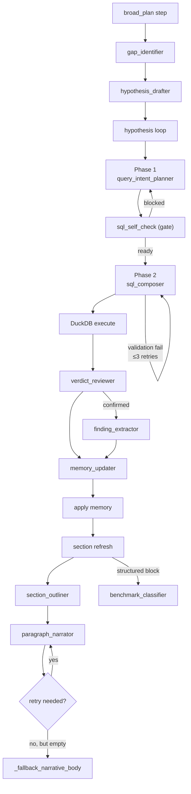

# LLM Roles

forensia decomposes LLM behavior into 11 "roles", each narrowed to a granularity where its purpose can be stated in one sentence. Each role has a dedicated prompt builder and output JSON Schema.

## 1. Invocation layer

All LLM calls go through `request_llm_json` / `async_request_llm_json` in [src/forensia/ai/json_response.py](../src/forensia/ai/json_response.py).

```
request_llm_json
   ↓
chat_completion (src/forensia/ai/llm_client.py)
   ↓
HTTP POST <base_url>/v1/chat/completions
```

HTTP layer characteristics:
- **Up to 3 retries** on HTTP 5xx / connect / timeout (exponential backoff of 2 / 4 / 8 seconds)
- Attempts strict json_schema for `response_format`, then downgrades in order to compatible (`strict: false`) → unspecified if rejected
- Downgrade results are cached per base_url in `_SCHEMA_MODE_CACHE` ([llm_client.py:32-49](../src/forensia/ai/llm_client.py#L32-L49)), so subsequent calls send the already-downgraded mode
- After 3 retries are exhausted, raises `LLMServerUnavailableError`, and the caller waits for recovery via `outage_wait_until_recovered`

Raw logs of LLM input/output are saved to `ai_logs/<phase>-<id>.json`.

---

## 2. Role list

### 2.1 Hypothesis investigation loop

`plan_hypothesis_query` ([planner.py:320](../src/forensia/ai/planner.py#L320)) is a two-phase composition of Phase 1 (intent) → Phase 2 (composer):

| Phase | Role | Caller | Prompt builder | Output schema |
|---|---|---|---|---|
| Phase 1 | `query_intent_planner` | [planner.plan_hypothesis_query](../src/forensia/ai/planner.py#L320) | `build_query_intent_messages` | `QUERY_INTENT_SCHEMA` |
| Phase 1 | `sql_self_check` | same (intent gate) | `build_sql_self_check_messages` | `SQL_SELF_CHECK_SCHEMA` |
| Phase 2 | `sql_composer` | same (up to 3 retries) | `build_sql_composer_messages` | `SQL_COMPOSER_SCHEMA` |
| `verdict_reviewer` | [checker._check_query](../src/forensia/ai/checker.py#L460) | `build_verdict_review_messages` | `VERDICT_REVIEW_SCHEMA` |
| `finding_extractor` | same (when verdict=confirmed) | `build_finding_extractor_messages` | `FINDING_EXTRACTOR_SCHEMA` |
| `memory_updater` | same | `build_memory_updater_messages` | `MEMORY_UPDATER_SCHEMA` |

### 2.2 Report generation

| Role | Caller | Prompt builder | Output schema |
|---|---|---|---|
| `section_outliner` | [section_agent._write_block_body](../src/forensia/ai/section_agent.py#L1907) | `build_section_outline_messages` | `SECTION_OUTLINE_SCHEMA` |
| `paragraph_narrator` | [section_agent._narrate_paragraph_with_retry](../src/forensia/ai/section_agent.py#L1819) | `build_paragraph_narrate_messages` | `PARAGRAPH_NARRATE_SCHEMA` |
| `benchmark_classifier` | [section_agent._write_block_body](../src/forensia/ai/section_agent.py#L2008) (structured answer candidate) | `build_benchmark_classify_messages` | `benchmark_classify_schema(n_rows)` |

---

## 3. Schema details

The schema bodies are centralized in [src/forensia/ai/schemas.py](../src/forensia/ai/schemas.py). Prompt builders live in [src/forensia/ai/prompts.py](../src/forensia/ai/prompts.py).

### 3.1 `MEMORY_UPDATER_SCHEMA`

```json
{
  "title": "MemoryUpdater",
  "type": "object",
  "additionalProperties": false,
  "properties": {
    "memory_updates": {
      "type": "object",
      "properties": {
        "facts":               {"type": "array", "items": {"type": "object"}},
        "timeline":            {"type": "array", "items": {"type": "object"}},
        "tasks":               {"type": "array", "items": {"type": "object"}},
        "overview":            {"type": "array", "items": {"type": "string"}},
        "refuted_hypotheses":  {"type": "array", "items": {"type": "object"}},
        "resolved_gaps":       {"type": "array", "items": {"type": "object"}},
        "entities":            {"type": "array", "items": {"type": "object"}}
      }
    },
    "new_hypotheses": {"type": "array", "items": {"type": "object"}}
  }
}
```

Each element of `memory_updates.entities[]` has `{entity_type, name, role, notes}`.
See [`_apply_memory_updates`](../src/forensia/ai/investigator.py#L737) for the application logic.

### 3.2 `VERDICT_REVIEW_SCHEMA`

```json
{
  "type": "object",
  "additionalProperties": false,
  "required": ["verdict", "rationale", "missing_questions"],
  "properties": {
    "verdict": {"enum": ["confirmed", "inconclusive", "refuted", "newlead"]},
    "rationale": {"type": "string", "minLength": 20},
    "missing_questions": {"type": "array", "items": {"type": "string"}, "minItems": 1},
    "confidence": {"type": "number", "minimum": 0.0, "maximum": 1.0}
  }
}
```

### 3.3 `PARAGRAPH_NARRATE_SCHEMA`

```json
{
  "type": "object",
  "additionalProperties": false,
  "required": ["body"],
  "properties": {
    "body": {"type": "string", "minLength": 50}
  }
}
```

A retry on empty body is performed exactly once in [`_narrate_paragraph_with_retry`](../src/forensia/ai/section_agent.py#L1819). If the second attempt also fails, [`_fallback_narrative_body`](../src/forensia/ai/section_agent.py#L1853) falls back to local generation (in the form `representative row is <timestamp> / <event_id> / <evidence_id>`).

### 3.4 `FINDING_EXTRACTOR_SCHEMA` / others

See [schemas.py](../src/forensia/ai/schemas.py) directly for the full set of schemas. Each schema uses `additionalProperties: false` to reject stranger keys.

---

## 4. Common prompt parts

Common helpers are gathered at the top of [src/forensia/ai/prompts.py](../src/forensia/ai/prompts.py).

| Function | Purpose |
|---|---|
| `_dfir_playbook(phase)` | DFIR guidelines per phase (`hypothesis_plan` / `check` / `report_section`) |
| `_time_range_guidance(time_range)` | Presents the case earliest/latest and explicitly forbids `datetime('now')` / `CURRENT_TIMESTAMP` |
| `_build_schema_guidance(table_name, db)` | Generates the `<SCHEMA_CARDS>` block + live `information_schema` + SQL Cookbook |
| `_format_schema_card(table_hints)` | A schema card for one table (core_columns + column_descriptions + notes) |
| `_load_schema_hints()` | Loads `rulepacks/_schema/*.yaml` (LRU cached) |
| `_slim_report_brief_for_section(brief, section_key)` | Slims the brief for a report section (drops unrelated top-level information) |
| `_render_entity_memory(...)` | Markdown formatting of entity cards |

---

## 5. Invocation timing of roles


