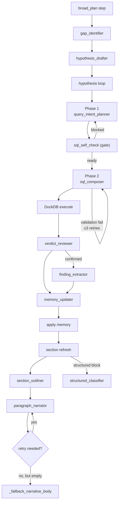

# LLM Roles

forensia decomposes LLM behavior into 11 "roles", each narrowed to a granularity where its purpose can be stated in one sentence. Each role has a dedicated prompt builder and output JSON Schema.

## 1. Invocation layer

All LLM calls go through `request_llm_json` / `async_request_llm_json` in [src/forensia/ai/llm/llm_gateway.py](../src/forensia/ai/llm/llm_gateway.py); JSON parsing/repair lives in [ai/llm/json_response.py](../src/forensia/ai/llm/json_response.py).

```
request_llm_json
   ↓
chat_completion (src/forensia/ai/llm/llm_client.py)
   ↓
HTTP POST <base_url>/v1/chat/completions
```

HTTP layer characteristics:
- **Up to 3 retries** on HTTP 5xx / connection failure (exponential backoff of 2 / 4 / 8 seconds). A connected request that reaches the read deadline is recorded as a call timeout and is not replayed as a server outage.
- Attempts strict json_schema for `response_format`, then downgrades in order to compatible (`strict: false`) → unspecified if rejected
- Downgrade results are cached per base_url in `_SCHEMA_MODE_CACHE` ([ai/llm/schema_compat.py](../src/forensia/ai/llm/schema_compat.py)), so subsequent calls send the already-downgraded mode
- After 3 retries are exhausted, raises `LLMServerUnavailableError`, and the caller waits for recovery via `outage_wait_until_recovered`
- `LLM_MAX_TOKENS` is a hard completion cap. A truncated JSON response gets one changed-request retry with a concise-output constraint; its budget may grow only up to that cap. Input compaction is reserved for an actual provider context-window rejection.

### Hypothesis verification policy

Hypothesis drafting may propose legacy `confirm_when`, `refute_when`, and
`evidence_requirements` fields. Admission normalizes these into the versioned
`VerificationSpec` on the `Hypothesis` model before persistence. The kernel,
rather than the LLM verdict, owns the resulting verification policy; in
particular `refute_when` is retained through rule seeding, reload, and resume.

Accepted input/output logs are saved to `ai_logs/<phase>-<id>.json`. Every provider
attempt, including timeouts and truncation, is recorded in trace DB telemetry; unusable
output keeps only a bounded head/tail diagnostic preview.

---

## 2. Role list

### 2.1 Hypothesis investigation loop

`plan_hypothesis_query` ([ai/planner.py](../src/forensia/ai/investigation/planner.py)) makes a single LLM SQL decision; the host validates it deterministically:

| Role | Caller | Prompt builder | Output schema |
|---|---|---|---|
| `query_intent_planner` | [planner.plan_hypothesis_query](../src/forensia/ai/investigation/planner.py) | `build_query_intent_messages` | `QUERY_INTENT_SCHEMA` |
| `verdict_reviewer` | [checking/checker.check_query_result](../src/forensia/ai/checking/checker.py) | `build_verdict_review_messages` | `VERDICT_REVIEW_SCHEMA` |
| `finding_extractor` | same (when verdict=confirmed) | `build_finding_extractor_messages` | `FINDING_EXTRACTOR_SCHEMA` |
| `memory_updater` | same | `build_memory_updater_messages` | `MEMORY_UPDATER_SCHEMA` |

### 2.2 Report generation

| Role | Caller | Prompt builder | Output schema |
|---|---|---|---|
| `section_outliner` | [sections/section_block_narrative._write_block_body](../src/forensia/ai/sections/section_block_narrative.py) | `build_section_outline_messages` | `SECTION_OUTLINE_SCHEMA` |
| `paragraph_narrator` | [sections/section_block_narrative._narrate_paragraph_with_retry](../src/forensia/ai/sections/section_block_narrative.py) | `build_paragraph_narrate_messages` | `PARAGRAPH_NARRATE_SCHEMA` |
| `structured_classifier` | [sections/section_block_narrative._write_block_body](../src/forensia/ai/sections/section_block_narrative.py) (structured answer candidate) | `build_structured_classify_messages` | `structured_classify_schema(n_rows)` |

---

## 3. Schema details

The schema bodies are centralized in [src/forensia/ai/llm/schemas.py](../src/forensia/ai/llm/schemas.py). Prompt builders live in the [src/forensia/ai/prompts/](../src/forensia/ai/prompts/) package (`prompt_investigation.py` for planner/checker roles, `prompt_sections.py` for report roles).

### 3.1 `MEMORY_UPDATER_SCHEMA`

```json
{
  "title": "MemoryUpdater",
  "type": "object",
  "additionalProperties": false,
  "properties": {
    "memory_updates": {
      "type": "object",
      "properties": {
        "facts":               {"type": "array", "items": {"type": "object"}},
        "timeline":            {"type": "array", "items": {"type": "object"}},
        "tasks":               {"type": "array", "items": {"type": "object"}},
        "overview":            {"type": "array", "items": {"type": "string"}},
        "refuted_hypotheses":  {"type": "array", "items": {"type": "object"}},
        "resolved_gaps":       {"type": "array", "items": {"type": "object"}},
        "entities":            {"type": "array", "items": {"type": "object"}}
      }
    },
    "new_hypotheses": {"type": "array", "items": {"type": "object"}}
  }
}
```

Each element of `memory_updates.entities[]` has `{entity_type, name, role, notes}`.
See [`_apply_memory_updates`](../src/forensia/ai/investigation/memory_sync.py) for the application logic.

### 3.2 `VERDICT_REVIEW_SCHEMA`

```json
{
  "type": "object",
  "additionalProperties": false,
  "required": ["verdict", "rationale", "missing_questions"],
  "properties": {
    "verdict": {"enum": ["confirmed", "inconclusive", "refuted", "newlead"]},
    "rationale": {"type": "string", "minLength": 20},
    "missing_questions": {"type": "array", "items": {"type": "string"}, "minItems": 1},
    "confidence": {"type": "number", "minimum": 0.0, "maximum": 1.0}
  }
}
```

### 3.3 `QUERY_INTENT_SCHEMA` and the bounded action gate

The query-intent response must select one typed action object: `{ "type":
"memory.read_more", "paths": [...] }` or `{ "type": "sql.query", "intent":
"...", "target_table": "..." }`. The
planner kernel computes eligibility by phase: both actions are eligible on the
initial call, and only `sql.query` is eligible after a memory expansion. It
validates the action and query-intent arguments before invoking the existing
scope filter, self-check, or SQL composer. A legacy response without `action`
is normalized only when a non-empty `read_more` list or a complete known-table
query intent makes the meaning unambiguous; otherwise planning stops without
SQL composition. For a valid nested action, the host materializes the normalized
action object rather than the outer response wrapper. If host validation or
materialization fails, the failure is persisted in the plan step and hypothesis
reasoning, injected into the next planner prompt, and retried once within a
bounded planner-only allowance; it is not counted as query execution progress.
`do`/`check` receipts remain the evidence that the hypothesis loop actually ran.
`knowledge.retrieve` remains an internal deterministic prompt-assembly step and
is not exposed as an LLM-callable action.

### 3.4 `PARAGRAPH_NARRATE_SCHEMA`

```json
{
  "type": "object",
  "additionalProperties": false,
  "required": ["body"],
  "properties": {
    "body": {"type": "string", "minLength": 50}
  }
}
```

A retry on empty body is performed exactly once in [`_narrate_paragraph_with_retry`](../src/forensia/ai/sections/section_block_narrative.py). If the second attempt also fails, [`_fallback_narrative_body`](../src/forensia/ai/sections/section_block_narrative.py) falls back to local generation (in the form `representative row is <timestamp> / <event_id> / <evidence_id>`).

### 3.4 `FINDING_EXTRACTOR_SCHEMA` / others

See [ai/llm/schemas.py](../src/forensia/ai/llm/schemas.py) directly for the full set of schemas. Each schema uses `additionalProperties: false` to reject stranger keys.

---

## 4. Common prompt parts

Common helpers live in the [src/forensia/ai/prompts/](../src/forensia/ai/prompts/) package. Section planning uses a role-specific projection: only block/keypoint/question-relevant Event IDs and playbook sections are included, while the report brief, findings snapshot, catalogs, and prior runs are compacted to fields needed for planning. This is a prompt projection only; DuckDB evidence and persisted report answers remain complete.

| Function | Purpose |
|---|---|
| `_dfir_playbook(phase)` ([prompt_playbook.py](../src/forensia/ai/prompts/prompt_playbook.py)) | DFIR guidelines per phase (`hypothesis_plan` / `check` / `report_section`) |
| `_time_range_guidance(time_range)` ([prompt_investigation.py](../src/forensia/ai/prompts/prompt_investigation.py)) | Presents the case earliest/latest and explicitly forbids `datetime('now')` / `CURRENT_TIMESTAMP` |
| `_build_schema_guidance(table_name, db)` ([prompt_context.py](../src/forensia/ai/prompts/prompt_context.py)) | Generates the `<SCHEMA_CARDS>` block + live `information_schema` + SQL Cookbook |
| `_format_schema_card(table_hints)` ([sql_schema.py](../src/forensia/ai/prompts/sql_schema.py)) | A schema card for one table (core_columns + column_descriptions + notes) |
| `_load_schema_hints()` ([sql_schema.py](../src/forensia/ai/prompts/sql_schema.py)) | Loads `knowledge/rulepacks/_schema/*.yaml` (LRU cached) |
| `_slim_report_brief_for_section(brief, section_key)` ([prompt_context.py](../src/forensia/ai/prompts/prompt_context.py)) | Slims the brief for a report section (drops unrelated top-level information) |
| `_render_entity_memory(...)` ([memory_sync.py](../src/forensia/ai/investigation/memory_sync.py)) | Markdown formatting of entity cards |

---

## 5. Invocation timing of roles


